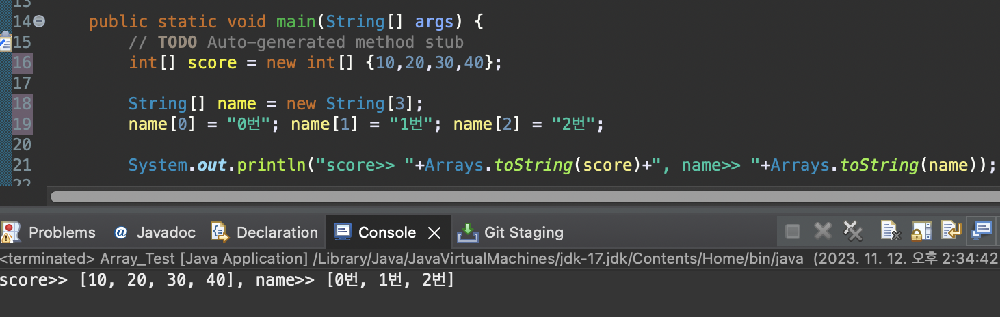
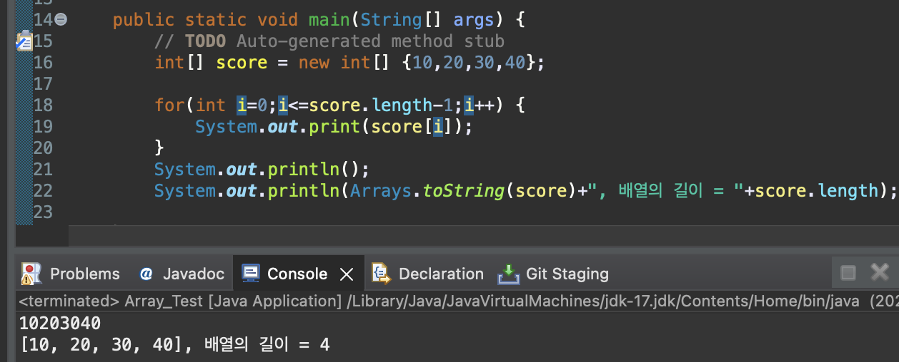
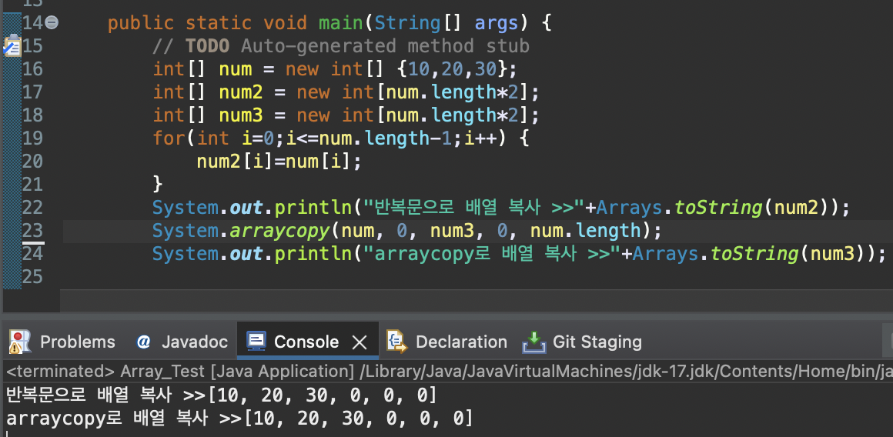
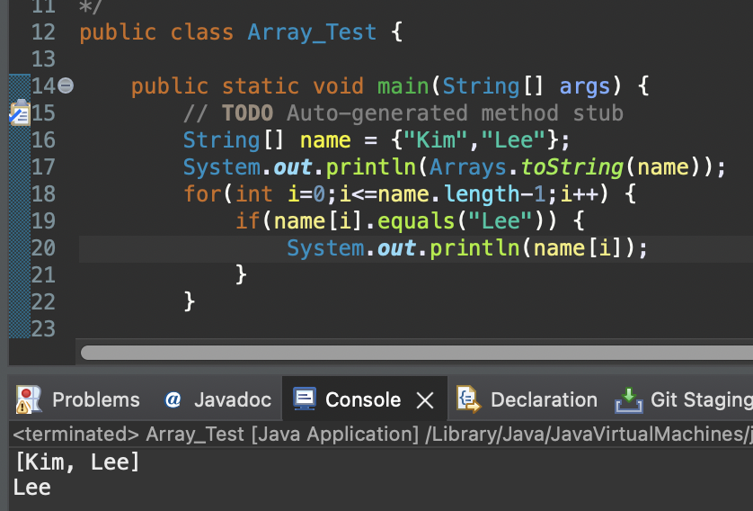
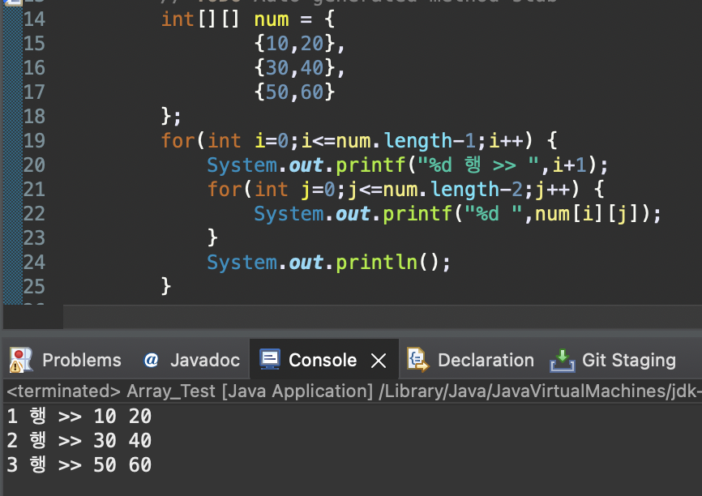

# 2023 11 11

## JAVA 배열
- 같은 타입의 여러 변수를 하나의 묶음으로 만드는것
- index의 범위는 0부터 배열의 길이-1 이다 
- 배열이 num[5]면 범위는 num[0]~num[4]이다
- 배열은 길이가 0도 가능하다

### 배열 선언, 초기화
```
int[] num; // 배열선언
num = new int[3];// int 타입의 값5개를 저장할수있는 배열
int[] score = new int[] {10,20,30,40}; // "{}" 안에 개수에 따라 배열의 길이가 정해진다

String[] name = new String[3];// 선언과 동시에 배열 생성
name[0] = "0번"; name[1] = "1번"; name[2] = "2번"; // 직접 값을 지정해 줄수있다
```
- 배열은 자료형뒤나 변수 뒤에 "[]"를 붙여 선언할 수 있다
- new 자료형을 사용하여 배열의 길이를 정하지만 String은 new String[]을 생략할 수 있다
- 배열을 초기화 하는 방법은 "{}"를 사용하여 원하는 값을 초기화할 수 있다
  


### 배열 길이 출력, 배열 출력

- 배열의 길이는 배열로 선언한 변수명.length로 길이를 알수 있다
- for문에서 length에 -1을 해주는 것은 배열이 0부터 시작하기 때문에 배열의 길이에서 1을 빼준것이다
- 배열의 값 하나를 출력하기 위해서는 배열명[숫자]로 출력이 가능하다
- 배열의 전체를 출력하고 싶다면 반복문으로 배열을 다 돌리거나 Arrays.toString(배열 변수명)으로 출력한다

### 배열 복사


- for문을 사용해 값을 하나씩 넣는방법이 있다
- System.arraycopy를 사용하여 배열을 복사 하는 방법이 있다
- arraycopy의 괄호는 (변수1,변수1의 0부터,변수2,변수2의 0부터,길이)가 들어간다
- 복사후 남는 곳은 자료형의 기본형이 들어간다

### 문자열 배열, 문자열 비교

- 배열을 만드는 것은 똑같으니 new String을 생략할 수 있다
- 변수명.equals를 사용하여 문자열을 비교할 수 있다
- equals는 대소문자를 구분하지만 equalsIgnoreCase는 대소문자를 구분하지 않는다

### 2차원 배열
- 2차원 배열은 행과 열이 있는 표와 비슷하다고 생각하면 편하다
- 배열과 다르게 int[][] 변수명으로 배열을 만든다


- num은 int num = new int[3][2]와 같은 크기이다

| - | 0 | 1 |
|-|-|-|
| 0 | 10 | 20 |
| 1 | 30 | 40 |
| 2 | 50 | 60 |

- 값은 위 표처럼 들어가 있다