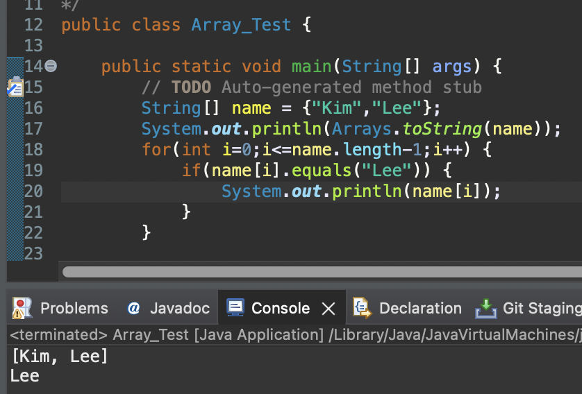
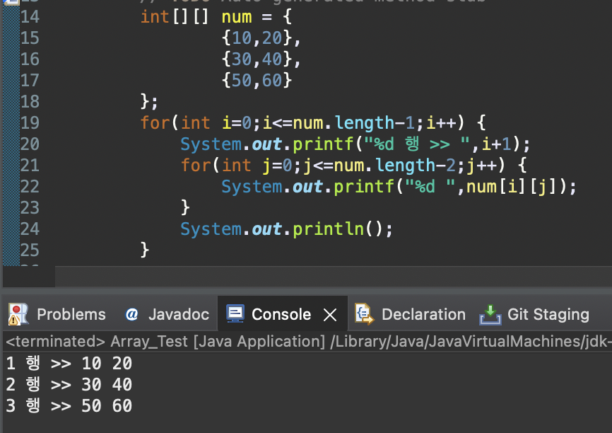

# 2023 11 11

## Javaの配列
- 配列とは同じタイプの複数の変数を一つのオブジェクトにまとめたオブジェクト
- indexの範囲は0から(配列の長さ-1)
- 配列がnum[5]だと、範囲はnum[0]-num[4]になる。
- 配列は長さが0でも可能

### 配列の宣言、初期化

```
int[] num; // 配列の宣言
num = new int[3]; // intタイプの値5つを保存できる配列
int[] sore = new int[] {10, 20, 30, 40} // "{}"の中の数によって長さが決まる。

String[] name = new String[3]; // 宣言と同時に配列生成（初期化）
name[0] = "0番目"; name[1] = "1番目"; name[2] = "2番目"; // 直接値の設定ができる。

```

- 配列はデータータイプの後に"[]"を付けて配列の宣言ができる。
- newを利用し配列の長さを決まるが、String型はnew String[]を省略できる。
- 配列を初期化する方法は"{}"を利用して設定したい値で初期化ができる。


### 配列の長さ出力、配列出力

- 配列の長さは配列として宣言した変数名.lengthで長さがわかる。
- for文の中でlength-1をした理由は配列は0から始まるので、−1をしないとNullPointExceptionエラーがでるため。
- 配列の値1つを出力するためには、配列名[index]で出力が可能。
- 配列の全体の値を出力したい場合、Loop文を使うか、Arrays.toString(配列名)で出力する。

### 配列のコピー


- for文を利用して値を1つずつ入れる方法
- System.arraycopyを利用し、配列をコピーする方法
- arraycopyの括弧は(変数1、変数1の0からの長さ、変数2、変数2の0からの長さ)
- コピー後、データーが割当てないインデックスには配列タイプの基本データーが割り当てる。
    - numberは0、charは''、boolはfalseなど


### 文字列の配列、文字列の比較

- 文字列の配列はStringというデーター型がある。
    - 実はStringは基本データー型ではないが、Javaが基本データー型みたいに使えるよう用意した実は1つのObject
- そのため、String型を宣言する際にはnew String()が要らない。
    - JavaでObjectを宣言するためにはObjectType variable = new ObjectType()のような宣言が必要
- 2つの文字列の比較はequalsで行う。
    - equalsは大文字・小文字を区分するが、equalsIgnoreCaseを使うと、大文字・小文字を問わず文字列の中身だけ比較する。


### 2次元配列
- 2次元配列は行と列がある表として考えたらイメージしやすいかも。
- 配列とは地学、int[ ][ ]のよう、[ ]が2つ付きます。

- 上記添付イメージの14−17行目のnumは int num = new int[3][2]と同じ意味。

```
| - | 0  | 1  |
| - | -  | -  |
| 0 | 10 | 20 |
| 1 | 30 | 40 |
| 2 | 50 | 60 |
```
上記のような値を持つことになる。
