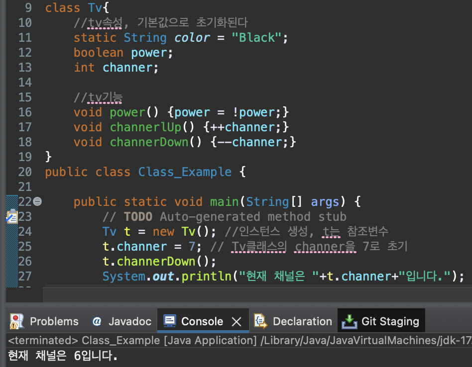

# 2023 11 12

## 클래스
- 클래스는 객체를 정의해 놓은것이다
- 클래스로부터 객체를 만드는 과정을 인스턴스화라고한다
- 객체는 인스턴스라고한다
- 인스턴스는 참초 변수를 통해서만 다를수 있다
- 참조변수의 타입은 인스턴스의 타입과 같아야 한다

### 메서드 사용
- 클래스는 인스턴스를 만들어 사용한다
- 클래스 안에 있는 static변수나 메서드는 인스턴스를 만들지 않고 클래스명을 사용하여 호출할 수 있다
- static메서드는 인스턴스 변수나 메서드를 호출할 수 없다
- 하나의 클래스로 두개의 인스턴스를 만든다면 그건 각각 다른 인스턴스 이다
- 메서드는 반환타입, 메서드이름, 매개변수 선언으로 구성되어있다
    - int Method(int i)
    - 반환은 return으로 반환한다
    - void는 반환할 것이 없을 때 사용한다
  

- Tv라는 클래스를 만들고 인스턴스를 t라고 만든다
- t.channer=7로 Tv클래스에 있는 channer변수값을 지정한다
- t.channerDown()로 Tv클래스에 있는 channerdown()메서드를 호출한다
- 메서드가 실행된 후 channer의 변수값이 변경된걸 볼수있다

  

- Add클래스에 plus는 static으로 만들었기 때문에 인스턴스를 만들지 않아도 호출이 가능하다
- Add를 a라는 이름으로 인흐턴스를 만든후 각각 x,y에 값을 넣어준다
- Add 클래스에 plus메소드가 실행되며(static이 없는 메소드) x+y의 결과가 return 된다
- Add.i=10과 Add.print2()는 static이기 떄문에 인스턴스를 만들지 않아도 클래스 이름으로 사용할 수 있다