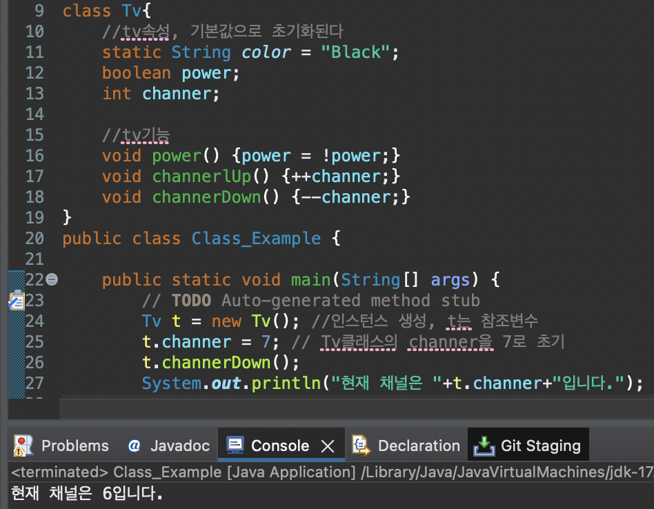
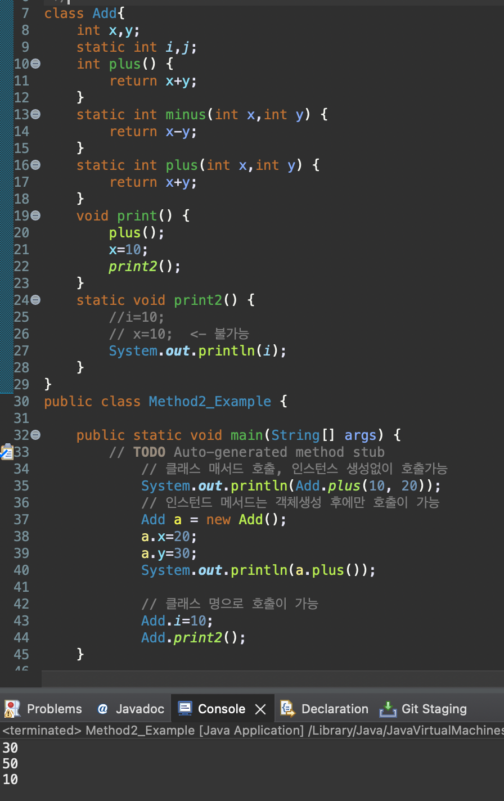

# 2023 11 12

## Class
- クラスはオブジェクトを定義したものです。
- クラスをオブジェクトとして使うために、宣言するのをインスタンス化だと言います。
- インスタンスしたオブジェクトをインスタンスと言います。
- インスタンスは参照変数をとおしてのみ使えます。
- 参照変数のタイプはインスタンスのタイプと同じく宣言する必要があります。

### メソッドの使用方法
- クラスはインスタンスを作って利用する。
- クラスの中にあるstatic変数やメソッドはインスタンスを宣言せず、クラス名を利用して使える。
- staticメソッドはインスタンス変数やメソッドを使えない。
- 1つのクラスで複数のインスタンスを作ると、それは違うインスタンスになる（メモリ的な話）
- メソッドはリターンタイプ、メソッドの名前、引数の宣言が必要
    - int Method(int i)
    - リターンはreturn命令でする。
    - voidはリターンタイプがない場合使う。

- Tvと言うクラスを作成し、それのインスタンスはtとして作る。
- t.channer = 7でTvクラスにあるchanner変数値を指定する。
- t.channerDown()関数でTvクラスにあるchannerDown()メソッドを呼び出す。
- メソッドが実行された後、channerの値が変わったのが確認できる。

- Addクラスのplusはstaticとして宣言したので、インスタンス化をしなくても使えるようになる。
- Addをaとして命名したインスタンスを作った後、xとyに値を付与する。
- Addクラスにplusメソッドが実行され(staticがないメソッド)、x+yの結果がreturnされる。
- Add.i=10とAdd.print2()はstaticなので、インスタンスを生成せず、クラス名で使える。

