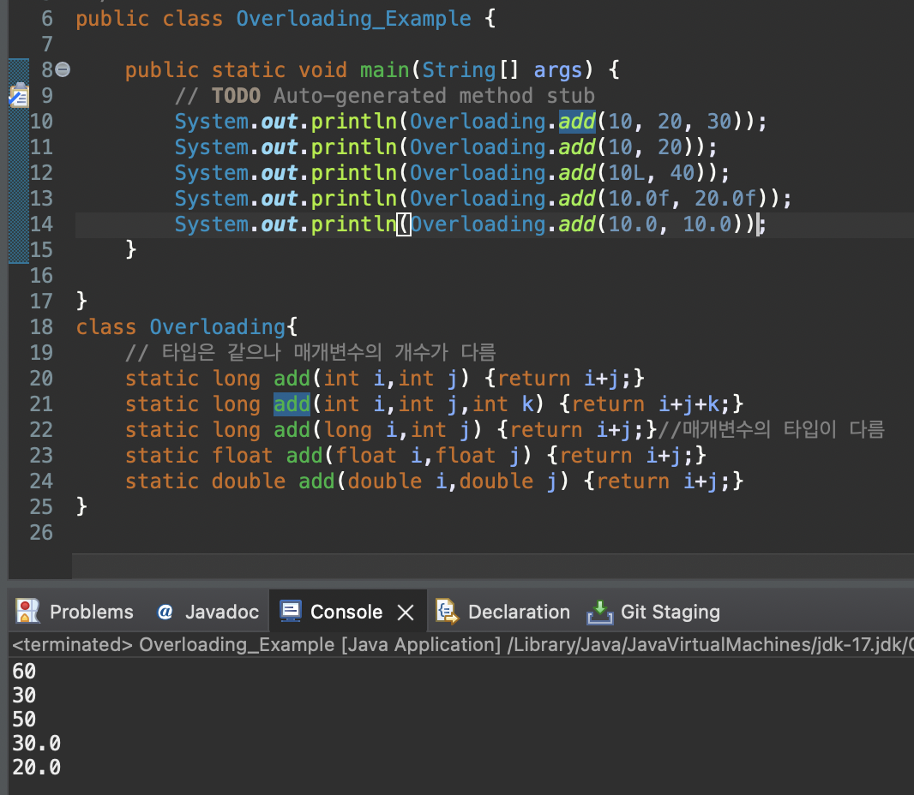

# 2023 11 13

## Overloading
- 한 클래스 내에서 같은 이름의 메서드를 여러가지 선언하는 것을 오버로딩이라고 한다
- 오버로딩은 메서드의 이름이 같아야 하며 매개변수의 개수 또는 타입이 달라야한다

- add메서드의 이름은 모두 같으나 매개변수의 타입, 개수가 다르기 때문에 사용할 때 타입과 값만 맞춰 준다면 해당 타입과 값의 개수가 같은 메서드가 사용된다
- 같은 이름을 사용하기 때문에 해당 메서드가 어떤 기능을 수행하는지 대략 예상할 수 있다