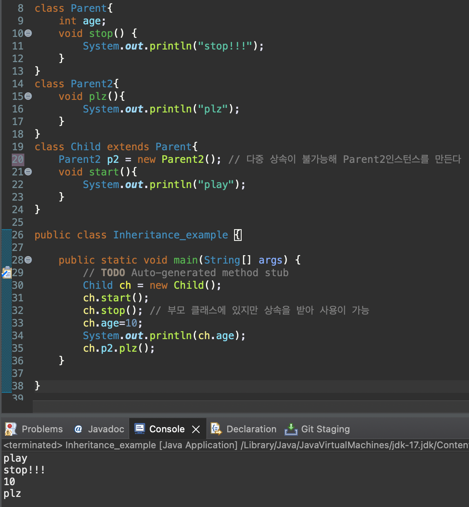

# 2023 11 15

## 상속
- 클래스와 클래스간에 관계
- 기존의 클래스를 재사용하여 새로운 클래스를 작성하는것
- extend를 사용하여 상속을 구현한다
    - ex) class Child extend Parent{}
    - Child가 자식클래스 Parent가 부모클래스이다
- 자식 클래스는 부모클래스의 변수나 메서드를 사용할 수 있으나 부모클래스는 사용할 수 없다

- Child클래스는 Parent클래스를 상속받아 Parent클래스의 변수나 메서드를 사용이 가능하다
- 다중 상속이 안되기 때문에 Parent2는 Child에 인스턴스를 만들어 사용한다
    - 이러면 Parent와 Parent2 클래스의 변수와 메서드를 사용할 수 있다