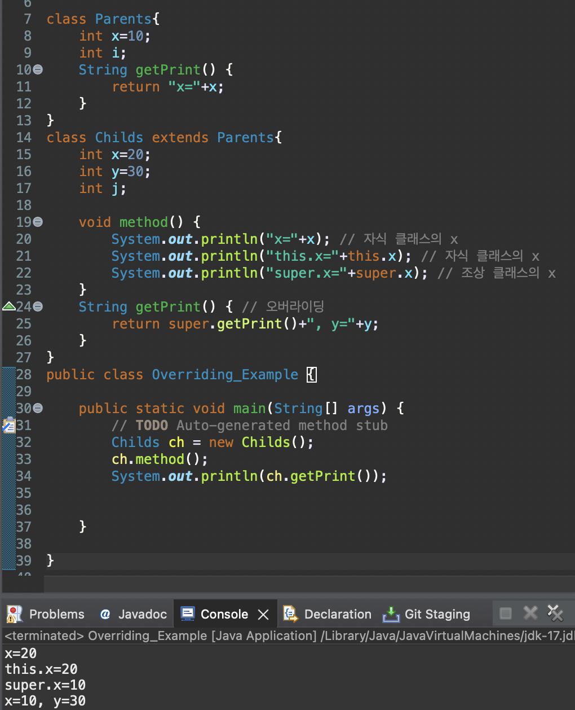
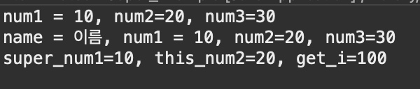

# 2023 11 16

## Overriding
- 조상 클래스로부터 상속 받은 메서드의 내용을 변경하는 것
- 조상 클래스의 메서드와 이름,매개변수,return타입이 같아야 한다

## super, super()
- super는 부모 클래스의 멤버에 접근할 때 사용한다
- super()는 부모 클래스의 생성자를 호출할 때 사용한다


- Childs클래스와 부모 클래스인 Parents는 x라는 변수의 값이 다르다
- Childs클래스의 method에서 x와 this.x의 값은 Childs클래스의 값을 출력한다
    - super.x는 부모 클래스인 parents의 x값을 출력한다
- Parents,Childs클래스는 공통적으로 getPrint메소드가 있지만 return값이 서로 다게 만들어 Childs클래스의 getPrint는 오버라이딩을 한 메서드이다
    - super.getPrint()로 부모클래스의 메서드를 호출해 return값을 가진다
    - Super를 사용하므로서 x의 값이 Childs의 값이 아닌 Parents의 값을 가진다
```

class Super1{
	int num1,num2;
	Super1(int i,int j){
		this.num1=i;
		this.num2=j;
	}
	String prints(){
		return "num1 = "+num1+", num2="+num2;
	}
}
class Super2 extends Super1{
	String name;
	int num3;
	Super2(int i,int j,int k){
		super(i,j); // 부모 생성자 Super1(int i,int j){} 호출
		this.num1=i;
		this.num2=j;
		this.num3=k;
		
	}
	Super2(int i,int j,int k,String name){
		super(i,j);
		this.num1=i;
		this.num2=j;
		this.num3=k;
		this.name = name;
		
	}
	String prints(){ // 오버라이딩
		return "num1 = "+num1+", num2="+num2+", num3="+num3;
	}
	String prints(String name) { // 오버로딩
		return "name = "+name+", num1 = "+num1+", num2="+num2+", num3="+num3;
	}
	String this_super(int i) {
		return "super_num1="+super.num1+", this_num2="+this.num2+", get_i="+i;
	}
}
public class Super_Example {

	public static void main(String[] args) {
		Super2 sp1 = new Super2(10,20,30);
		System.out.println(sp1.prints());
		System.out.println(sp1.prints("이름"));
		System.out.println(sp1.this_super(100));
	}

}

```
출력결과  

- Super2의 생성자에 super(i,j)는 부모 클래스의 생성자를 호출한다
- Super2의 prints()메서드는 부모클래스의 prints()메서드를 오버라이딩 한것이다
- 리턴 타입은 같지만 리턴하는 값이 추가되었다
- prints(String name) 메서드는 매개변수가 추가되었기 때문에 오버라이딩을 한것이 아닌 같은 클래스에 있는 prints()메서드를 오버로딩한 것이다
