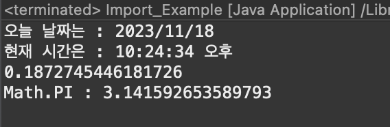
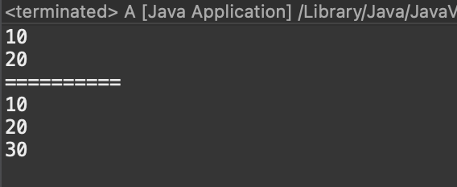

# 2023 11 18

## import
- 다른 패키지에 클래스를 사용하기 위해 사용한다
- static import를 사용하면 클래스 명을 사용할 수 있다
- 사용법
    - import 패키지명.클래스명;
    - import 패키지명.*;
```
package example2;

import static java.lang.System.out;
import static java.lang.Math.*;
import java.text.SimpleDateFormat;
import java.util.Date;

public class Import_Example {

	public static void main(String[] args) {
		// TODO Auto-generated method stub
		Date today = new Date();
		SimpleDateFormat date = new SimpleDateFormat("yyyy/MM/dd");
		SimpleDateFormat time = new SimpleDateFormat("hh:mm:ss a");
		
		System.out.println("오늘 날짜는 : "+date.format(today));
		System.out.println("현재 시간은 : "+time.format(today));
		
		// System.out.println(Math.random());
		out.println(random());
		// System.out.println("Math.PI : "+Math.PI);
		out.println("Math.PI : "+PI);
	}

}
```



- Date와 SimpleDateFormat을 사용하기 위해 import
- System.out.println()을 사용해야 하지만 static import함으로써 out.println()으로 간단히 사용할 수 있다

## 접근 제어자
- public, protect, default, private가 있다
    - public >> 접근 제한이 없다
    - protect >> 같은 패키지 내에서, 다른 패키지의 자손 클래스에서 접근이 가능
    - default >> 같은 패키지 내에서만 접근이 가능
    - private >> 같은 클래스 내에서만 접근이 가능
- 접근 제어자를 지정하지 않으면 default로 지정된다
- 하나의 클래스에는 하나의 public클래스만 있어야 하면 public클래스의 이름은 파일의 이름과 같아야 한다

```
class PublicTest{
	public int a=10;
	protected int b = 20;
	private int c = 30;
	
	public int getC() {
		return c;
	}
	
}
class PrivateTest extends PublicTest{
	int getPrintA() {
		return a;
	}
	int getPrintB() {
		return b;
	}
	int getPrintC() {
		int c = getC();
		return c;
	}
}
public class A {

	public static void main(String[] args) {
		PublicTest pt = new PublicTest();
		out.println(pt.a);
		out.println(pt.b);
		//out.println(pt.c); // private라 불가능
		out.println("==========");
		PrivateTest pt2 = new PrivateTest();
		out.println(pt2.getPrintA());
		out.println(pt2.getPrintB());
		//부모 클래스에서 getter를 만들어서 자식 클래스에서 값을 가져올수 있게 해야한다
		out.println(pt2.getPrintC()); 
	}

}
```


- PrivateTest와 PublicTest는 상속관계이다
- PublicTest에 변수 a,b,c는 각각 public,protected,private로 접근 제어자를 설정했다
- 메인에서 PrivateTest클래스를 pt로 지정
    - a,b,c를 출력하지만 c는 private라 호출할 수 없다
    - a는 public이고 b는 protected라 값을 가져올 수 있다
- PrivateTest를 pt2로 하나를 더만들고 PrivateTest에 있는 메소드를 호출한다
    - a와b는 값을 return 하여 출력할 수 있지만 c는 private라 PublicTest에서 값을 리턴해주는 메소드를 하나 만들어 그 메소드를 호출한 값을 return 받아야 값을 얻을수 있다
