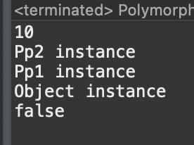
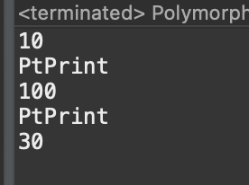

# 2023 11 19

## 다형성
- 부모클래스 타입의 참조변수로 자식클래스의 인스턴스를 참조할 수 있도록 하는것
- 부모타입의 참조변수로 자식타입의 인스턴스를 참조할 수 없다
- 자손타입의 참조변수로 부모타입의 인스턴스를 참조할 수 없다
- 형변환은 타입을 변경하는 것이지 인스턴스를 변경하는 것은 아니다
    - 자식타입->조상타입(Up-casting) << 형변환 생략가능
    - 조상타입->자식타입(Down-casting) << 형변환 생략불가
- instanceof는 왼쪽은 참조변수 오른쪽은 타입으로 조건문에 사용되며 연산결과는 true,false로 반환한다
    - 결과가 true면 형변환이 가능하다
    - 예 >> if(p2_1 instanceof Pp2) {}

### 코드
예1   

```
import static java.lang.System.out;

class Pp1{
	int i;
	boolean j;
	void P1print() {
		out.println("출력");
	}
}
class Pp2 extends Pp1{
	String text;
	void Pprint() {}
}
public class Polymorphism_Example {

	public static void main(String[] args) {
		Pp1 p = new Pp2();
		// p.text; << 불가능
		p.i=10;
		out.println(p.i);
		
		Pp1 pu = null;
		Pp1 pu1 = new Pp1();
		Pp2 p2_1 = new Pp2();
		Pp2 p2_2 = null;
		
		pu = p2_1; // 형변환 생략 가능
		p2_2 = (Pp2)pu; // 형변환 생략 불가능
		
		if(p2_1 instanceof Pp2) {out.println("Pp2 instance");}
		if(p2_1 instanceof Pp1) {out.println("Pp1 instance");}
		if(p2_1 instanceof Object) {out.println("Object instance");} 

		if(pu1 instanceof Pp2) {
			out.println("Pp2 instance");
			}else {
				out.println("false");
			}
	}

}

```

- Pp1 p = new Pp2()로 부모클래스 타입으로 자식클래스의 인스턴스를 참조할 수 있다
    - 자식클래스의 변수는 사용할 수 없다
- 부모클래스인 Pp1이 null이 아니라 인스턴스로 만들었다면 자식클래스로 형변환이 불가능하다
    - null이라면 형변환이 가능하며 형변환이 생략 가능하다
- p2_2 = (Pp2)pu는 자식클래스에 <- 부모클래스이기 때문에 형변환이 생략 불가능 하다
- instanceof로 형변환이 가능한지 확인할 수 있다
    - 가능하다면 true를 반환하여 조건문을 실행하고 false라면 실행하지를 않거나 else문을 실행한다


예2   

```
import static java.lang.System.out;
/*
 메서드의 이름이 같으면 오버라이딩된 메서드가 실행되지만
 변수는 참조변수의 타입에 따라 달라진다
 */
class In{
	int i=10;
	int j=30;
	
	void method() {
		out.println("InPrint");
	}
}
class Pt extends In{
	int i=100;
	
	void method() {
		out.println("PtPrint");
	}
}
public class Polymorphism {

	public static void main(String[] args) {
		In in = new Pt();
		Pt p = new Pt();
		
		out.println(in.i);
		in.method();
		
		out.println(p.i);
		p.method();
		out.println(p.j);
	}

}

```

- 변수의 이름이 같지만 출력 결과가 다르다
    - 변수는 참조변수의 타입에 따라 값이 달라진다
    - 부모 클래스와 자식클래스에 같은 변수가 있다면 참조변수의 타입에 따라 해당 변수의 값이 출력된다
    - 변수의 이름이 다르다면 상관없다
- 메소드의 이름이 같다면 오버라이딩되어 자식클래스의 값이 출력된다
