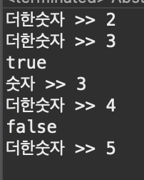

# 2023 11 20

## 추상클래스, 추상메소드
- 미완성 설계도,미완성 메소드를 포함
- 추상클래스로는 인스턴스를 만들수 없다
- 상속을 통해 자식클래스에서만 완성할 수 있다
- abstract class 클래스이름 으로 추상 클래스를 만들수 있다
- 추상메서드는 선언부만 만들어두고 구현부는 작성하지 않고 미완성으로 남겨 둔 것이다
- 메서드의 내용이 상속받는 클래스에 따라 달라질 수 있기 때문에 비워둔다
- 추상메서드는 구현부가 없으므로 "{}"대신 ";"를 사용해 끝낸다
- 상속받는 자식클래스는 오버라이딩을 통해 추상메서드를 모두 구현해줘야 한다
- 하나라도 구현하지 않는다면 자식클래스도 추상클래스로 지정해야한다

### 코드
```
abstract class Abs1{
	boolean btn;
	int num;
	
	Abs1() { 
		btn = false;
		num = 1;
	}
	// 값을 ++
	abstract void plus();
	// 값을 보여줌
	abstract void stop();
	
	void pause() {
		if(btn){
			btn = false;
			out.println(btn);
			plus();
		}else {
			btn = true;
			out.println(btn);
			stop();
		}
	}
}
class Abs2 extends Abs1{
	void plus() {
		this.num = this.num+1;
		out.println("더한숫자 >> "+ this.num);
	}
	void stop() {
		btn=true;
		out.println("숫자 >> "+ this.num);
	}
}
public class Abstract_Example {

	public static void main(String[] args) {
		Abs1 ab = new Abs2();
		ab.plus();
		ab.plus();
		ab.pause();
		ab.plus();
		ab.pause();
	}

}
```

출력결과



- Abs1이라는 추상 클래스를 만들고 plus와 stop메소드를 추상메소드로 만든다
- 추상메소드도 생성자를 만들수 있다
- Abs2를 Abs1을 상속하도록 만들고 Abs1에 추상메소드를 구현해준다
    - 추상메소드는 오버라이딩해 완성한다
- plus메소드를 실행하는 숫자를 1씩 더하고 stop메소드를 실행하면 지금 까지 더한 값을 출력한다