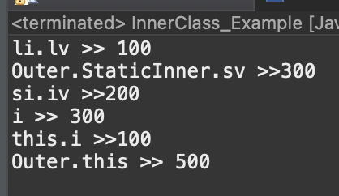

# 2023 11 21

## 내부 클래스
- 클래스 안에 선언된 클래스
- 내부 클래스에서 외부 클래스의 멤버들을 쉽게 접근이 가능하다
- 코드의 복잡성을 줄일수 있다
- 내부 클래스중 스택틱 클래스만 static멤버를 가질수 있다
- final과 static이 같이 붙은 변수는 상수라서 모든 내부 클래스에서 사용이 가능하다
### 코드
```
class Outer{
	private int a=10;
	static int b = 20;
	int iv = 500;
	class InstanceInner{
		int iv = 100;
		
		// 변수명이 같을 때 구별 방법
		void method() {
			int iv = 300;
			out.println("i >> "+iv);
			out.println("this.i >>"+ this.iv);
			out.println("Outer.this >> "+Outer.this.iv);
		}
	}
	static class StaticInner{
		int iv = 200;
		static int cv = 300;
	}
	InstanceInner i = new InstanceInner();
	StaticInner s = new StaticInner();
	
	static void staticMethod() {
		// int sa = a;  <- 외부 클래스의 인스턴스 변수에 접근 불가능
		int sb = b;
		// InstanceInner obj1 = new InstanceInner();  <- static멤버는 인스턴스멤버에 직접 접근 불가능
		StaticInner obj2 = new StaticInner();
		
		// 접근방법
		Outer outer = new Outer();
		InstanceInner obj1 = outer.new InstanceInner();
	}
	void instanceMethod() {
		int ia = a;
		int ib = b;
		
		InstanceInner obj1 = new InstanceInner();
		StaticInner ibj2 = new StaticInner();
		
		// LocalInner l = new LocalInner();  <- 메서드 내에 선언된 내부클래스는 불가능
	}
	void method() {
		int lv = 0;
		final int LV = 0;
		
		class LocalInner{
			int liv = a;
			int liv2 = b;
			
			int liv3 = lv;
			int liv4 = LV;
		}
		LocalInner l = new LocalInner();
	}
}
public class InnerClass_Example {
	public static void main(String[] args) {
		Outer o = new Outer();
		Outer.InstanceInner li = o.new InstanceInner();
		
		out.println("li.lv >> "+li.iv);
		out.println("Outer.StaticInner.sv >>"+Outer.StaticInner.cv);
		
		// static 내부 클래스는 인스턴스를 만들지 않아도 된다
		Outer.StaticInner si = new Outer.StaticInner();
		out.println("si.iv >>"+si.iv);
		
		li.method();
	}
}

```

### 실행결과
   
- Outer클래스안에 InstanceInner, StaticInner인 내부클래스다 있다
    - static 메소드는 외부 클래스의 인스턴스 변수에 접근이 불가능하지만 static이 붙은건 가능하다
    - 인스턴스 클래스에 접근하려면 해당 클래스의 인스턴스를 만들고, 내부 클래스에 인스턴스를 만들어 접근해야 한다
- 메소드 안에 선언된 LocalInner클래스(지역클래스)가 있다
    - 외부 클래스에 인스턴스멤버와 static멤버를 모두 사용이 가능하다
    - 지역클래스가 포함된 메서드에서는 final이 붙은 지역변수만 접근이 가능하다
    - JDK1.8부터는 final이 생략 가능하다
    - 메서드 내에 선언된 지역클래스는 다른 메소드에서 인스턴스를 만들수 없다
- 외부,내부,메서드에 선언된 변수의 이름이 같다면 this를 통해 구분할 수 있다
    - 메서드에 선언된건 그냥 사용하면되지만 내부 클래스에서 선언된 변수는 this를 사용하면된다
    - 내부클래스도 아니고 메서드에 선언된 것이 아니라면 클래스명.this.변수명을 통해 값을 얻을수 있다