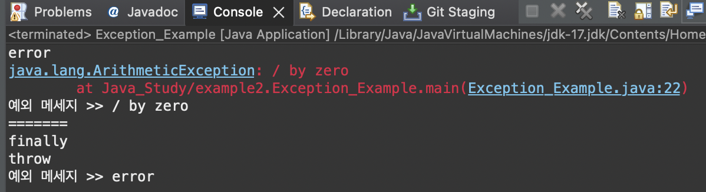

# 2023 11 22

## 예외처리
- 컴파일에러 >>컴파일 시에 발생하는 오류
- 런타임에러 >> 실행 시에 발생되는 에러
- 논리적에러 >> 실행은 되지만, 의도와 다르게 움직이는 것
- Exception과 Error도 Object의 자식클래스이다
- try cat finally를 사용해 오류가 있는지 확인할 수 있다
- printStackTrace는 예외발생시 호출스택에 있던 메서드의 정보와 예외 메시지를 화면에 출력한다
- getMessage는 발생한 예외클래스의 인스턴스에 저장된 메시지를 얻을 수 있다
- throw를 사용하면 고의로 에러를 발생시킬수 있다

### 코드
```
public class Exception_Example{

	public static void main(String[] args){
		int i = 10;
		
		try {	
			if(i/0==1) {
				out.println("ok");
			}
		}catch(ArithmeticException a) {
			out.println("error");
			a.printStackTrace();
			out.println("예외 메세지 >> "+a.getMessage());
			out.println("=======");
			
		}finally {
			out.println("finally");
		}
		try {
			throw new Exception("error");
		}catch(Exception e) {
			out.println("throw");
			out.println("예외 메세지 >> "+e.getMessage());
		}
		
	}

}

```
### 결과

- try문 안에 있는 if문의 조건이 i를 0으로 나누는 것이다
    - 0으로 나눌수 없기 때문에 오류가 발생해 catch문을 실행한다
    - catch문을 실행해 어떤 오류인지 어디서 오류가 났는지 확인할 수 있다
    - finally문은 마지막에 실행이 된다
- throw로 고의로 오류를 만들어 오류를 테스트할 수 있다