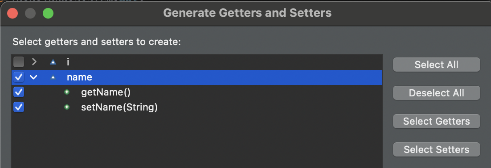
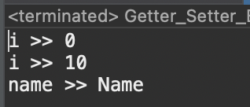

# 2023 11 23

## Getter,Setter
- private에 접근하기 위해 사용된다
- private에 접근하기 위해 메서드로 Getter는 값을 얻어오고 Setter는 값을 저장한다
- 해당 클래스를 인스턴스로 만든후 getter나 setter메서드를 사용해 값을 저장하거나 가져올수 있다


- 변수 우클릭 후 source에서 게터/세터에서 생성가능
- Getter, Setter를 만들 변수를 체크한 후 생성
### 코드
```
class Getter_Setter{
	int i;
	private String name;
	
	public int getI() {
		return i;
	}
	public void setI(int i) {
		this.i = i;
	}
	
	public String getName() {
		return name;
	}
	public void setName(String name) {
		this.name = name;
	}
	
}
public class Getter_Setter_Example {

	public static void main(String[] args) {
		Getter_Setter gs = new Getter_Setter();
		out.println("i >> "+gs.i);
		// out.println("name >> "+gs.name); // <- private라 불가능
		 
		// 값 세팅
		gs.setI(10);
		gs.setName("Name");
		// 값 가져오기
		out.println("i >> "+gs.getI());
		out.println("name >> "+gs.getName());
	}

}

```
### 결과


- i와 달리 name은 private이기 때문에 값을 가져오지 못한다
    - i는 private가 아니므로 가져올수 있다
- getter와 setter메서드로 값을 넣어주고 값을 가져올 수 있다
- getter메서드를 사용하지 않고서는 값을 가져올수 없다