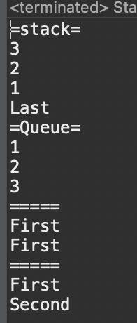

# 2023 11 24

## Stack, Queue
- Stack, Queue
- 스택 >> 마지막에 저장한 데이터를 가장 먼저 꺼내게 되는 구조, FIFO
    - 1,2,3 순으로 들어간다면 나가는건 3,2,1순으로 나간다
- 큐 >> 처음에 저장한 데이터를 가장 먼저 꺼내게 되는 구조, LIFO
    - 1,2,3 순으로 들어간다면 1,2,3순으로 나간다
### 코드
```
public class Stack_Queue_Example {

	public static void main(String[] args) {
		Stack st = new Stack();
		Queue q = new LinkedList();
		
		// Stack
		System.out.println("=stack=");
		// 값 저장
		st.push("1");
		st.push("2");
		st.push("3");			
		// 값을 빼오기
		while(!st.empty()) {// 객체가 비었는지 확인
			System.out.println(st.pop());
		}
		st.push("1");
		st.push("Last");
		System.out.println(st.peek()); // 맨위에 저장된 객체를 꺼냄
		
		// Queue	
		System.out.println("=Queue=");
		// 값 저장, 성공하면 true,실패하면 false 반환
		q.offer("1");
		q.offer("2");
		q.offer("3");
		while(!q.isEmpty()) {
			System.out.println(q.poll()); // 값을 꺼내 반환
		}
		System.out.println("=====");
		// 값 저장
		q.add("First");
		q.add("Second");
		System.out.println(q.peek()); // 삭제 없이 요소를 읽어옴, 비었으면 nul반환
		System.out.println(q.element()); // peek과 달리 큐가 비었을때 오류 발생
		System.out.println("=====");
		while(!q.isEmpty()) {
			System.out.println(q.poll());
		}
	}

}
```
### 결과

- Stack과 Queue를 생성한다
    - Queue는 데이터의 추가/삭제가 쉬운 LinkedList로 구현하는게 더 적합하다
- Stack은 add나 push로 값을 넣을수 있다
    - empty()는 Stack이 비었는지 확인하는 메서드이다
    - poll()은 값을 하나씩 빼오는 메서드이다
    - peek()은 스택의 맨위에 저장된 객체를 반환하지만 값을 꺼내지는 않는다
- Queue는 add나 offer로 값을 넣을수 있다
    - isEmpty()로 Queue가 비었는지 확인할 수 있다
    - peek()로 삭제없이 값을 읽어온다, 비었다면 null을 반환한다
    - element()도 peek()과 비슷하나 비어있으면 오류를 발생시킨다
    - poll()로 값을 빼온다, 비어있으면 null을 반환한다