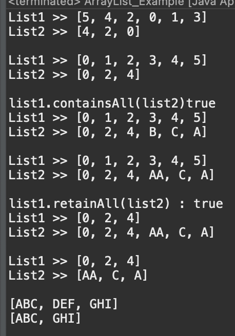

# 2023 11 25

## ArrayList
- 데이터의 저장순서가 유되고 중복을 허용한다
- 리스트의 길이가 가변적이다
- 데이터 사이에 빈 공간을 허용하지 않는다
- ArrayList<type> list = new ArrayList<type>(길이)
## 코드
```
public class ArrayList_Example {

	public static void main(String[] args) {
		ArrayList list1 = new ArrayList(10);
		list1.add(new Integer(5));
		list1.add(new Integer(4));
		list1.add(new Integer(2));
		list1.add(new Integer(0));
		list1.add(new Integer(1));
		list1.add(new Integer(3));
		
		ArrayList list2 = new ArrayList(list1.subList(1, 4));
		print(list1,list2);
		
		Collections.sort(list1);
		Collections.sort(list2);
		print(list1,list2);
		
		out.println("list1.containsAll(list2)"+list1.containsAll(list2));
		
		list2.add("B");
		list2.add("C");
		list2.add("A");
		print(list1,list2);
		
		list2.set(3, "AA");
		print(list1,list2);
		
		out.println("list1.retainAll(list2) : "+list1.retainAll(list2));
		print(list1,list2);
		
		for(int i=list2.size()-1;i>=0;i--) {
			if(list1.contains(list2.get(i)))
				list2.remove(i);
		}
		print(list1,list2);
		
		ArrayList<String> list3 = new ArrayList<String>();
		list3.add("ABC");
		list3.add("DEF");
		list3.add("GHI");
		out.println(list3);
		list3.remove(1);
		out.println(list3);
	}
	static void print(ArrayList list1, ArrayList list2) {
		out.println("List1 >> "+list1);
		out.println("List2 >> "+list2);
		out.println();
	}
}

```
## 결과

- list1에 정수형 값을 넣고 list2에 subList(1,4)로 list1에 [1]~[3]까지의 값을 넣어준다
- Collections.sort로 list1,list2를 정렬시킨다
- contatinsAll로 list2의 값이 list1에 있는지 확인한다
    - 모두 포함하고 있어서 true를 반환한다, 그게 아니라면 false를 반환
    - 그후 list2에 각각 A,B,C,라는 값을 저장한다
    - list2.set(3,"AA")로 3번째의 값을 "AA"로 변경한다, 0부터 시작이기때문에 4번째 값이 변경된다
- list1.retainAll(list2)로 list1에 값과 list2의 값이 같은것을 제외한 나머지를 삭제한다
    - list1의 값만 삭제된고 retainAll에 의해 변화가 있으므로 true를 반환한다
- for문을 사용해 list1과 list2의 값이 같은것이 있는지 확인한다
    - 같은게 있다면 list2의 값을 제거한다
    - list1은 제거되지 않는다
    - 제거후 list2는 list1에 공통적인 값이 없고 다른 값만 있다


- list3은 String의 ArrayList를 만들고 값을 넣는것과 삭제한후의 ArrayList이다
    - remove(1)로 값을 제거해 "DEF"가 삭제된다