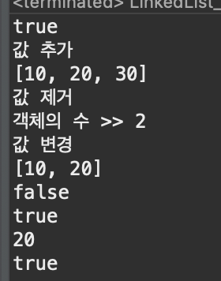

# 2023 11 26

## LinkedList
- LinkedList는 각각의 노드를 연결하는 방식을 사용
- 추가나 삭제를 하면 노드를 다시 연결하면 된다
- 순차적으로 데이터를 추가/삭제 -> ArrayList가 더 빠르다
- 비순차적으로 데이터를 추가/삭제 -> LinkedList가 더 빠르다
- 접근시간 -> ArrayList가 더 빠르다
- LinkedList<type> name = new LinkedList<type>으로 만들수 있다

### 코드
```
public class LinkedList_Example {

	public static void main(String[] args) {
		LinkedList l = new LinkedList();
		
		out.println(l.isEmpty());
		out.println("값 추가");
		l.add(10);
		l.add(20);
		l.add(30);
		out.println(l);
		
		out.println("값 제거");
		l.remove(1);
		
		out.println("객체의 수 >> "+l.size());
		
		out.println("값 변경");
		l.set(1, 20);
		out.println(l);

		out.println(l.isEmpty());

		if(l.contains(10)) {
			out.println(l.contains(10));
		}

		out.println(l.get(1));
		// 값전체 제거
		l.clear();
		out.println(l.isEmpty());
	}
}

```
### 결과

- LinkedList를 l로 만든다
- isEmpty()로 LinkedList가 비었는지 확인한다
    - 비었으면 true를 반환하고 값이 있으면 false를 반환한다
- add()로 값을 추가한후 LinkedList를 출력한다
- remove(index번호)로 값을 제거한다
    - 0부터 시작하기 때문에 두번쨰인 20이 제거된다
- size()로 값이 몇개있는지 확인할수 있다
    - 값이 두개있으므로 2가 출력된다
- set(index번호,변경값)로 값을 변경한다
    - set(1,20)으로 30이었던 값이 20으로 변경된다
- contains(10)으로 LinkedList에 10이라는 값이 있는지 확인한다
    - 값이 있다면 true를 반환하고 없다면 false가 반환된다
- get(index번호)로 값을 가져온다
    - 0은 10이있고 1은 20이있기 떄문에 20을 가져온다
- clear()로 값을 전부 제거한다
    - remove()는 하나씩제거하지만 clear()는 전부 제거된다
    - 그후 isEmpty()로 비었는지 확인하면 값이 없어 비었기 때문에 true를 반환환다