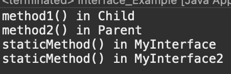

# 2023 11 30

## Interface
- 추상메소드와 상수만을 멤버로 가질수 있다
- 모든 멤버변수는 public static final 이어야하며 생략이 가능하다
- 모든 메서드느 public abstract 이어야하며 생략이 가능하다
- 인터페이스는 인터페이스로만 상속이 가능하며 다중상속이 가능하다
- 상속은 extends를 사용하지만 인터페이스는 implements를 사용한다
- 장점
    - 개발시간을 단축할수 있다
	- 표준화가 가능하다
	- 서로 관계없는 클래스들에게 관계를 맺어 줄 수 있다
	- 독립적인 프로그래밍이 가능하다

### 코드
```
public class Interface_Example {

	public static void main(String[] args) {
		Chd1 c = new Chd1();
		c.method1();
		c.method2();
		MyInterface1.staticMethod();
		MyInterface2.staticMethod();
	}

}
class Chd1 extends Prt1 implements MyInterface1,MyInterface2{
	public void method1() { // 오버라이딩
		out.println("method1() in Child");
	}
}
class Prt1{
	public void method2() {
		out.println("method2() in Parent");
	}
}
interface MyInterface1{
	default void method1() {out.println("method1() in MyInterface");}
	default void method2() {out.println("method2() in MyInterface");}
	static void staticMethod() {out.println("staticMethod() in MyInterface");}
}
interface MyInterface2{
	default void method1() {out.println("method1() in MyInterface2");}
	static void staticMethod() {out.println("staticMethod() in MyInterface2");}
}
```
### 결과

Ch1 Prt1
- Ch1의 메소드 method1()을 호출하면 MyInterface1의 method1()을 오버라이딩한 Ch1 class에 메소드가 실행된다
- c.method2()는 Prt1을 상속받으므로 Prt1의 method2()가 실행된다
- MyInterface1과 MyInterface2의 static메소드는 인스턴스를 만들지 않고도 호출이 가능하다