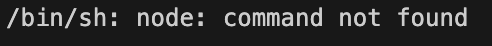
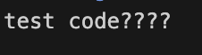
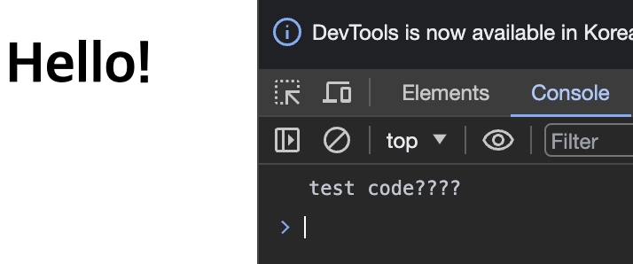

# 2023 12 20

## vscode, javascript 실행
### nodejs설치
- https://nodejs.org/en 에서 다운


### error

- 해당 오류가 뜬다면 js가 제대로 설치 되었는지 확인해본다
- nodejs가 설치되지 않는다면 오류가 발생함

### 실행 테스트
```
    <script type="text/javascript" src="../js/test.js"></script>
```
- html파일에 해당 태그를 사용해 js파일을 사용할수 있게 해준다



```
console.log("test code????");
```

- vscode code-runner에서 제대로 나오는지 확인한다


- html에서 console을 확인한다

### vscode 확장프로그램
- Code Runner
- Live Server