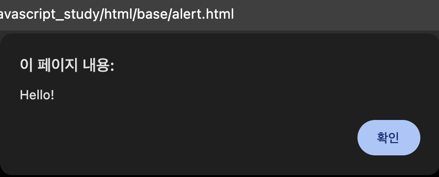
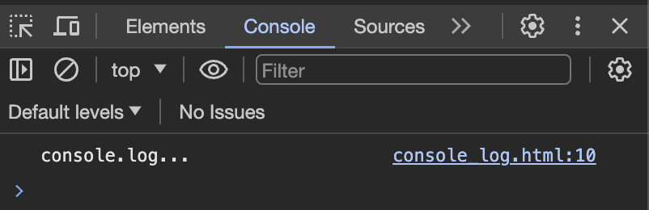
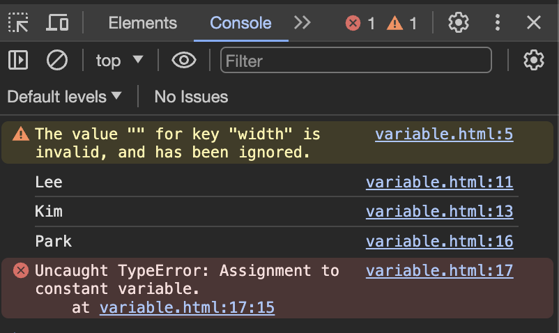
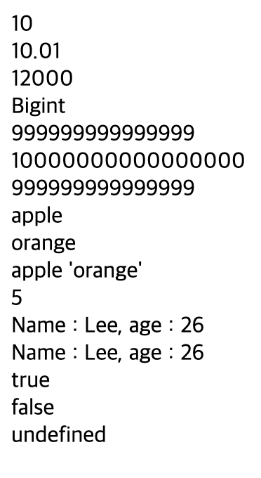
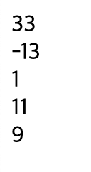
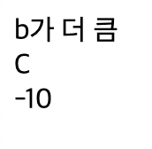
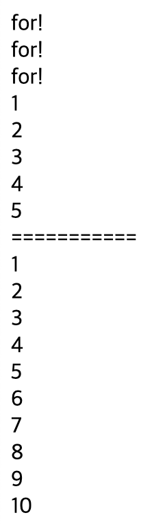

# 2023 12 27

## javascript

### 데이터 출력
```
<p id="show"></p>
    <script>
        document.getElementById("show").innerHTML = "Hello";
    </script>
```

- p태그의 id인 show를 getElementById로 지정후 innerHTML로 Hello를 출력한다
```
alert("Hello!");
```

- alert를 사용해 브라우저에 알림창을 출력한다
```
console.log("console.log...");
```

- console.log를 사용해 콘솔창에 데이터를 출력하는데 사용한다
- 브라우저에 개발자모드에서 콘솔창에서 확인할수 있다
### 변수 선언
```
let name = "Lee";
console.log(name);
name = "Kim";
console.log(name);
        
const names = "Park";
console.log(names);
names = "Hong";
console.log(names);
```

- var,let,const가 있다
- const는 상수로 변수의 값을 변경할수 없다
- const의 값을 변경시 오류가 뜨며 콘솔에서 확인할수 있다

### 데이터형
```
  let a = 10;
        let b = 10.01;
        let c = 12e3;
        document.write(a+"<br>");
        document.write(b+"<br>");
        document.write(c+"<br>");

        let aa = 999999999999999;
        let aaa = 9999999999999999;
        let aaaa = 999999999999999n;
        document.write("Bigint<br>");
        document.write(aa+"<br>");
        document.write(aaa+"<br>");
        document.write(aaaa+"<br>");

        let text1 = "apple";
        let text2 = "orange";
        let text3 = "apple \'orange\'";
        document.write(text1+"<br>");
        document.write(text2+"<br>");
        document.write(text3+"<br>");
        document.write(text1.length+"<br>");
        let name = "Lee";
        let age = 26;
        let myText1 = "Name : " + name + ", age : " + age;
        let myText2 = `Name : ${name}, age : ${age}`;
        document.write(myText1+"<br>");
        document.write(myText2+"<br>");

        let x = 10>4;
        let y = 10>30;
        document.write(x+"<br>");
        document.write(y+"<br>");

        let noData;
        document.write(noData+"<br>");
```

- 데이터형의 숫자데이터는 정수와 부동소수점 숫자가 사용된다
    - Bigint 자바스크립트는 15자리까지 나타낼수 있고 그이상은 Bigint를 사용해야한다
    - Bigint 숫자 뒤에 n을 붙이면 된다
-  문자열 큰따옴표나 작은 따옴표를 사용하면 된다, length를 사용하면 문자열의 길이를 알수 있다
    - 문자열안에 따옴표를 사용하려면 \를 사용하면 된다
    - +를 사용해 문자열 끼리 연결할수 있다
    - `을 사용하여 ${변수이름}으로 사용이 가능하다
- 변수의 값이 10>20 이런식의 조건이 있다면 변수는 true 또는 false을 변수의 저장한다
- 변수 선언시 값을 주지 않는다면 undefined이라는 값을 가지게 된다

### 산술연산
```
let a = 10;
let b = 23;
let add,minus,r,c,d;
add = a+b;
minus = a-b;
r = a%3;
document.write(add+"<br>");
document.write(minus+"<br>");
document.write(r+"<br>");
a++;
document.write(a+"<br>");
a--;
a--;
document.write(a+"<br>");
```

- 산술연산자
    - +는 덧셈 , 문자열 연결도 가능
    - -는 뺼셈, * = 곱셈, / = 나눗셈, % = 나머지, ** = 거듭제곱, ++ = 1증가, -- = 1감소
- 비교연산자
    - == : 값이 같은지 확인
    - === : 값과 데이터 형이 같은지 확인
    - != : 같지 않다면 true, 다르다면 false
    - !== : 값과 데이터형이 다르면 true 다르면 false
- 논리연사자
    - && = AND
    - || = OR
    - ! = NOT

### 조건문
```
let a = 10;
let b = 20;
    if(a>b){
        document.write("a가 더 큼<br>");
    }else{
        document.write("b가 더 큼<br>");
    }
    let score = 75;
    if(score>90){
        grade = "A";
    }else if(score>=80){
        grade = "B";
    }else if(score>=70){
        grade = "C";
    }else if(score>=70){
        grade = "D";
    }else{
        grade = "F";
    }
    document.write(grade+"<br>");

    let num1 = 10;
    let num2 = 20;
    let op = "-";
    switch(op){
        case "+":
            rs = num1+num2;
            document.write(rs);
            break;
        case "-":
            rs = num1-num2;
            document.write(rs);
            break;
        default:
            document.write("error");
            break;
    }
```

- if문은 괄호안에 조건이 맞으면 괄호안에 내용을 실행을한다
    - else문이있다면 조건이 맞지않을때 else문을 실행한다
    - if~else if로 여러개의 조건을 줄수 있다
- switch문은 괄호안에 값과 맞는걸 case에서 찾아 해당 case문을 실행하며 모든 조건에 부합하지 않는다면 default문을 실행한다
    - break로 해당 조건문을 끝낸다
### 반복문
```
for(let i=1;i<=3;i++){
        document.write("for!<br>");
    }
    let i=1;
    while(i<=5){
        document.write(i+"<br>");
        i++;
    }
    i=1;
    document.write("===========<br>");
    do{
        document.write(i+"<br>");
        i++;
    }while(i<=10)
```

- 반복문 for은 조건에 맞다면 계속 반복하는것이다
    - for(시작;조건;증가)
    - 조건이 맞지 않다면 반복을 끝낸다
- while은 괄호안 조건이 맞다면 계속 반복한다
    - break문으로 반복문을 끝낼수 있다
    - do while은 do안에 작성된 코드는 무조건 한번은 실행이 되고 그이후 while처럼 작동한다