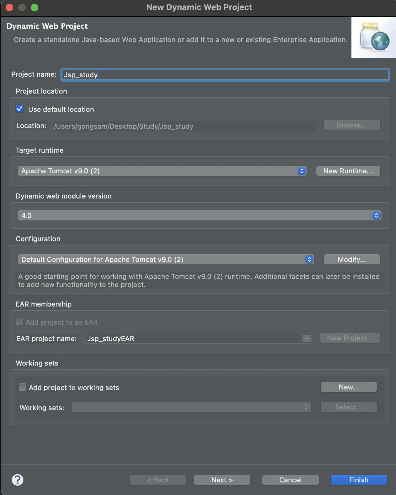
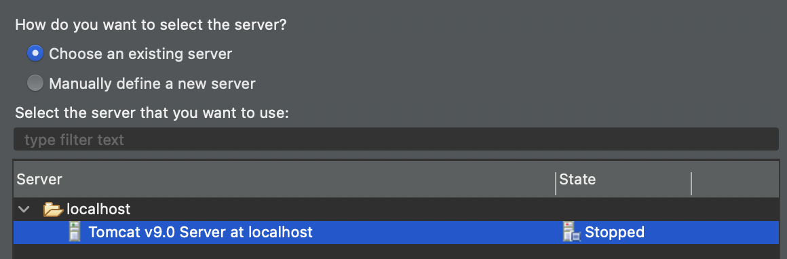
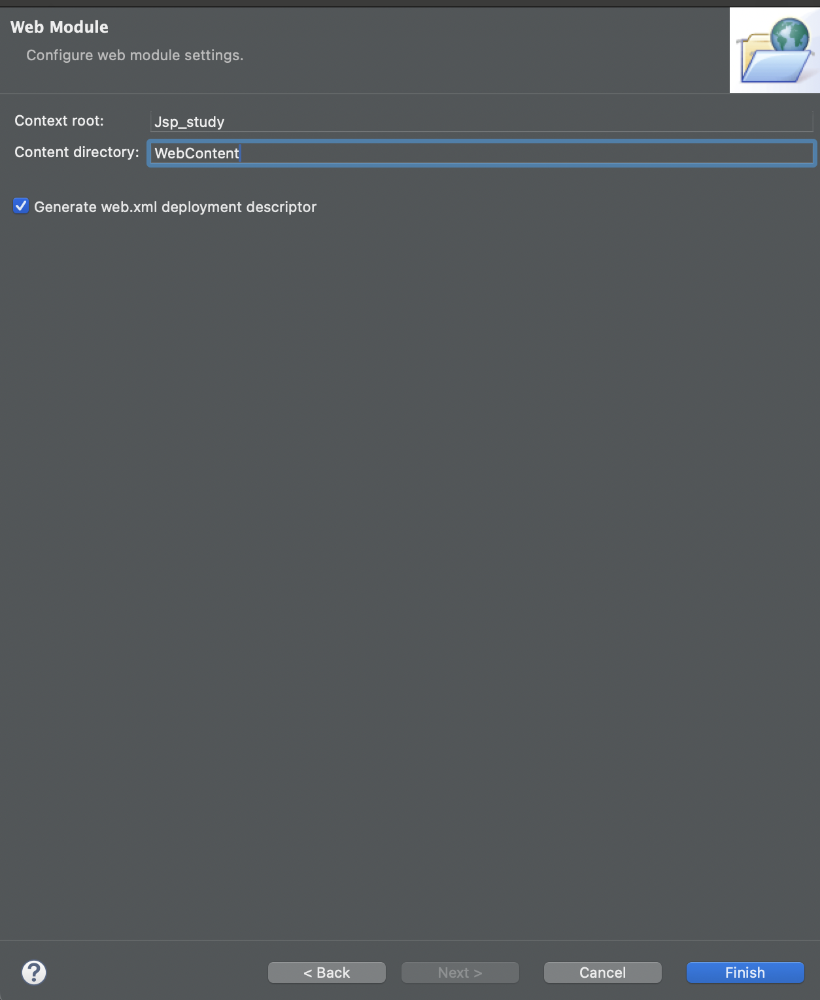
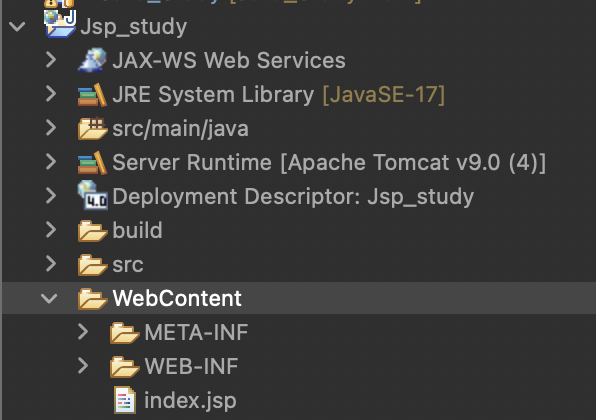
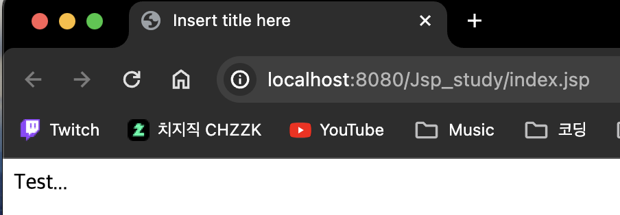

# 2023 12 25

## JSP파일생성, 실행

### 파일생성

- project->Dynamic Web Project로 프로젝트를 생성한다

- 자신이 받은 톰캣의 버전을 설정한다
- [아파치 톰캣](https://tomcat.apache.org/)
- [톰캣 호환 확인](https://tomcat.apache.org/whichversion.html)

- content directory이름을 변경한다

- 제대로 프로젝트가 만들어 지면 위와같은 구조가 나온다
### 실행
  
- WebContent 폴더에 index.jsp라는 파일을 생성
- jsp파일이 생성되며 간단한 글 작성
- 해당 파일 우클릭후 Run As를 눌러 실행
- localhost로 실행되는걸 확인