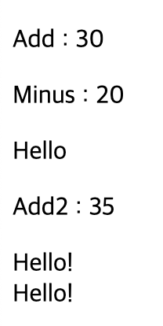
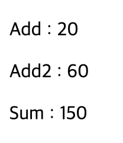

# 2024 01 05

## 함수
- 한번 정의해두면 재사용이 가능하다
- alert, write등도 함수이다

### 예제1
```
   <p id="Add"></p>
    <p id="Minus"></p>
    <p id="Hello"></p>
    <p id ="Add2"></p>
    <p id ="Minus2"></p>
    <script>
        hello();
        hello();
        function hello(){
            document.write("Hello!<br>");
        }

        let addResult;
        addResult = add(10,20);
        document.getElementById("Add").innerHTML = "Add : " + addResult;
        function add(a,b){
            result = a+b;
            return result;
        }

        // 익명함수
        let minus = function(a,b){return a-b};
        let minusResult = minus(30,10);
        document.getElementById("Minus").innerHTML = "Minus : " + minusResult;

        // 자기호출 익명함수
        (function(){
            document.getElementById("Hello").innerHTML = "Hello";
        })();   
        // 화살표 함수
        let z = (x,y) => x+y;
        document.getElementById("Add2").innerHTML = "Add2 : " + z(10,25);

    </script>
```
   

- hello()함수는 hello를 화면에 출력하는 함수이다
    - 두번 호출했기 때문에 화면에 두번 출력된다
- add()함수는 두 값을 더하는 함수이다
    - addResult에 함수 add를 호출해 add함수에 return 값을 저장한다
    - add(10,20)으로 add함수에 a와 b에는 10과 20이 들어가 return시킨다
- minus()는 익명함수로 함수이름이 없는 함수이다
    - minus변수에 값을 빼는 형태의 함수를 저장
    - minusResult에 minus변수명으로 함수를 호출한다
        - 익명함수도 함수이기 때문이다
- (function(){...})();의 형태는 자기호출 익명 함수이다
    - 함수의 정의와 동시에 호출이 동시에 일어나 실행이 된다
    - 함수를 변수에 저장하거나 함수를 호출하지 않아도 자기 자신을 호출하여 실행된다
- "=>"기호를 사용한 변수 z는 화살표 함수로 function,return,"{}"대신 "=>"기호를 사용한다
- 함수는 호출이 정의보다 먼저 있으면 안되지만 javascript는 허용한다
    - 맨 처음 hello()함수가 호출이 먼저된고 정의가 된다
    - 익명함수는 불가능하다
    - 함수를 먼저 정의하고 호출하는것이 바람직하다

### 예제2
```
    <p id="Add"></p>
    <p id="Add2"></p>
    <p id="Sum"></p>
    <script>
        function add(a,b=10){return a+b;}
        document.getElementById("Add").innerHTML = "Add : " + add(10);
        document.getElementById("Add2").innerHTML = "Add2 : " + add(10,50);

        function sum(...num){
            let sum = 0;
            for(let score of num){
                sum += score;
            }
            return sum;
        }
        let sumResult = sum(10,20,30,40,50);
        document.getElementById("Sum").innerHTML = "Sum : " + sumResult;
    </script>
```
   
- 함수 add는 a,b=10으로 값을 받는다
    - a,b를 호출할때 값을 넣을수 있지만 b를 생략하고 a만 넣을수 있다
    - b를 생략시 기본값으로 b에 10이 들어간 상태로 계산된다
- sum함수는 ...num으로 되어있는데 이를 나머지 매개변수라고 한다
    - 매개변수의 수를 무한대로 설정할 수 있다
    - for문은 for of문으로 배열이나 문자열 같이 반복가능한 데이터형의 요소를 읽을때 사용한다
    - 데이터를 하나씩 순차적으로 반복해서 읽어오며 그 값은 변수에 저장된다
        - num을 하나씩 읽어와 score에 저장된다
    - 5개의 값이 모두 더해진 값이 sum에 저장되고 sum을 return해 그 값을 sumResult에 저장한다