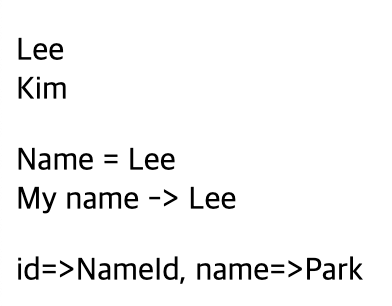

# 2024 01 06

## 객체
- 프로퍼티와 메서드의 집합
    - 프로퍼티는 변수와 같은 개념
    - 메서드는 함수와 거이 동일

### 예제
```
 <p id="show1"></p>
    <p id="show2"></p>
    <p id="show3"></p>
    <p id="show4"></p>
    <p id="show5"></p>
    <p id="show6"></p>
    <script>
        const member = {
            id : "Lww",
            name : "Lee",
            age : 27
        };
        let text;
        text = member.id + " " + member.name + " " + member.age;
        document.getElementById("show1").innerHTML = text;
        document.getElementById("show2").innerHTML = member["id"] + " " + member["name"] + " " + member["age"];

        let text2="";
        for (x in member){
            text2 += member[x] + "<br>";
        }
        document.getElementById("show3").innerHTML = text2;
        let text3="";
        member.email = "email@test";
        for (x in member){
            text3 += member[x] + "<br>";
        }
        document.getElementById("show4").innerHTML = text3;

        let text4="";
        delete member.email;
        for (x in member){
            text4 += member[x] + "<br>";
        }
        document.getElementById("show5").innerHTML = text4;

        const obj={
            id:"ID",
            pw:"PW",
            obj2:{
                name:"Name",
                age:"age"
            }
        };
        document.getElementById("show6").innerHTML = obj.id + " " + obj.obj2.name + " " + obj.obj2.age;
    </script>
```
   
- 객체 member를 생성
    - id에는 Lww, name에는 Lee, age에는 27이 키와 값으로 구성되있다
- text에는 member객체에 값을 넣어준다
    - member에 "."을 붙여 사용한다
    - member.key값
    - member.key값 대신 member["key"]로도 사용할수 있다
- text2는 for in 을 사용하여 값을 출력한다
    - for in에 x는 member에 key값이 되며 id,name,age가 해당되며 for in을 사용해 x의 값이 member에 key값으로 변경되어 값을 가져올수 있다
- text3도 for in을 사용하여 출력하지만 member.email로 프로퍼티를 추가한것이다
    - "객체명.프로퍼티명 = 값"으로 프로퍼티를 추가할수 있다
- text4는 text3처럼 추가한것이 아닌 제거한것이다
    - "delete 삭제할객체.프로퍼티"로 사용된다
- obj객체는 중첩객체로 obj안에 obj2라는 객체가 있는 구조이다
    - 값을 가져오는 방법은 객체명.중첩객체명.key로 가져올수 있다

## 메서드
- 객체에 소속된 함수이다
- 함수명:function(){}으로 객체 안에 만들수 있다

### 에제
```
<p id="show1"></p>
    <p id="show2"></p>
    
    <script>
        const show={
            name : "Name",
            age : "age",
            intro:function(){
                return "Name = "+this.name+", Age:"+this.age;
            }
        };
        document.getElementById("show1").innerHTML=show.intro();

        show.getAge = function(){
            return "Name = "+this.age;
        }
        document.getElementById("show2").innerHTML=show.getName();
    </script>
```
     
- show라는 객체안에 name,age와 intro라는 함수가 있다
    - intro함수는 이름과 나이에 대한것을 return시켜준다
    - 객체안에있는 함수는 객체명.함수명()으로 호출이 가능하다
- show.getName은 메서드를 추가한것이다
    - age를 return해주는 메서드 이다
    - return문에 "Name = "+this.age로 나이를 가져올수 있다

## 프로토타입
- 모든 자바스크립트 객체는 프로토타입 객체로부터 프로퍼티와 메서드를 상속받는다
- 프로토타입 객체를 프로토타입으로 부른다
### 예제
```
<p id="show1"></p>
    <p id="show2"></p>
    <p id="show3"></p>
    <script>
        function Member(name,age){
            this.name = name;
            this.age = age;
            this.getName = function(){
                return "My name -> "+this.name;
            }
        }
        const mem1 = new Member("Lee",27);
        const mem2 = new Member("Kim",26);

        let text="";
        text += mem1.name+"<br>";
        text += mem2.name+"<br>";
        document.getElementById("show1").innerHTML=text;

        document.getElementById("show2").innerHTML = "Name = " + mem1.name + "<br>" + mem1.getName();
        
        // Member.id="NameId";
        Member.prototype.id = "NameId";
        Member.prototype.getId = function(){
            return "Id => "+this.id;
        }
        const mem3 = new Member("Park",25);
        document.getElementById("show3").innerHTML = "id=>"+mem3.id + ", name=>"+mem3.name;
    </script>
```
    
- Member라는 생성자 함수를 만든다
    - getName은 메서드이다
- mem1과 mem2는 생성자 함수 Member를 호출하여 mem1과 mem2객체를 생성한다
- 태그의 id가 show2인 태그에는 mem1의 name을 출력하고 getName으로 또 이름을 출력한다
    - mem1.name은 이름을 출력하지만 mem1.getName은 생성자에 함수를 실행해 return 값을 출력한다
- 프로토타입에는 이전과 같이 프로퍼티를 추가할수 없다
    - 자바스크립트 객체는 프로토타입으로부터 프로퍼티와 메서드를 상속받기에 Member.prototype으로 프로퍼티와 메서드를 상속받는다
    - id라는 프로퍼티를 추가하였고 getId라는 메서드를 추가시켰다

## 클래스
- 객체를 생성하기 위한 틀이다
- 자바스크립트 ES6버전부터 클래스를 지원한다

### 예제
```
   <p id="show1"></p>
    <p id="show2"></p>
    <script>
        class Member{
            constructor(name,age){
                this.name = name;
                this.age = age;
            }
            getAge(){
                return "Age => "+ this.age;
            }
        }
        const mem1 = new Member("Lee",25);
        document.getElementById("show1").innerHTML = "Name=> "+mem1.name + ", "+mem1.getAge();

        class Id extends Member{
            constructor(name,age,id){
                super(name,age);
                this.id = id;
            }
            getid(){
                return "Id=> "+this.id;
            }
            static getCountry(){
                return "Korea";
            }
        }
        const mem2 = new Id("Kim",20,"Id_Kim")
        document.getElementById("show2").innerHTML = "Name=> "+mem2.name + ", "+mem2.getAge() + "," + mem2.getid()+"<br>"+Id.getCountry();

    </script>
```
   
- Member라는 클래스를 만든다
    - constructor()는 연산자에 의해 자동호출되며 객체의 기본상태를 설정한다
    - getAge()는 클래스 메서드이다
- mem1은 new연산자를 사용해 객체를 생성하며 constructor로 인해 name과 age에 값이 설정된다
    - 프로퍼티와 메서드는 "."을 사용하여 접근이 가능하다
- Id라는 클래스는 Member클래스를 상속받는다
    - super()는 부모클래스에 constructor()를 호출한다
    - 자식 클래스는 id가 추가되었다
    - static getCountry는 정적메서드로 객체로 호출하는것이 아닌 클래스에서 호출해 사용한다
        - 정적 메서드를 사용할때는 static을 붙여 사용한다