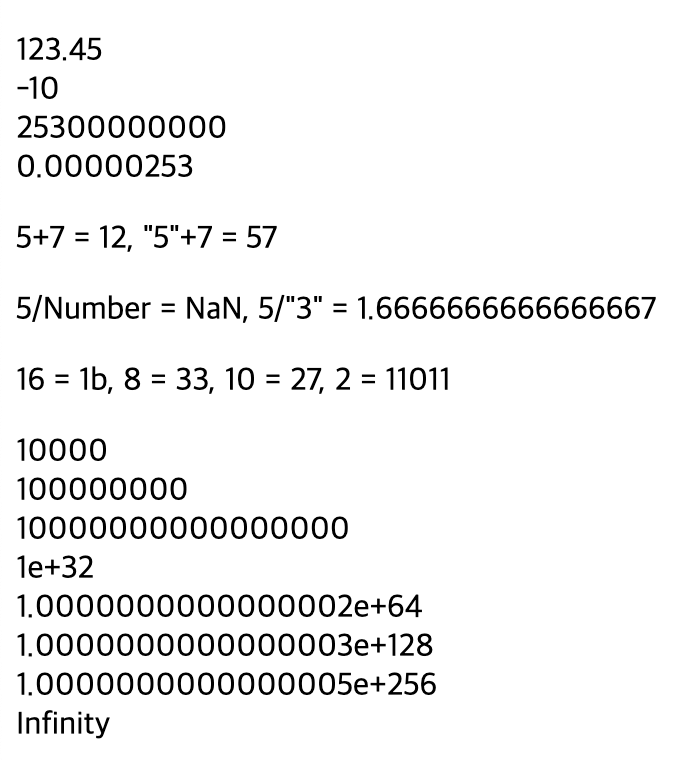
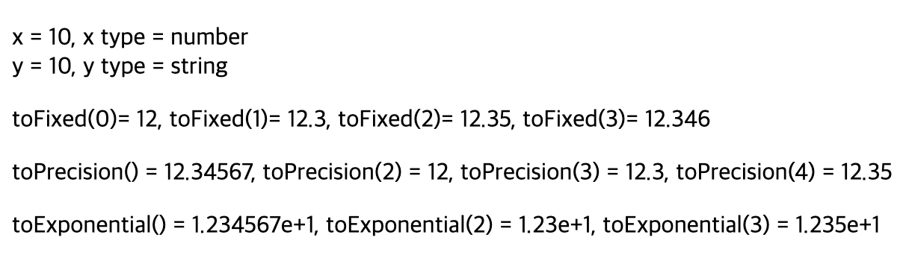
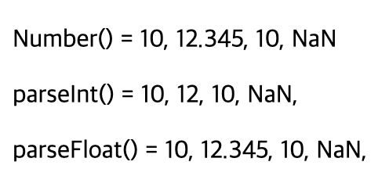
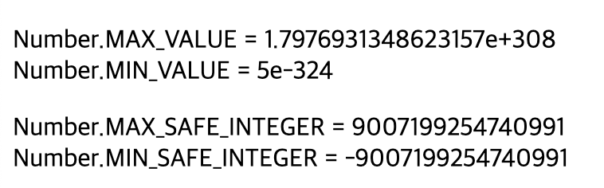

# 2024 01 07

## NUMBER
- 다른 언어와 달리 자바스크립트에서 숫자는 64비트에 부동 소수점으로 저장된다
- 아주큰 정수는 BigInt를 사용한다
    - Bigint 자바스크립트는 15자리까지 나타낼수 있고 그이상은 Bigint를 사용해야한다
    - Bigint 숫자 뒤에 n을 붙이면 된다

### 예제
```
    <p id="num1"></p>
    <p id="num2"></p>
    <p id="num3"></p>
    <p id="num4"></p>
    <p id="num5"></p>

    <script>
        let a = 123.45;
        let b = -10;
        let c = 253e8;
        let d = 253e-8;

        let txt="";
        txt += a + "<br>";
        txt += b + "<br>";
        txt += c + "<br>";
        txt += d;
        document.getElementById("num1").innerHTML = txt;

        let i = 5;
        let j = "5";
        let k = 7;
        document.getElementById("num2").innerHTML = "5+7 = "+ (i+k) + ", \"5\"+7 = " + (j+k);

        let na1 = 5;
        let na2 = "Number";
        let na3 = "3";
        let rs1 = na1/na2;
        let rs2 = na1/na3;
        document.getElementById("num3").innerHTML = "5/Number = " + rs1 + ", 5/\"3\" = " + rs2;

        let ch = 27;
        document.getElementById("num4").innerHTML = "16 = " + ch.toString(16) + ", 8 = " + ch.toString(8) + ", 10 = " + ch.toString(10) + ", 2 = " + ch.toString(2);

        let x = 100;
        let txt2 = "";
        while(x != Infinity){
            x = Math.pow(x,2);
            txt2 += x+"<br>";
        }
        document.getElementById("num5").innerHTML = txt2;   
    </script>
```
   
- 자바스크립트에서는 부동소수점과 정수가 주로 사용된다
    - 매우큰수와 매우작은수는 지수를 사용하기도 한다 
    - 메모리에 저장될때 64비트 부동 소수점으로 저장된다
- i,j,k는 숫자와 문자열로 되어있다
    - 숫자끼리는 문제없이 계산이 되지만 숫자와 문자는 문자열이 숫자와 더해지지 않고 문자열 뒤에 숫자가 붙여서 계산된다
- na1은 숫자이고 na2,na3는 문자열이다
    - 숫자와 문자열간 나눗샘이 불가능하지만 문자열이 숫자라면 가능하다
    - 문자열이 숫자면 문자가 숫자로 변환되어 연산이 가능하다
    - 문자열이 숫자가 아닐경우에는 숫자로 변환이 되지 않아 NaN이라는 결과가 나오게된다
        - 계산결과를 isNaN(변수명)으로 해당 변수가 NaN인지 확인할수 있다
        - 결과는 true,false로 반환된다
- toString()으로 진수변환을 할수 있다
    - 괄호안에 2,8,10,16을 넣음으로써 원하는 진수로 변환할수 있다
- Infinity는 무한대의 수를 표현하기 위해 사용한다
    - while문은 해당 변수가 자바스크립트가 표현할수 있는 숫자보다 커질때까지 수를 제곱시킨것이다
    - Math.pow(x,2)는 x의 값을 제곱시킨것이다
        - Math.pow(변수명,거듭제곱수)
    - 어떤 수를 0으로 나눌때도 Infinity가 발생한다
    - 음수는 -Infinity로 출력된다

### Number메서드 에제
```
    <p id="num1"></p>
    <p id="num2"></p>
    <p id="num3"></p>
    <p id="num4"></p>

    <script>
        let x = 10;
        let y = x.toString();
        document.getElementById("num1").innerHTML = "x = "+ x +", x type = " + typeof(x) + "<br>" + "y = "+ y + ", y type = " + typeof(y);

        let z = 12.34567;
        document.getElementById("num2").innerHTML = "toFixed(0)= " + z.toFixed(0) + ", toFixed(1)= " + z.toFixed(1) + ", toFixed(2)= " + z.toFixed(2) + ", toFixed(3)= " + z.toFixed(3);

        document.getElementById("num3").innerHTML = "toPrecision() = " + z.toPrecision() + ", toPrecision(2) = " + z.toPrecision(2) + ", toPrecision(3) = " + z.toPrecision(3) + ", toPrecision(4) = " + z.toPrecision(4);

        document.getElementById("num4").innerHTML = "toExponential() = " + z.toExponential() + ", toExponential(2) = " + z.toExponential(2) + ", toExponential(3) = " + z.toExponential(3);
    </script>
```

- 숫자에 toString()을 사용하면 문자열로 변환된다
    - typrof()로 해당 변수에 타입을 알수 있다
- toFixed()메서드로 부동소수점에 대해 소수점 자릿수를 구하는데 사용한다
    - 괄호 안에 숫자만큼에 소수점 자릿수를 구한다
    - 12.34567에 toFixed(2)를 하면 소수점 두번째 자리까지표현되지만 소수점 세번째 숫자가 반올림되어 12.34가 아닌 12.35가 된다
- toPrecision()은 toFixed()메서드와 마찬가리로 부동소수점 자릿수를 구하는데 사용한다
    - 표시되는 전체숫자의 개수를 이용하여 자릿수를 구한다
- toExponential()은 지수 표기로 반올림된 문자열을 반환한다

### 숫자변환 예제
```
    <p id="num1"></p>
    <p id="num2"></p>
    <p id="num3"></p>
    <script>
        let a = "10";
        let b = "12.345";
        let c = "  10";
        let d = "orange";
        let text1 = "";
        text1 += Number(a) + ", ";
        text1 += Number(b) + ", ";
        text1 += Number(c) + ", ";
        text1 += Number(d);
        document.getElementById("num1").innerHTML = "Number() = " + text1;

        let text2 = "";
        text2 += parseInt(a) + ", ";
        text2 += parseInt(b) + ", ";
        text2 += parseInt(c) + ", ";
        text2 += parseInt(d) + ", ";
        document.getElementById("num2").innerHTML = "parseInt() = " + text2;

        let text3 = "";
        text3 += parseFloat(a) + ", ";
        text3 += parseFloat(b) + ", ";
        text3 += parseFloat(c) + ", ";
        text3 += parseFloat(d) + ", ";
        document.getElementById("num3").innerHTML = "parseFloat() = " + text3;
    </script>
```

- Number()는 데이터의 값을 숫자로 변환시킨다
    - 숫자형태의 문자열은 변환하는데 문제없지만 문자열안에 0~9 숫자가 아닌경우에는 NaN을 반환한다
- ParseInt()는 변수나 데이터를 정수로 반환시킨다
    - 0~9 숫자가 아닌경우는 NaN을 반환한다
    - 소수점이있는 숫자는 소수점이 사라진다
- parseFloat()는 ParseInt()와 비슷하지만 부동 소수점 숫자로 변환시킨다

### Number프로퍼티 예제
```
<p id="num1"></p>
    <p id="num2"></p>

    <script>
        let x = Number.MAX_VALUE;
        let y = Number.MIN_VALUE;
        document.getElementById("num1").innerHTML = "Number.MAX_VALUE = " + x + "<br>Number.MIN_VALUE = " + y; 

        let z = Number.MAX_SAFE_INTEGER;
        let k = Number.MIN_SAFE_INTEGER;
        document.getElementById("num2").innerHTML = "Number.MAX_SAFE_INTEGER = " + z + "<br>Number.MIN_SAFE_INTEGER = " + k;
    </script>
```

- Number객체에 MAX_VALUE와 MIN_VALUE은 자바스크립트에서 표현 가능한 가장 큰수와 가장 작은수를 나타낸다
    - MAX_VALUE와 MIN_VALUE를 조건문에 사용하여 자바스크립트에서 표현 가능한 숫자인지 확인할수 있다
- MAX_SAFE_INTEGER와 MIN_SAFE_INTEGER은 자바스크립트에서 안전하게 표현가능한 정수를 의미한다