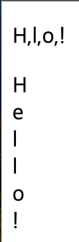
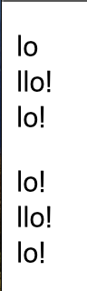
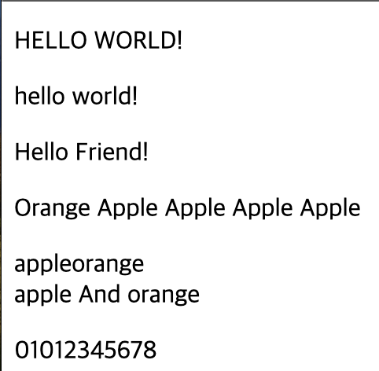
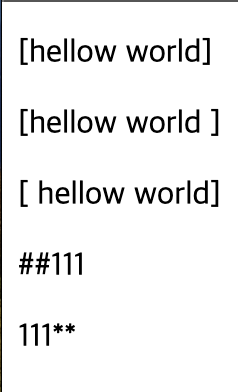
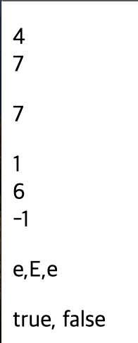

# 2024 01 08
## 문자열
### 특정 문자읽기 예제
```
    <p id="string1"></p>
    <p id="string2"></p>
    <script>
        let str = "Hello!";
        let txt1 = "";
        txt1 += str[0]+",";
        txt1 += str[3]+",";
        txt1 += str[4]+",";
        txt1 += str[5];
        document.getElementById("string1").innerHTML = txt1;

        let txt2 = "";
        for(let i = 0;i<str.length;i++){
            txt2 += str[i] + "<br>";
        }
        document.getElementById("string2").innerHTML = txt2;
    </script>
```
    
- 문자열의 인덱스는 0부터 시작한다
    - Hello!의 0번은 H이고 3은 l, 4번째는 o이다
- Hello!의 문자열 길이는 6이다
    - for문을 사용하여 문자를 읽어올수 있다

### 문자열 추출 예제
```
    <p id="string1"></p>
    <p id="string2"></p>

    <script>
        let str1 = "Hello!";
        let txt1 = "";
        txt1 += str1.slice(3,5) + "<br>";
        txt1 += str1.slice(2) + "<br>";
        txt1 += str1.slice(-3);
        document.getElementById("string1").innerHTML = txt1;

        let txt2 = "";
        txt2 += str1.substr(3,5) +  "<br>";
        txt2 += str1.substr(2) + "<br>";
        txt2 += str1.substr(-3);
        document.getElementById("string2").innerHTML = txt2;
    </script>
```
    
- slice()는 문자 시작 위치와 끝위치를 기준으로 문자열을 추출한다
    - 인덱스 시작부터 끝-1까지 문자열을 추출한다
    - Hello!의 slice(3,5)는 인덱스 3부터 4까지의 문자열을 추출한다
    - slice(2)는 인덱스 2부터 끝까지 출력한다
    - slice(-3)은 문자열 끝에서 3개의 문자열을 출력한다
- substr()는 시작위치와 추출하는 개수를 지정한다
    - substr(3,5)는 인덱스 3부터 5개의 문자열을 출력한다
    - substr(2)는 인덱스 2부터 끝까지 문자열을 출력한다
    - substr(-3)은 끝에서 세개의 문자열을 출력한다

### 문자열 변환
```
    <p id="string1"></p>
    <p id="string2"></p>
    <p id="string3"></p>
    <p id="string4"></p>
    <p id="string5"></p>
    <p id="string6"></p>

    <script>
        let text = "Hello World!";
        document.getElementById("string1").innerHTML = text.toUpperCase();

        document.getElementById("string2").innerHTML = text.toLowerCase();

        let str1 = text.replace("World","Friend");
        document.getElementById("string3").innerHTML = str1;

        let text2 = "Orange orange orange orange orange";
        document.getElementById("string4").innerHTML = text2.replaceAll("orange","Apple");

        let text3 = "apple";
        let text4 = "orange";
        let str2 = "";
        str2 += text3.concat(text4) + "<br>";
        str2 += text3.concat(" And ",text4);
        document.getElementById("string5").innerHTML = str2;

        let phone = "010-1234-5678";
        let phoneNum = phone.split("-");
        document.getElementById("string6").innerHTML = phoneNum[0] + phoneNum[1] + phoneNum[2];
    </script>
```
   
- toUpperCase()는 문자열의 영문 소문자를 대문자로 변경시켜준다
- tpLowerCase()는 문자열의 영문 대문자를 소문자로 만들어준다
- replace()는 특정 문자열을 바꾸는것이다
    - World라는 문자열이 있으면 Friend로 변경시킨다
    - 첫번째로 매치되는 문자열만 변경시킨다
- replaceAll()메서드는 replace()와 같이 문자열을 변경시킨다
    - 첫번쨰만이 아닌 모든 일치하는 문자열을 모두 변경시킨다
- contact()메서드는 문자열을 병합시킨다
    - 변수명1.contact("추가할문자",변수명2)을 실행하면 변수명1과 변수명2사이에 문자가 추가된 상태로 병합된다
- split()메서드는 문자열을 분리시킨다
    - "-"라는 문자를 기준으로 문자열을 분리시킨다

### 공백삭제,문자열패딩 에제
```
    <p id="string1"></p>
    <p id="string2"></p>
    <p id="string3"></p>
    <p id="string4"></p>
    <p id="string5"></p>

    <script>
        let str1 = "    hellow world    ";
        let txt1 = str1.trim();
        document.getElementById("string1").innerHTML = "[" + txt1 + "]";

        let txt2 = str1.trimStart();
        document.getElementById("string2").innerHTML = "[" + txt2 + "]";

        let txt3 = str1.trimEnd();
        document.getElementById("string3").innerHTML = "[" + txt3 + "]";

        let str2 = "111";
        let txt4 = str2.padStart(5,"#");
        document.getElementById("string4").innerHTML = txt4;

        let txt5 = str2.padEnd(5,"*");
        document.getElementById("string5").innerHTML = txt5;
    </script>
```
   
- trim()은 문자열의 양끝쪽에 공백을 제거시킨다
- trimStart()는 문자열의 앞쪽 공백만을 제거시킨다
- trimEnd()는 문자열의 맨끝 공백만을 제거한다
- padStart()는 문자열의 앞을 특정문자로 채운다
    - padStart(5,"#")는 길이가 문자열의 길이가 5가될때까지 문자열의 앞을 #으로 채운다
- padEnd()는 문자열의 맨끝을 특정문자로 채운다
    - padStart와 사용법은 다르지 않지만 앞이 아닌 뒤에 특정 문자열을 채운다

### 문자열 검색 예제
```
    <p id="string1"></p>
    <p id="string2"></p>
    <p id="string3"></p>
    <p id="string4"></p>
    <p id="string5"></p>

    <script>
        let str1 = "Hello world";
        let txt1 = "";
        txt1 += str1.indexOf("o")+"<br>";
        txt1 += str1.indexOf("o",5);
        document.getElementById("string1").innerHTML = txt1;

        document.getElementById("string2").innerHTML = str1.lastIndexOf("o");

        txt2 = "";
        txt2 += str1.search("e")+"<br>";
        txt2 += str1.search("w")+"<br>";
        txt2 += str1.search("Test");
        document.getElementById("string3").innerHTML = txt2;

        let str2 = "Hello TEST Code";
        let arr = str2.match(/e/gi);
        document.getElementById("string4").innerHTML = arr;

        let rs1 = str2.includes("TEST");
        let rs2 = str2.includes("World");
        document.getElementById("string5").innerHTML = rs1 + ", " + rs2;
    </script>
```
   
- indexof()는 특정 문자가 있는지를 확인하고 해당 인덱스를 반환한다
    - indexOf("찾을문자",시작위치)로 검색 시작위치를 지정하면 그 시작위치에서부터 가장 첫번째에있는 문자를 찾고 인덱스를 반환한다
    - 찾는 문자가 없다면 -1을 반환한다
- lastIndexOf()는 특정 문자가 있는 마지막을 반환한다
    - 찾는 문자가 문자열에 여러개 있을때 가장 마지막에 있는 문자에 인덱스를 반환한다
- search()메서드는 해당 문자가 처음 발생하는 위치를 반환한다
    - 없다면 -1을 반환한다
- match()메서드는 정규표현식으로 표현된 특정 문자열이 존재하는지 검사하고 그결과를 배열로 반환한다
    - /e/gi는 문자 'e'를 대소문자 구분하지 않고 찾는다
- includes()메서드는 문자열에 특정문자가 있는지 확인한다
    - 존재한다면 true를 반환하고 존재하지 않는다면 false를 반환한다