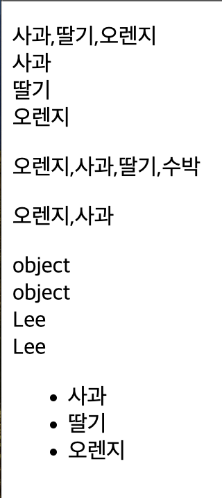
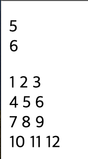

# 2024 01 10

## 정규 표현식
- 문자열에서 특정 문자열을 검색하거나 치환할때 사용
- /검색옵션/플래그;로 옵션을 사용해 특정 문자열을 검색한다
- id,pw,email등의 특정 조건이 필요한 문자열을 확인할때 사용할수도 있다

### 정규표현식 예제1
```
    <p id="reg1"></p>
    <p id="reg2"></p>

    <script>
        let str1 = "Hello Apple";
        let patten1 = /Apple/;
        let rs1 = str1.replace(patten1,"orange");
        document.getElementById("reg1").innerHTML = rs1;

        let str2 = "Orange Banana orange banana ORANGE BANANA";
        let patten2 = /orange/ig;
        let rs2 = str2.replace(patten2,"APPLE");
        document.getElementById("reg2").innerHTML = rs2;
    </script>
```
   
- /Apple/은 Apple이라는 문자열이 있는지를 검색하는것이다
    - replace(patten1,"orange")는 patten1에 맞는 조건이 있다면 첫번째로 조건에 맞는 문자열을 orange로 변경시킨다
- patten2에는 patten1과 달리 ig가 추가로 생겼다
    - i는 영문 대소문자를 구분하지 않고 검색한다
    - g는 문자열 내의 모든 패턴에 대해 검색한다
    - ig는 영문 대소문자를 구분하지 않고 문자열 내의 모든 패턴에 대해 검색한다
    - orange라는 문자를 모두 APPLE로 변경시킨다

### 정규표현식 예제2
```
<p id="reg1"></p>
    <p id="reg2"></p>
    <p id="reg3"></p>
    <p id="reg4"></p>
    <p id="reg5"></p>
    <p id="reg6"></p>
    <p id="reg7"></p>
    <p id="reg8"></p>
    <p id="reg9"></p>
    <p id="reg10"></p>
    <p id="reg11"></p>
    <p id="reg12"></p>

    <script>
        let str1 = "cat cut dog orange apple";
        let patten1 = /c.t/g;
        let rs1 = str1.match(patten1);
        document.getElementById("reg1").innerHTML = rs1;

        let str2 = "Discord loading:25%...";
        let patten2 = /\w/g;
        let rs2 = str2.match(patten2);
        document.getElementById("reg2").innerHTML = rs2;
        let patten3 = /\W/g;
        let rs3 = str2.match(patten3);
        document.getElementById("reg3").innerHTML = rs3;

        let str3 = "Phone Number 010-1234-5678";
        let patten4 = /\d/g;
        let rs4 = str3.match(patten4);
        document.getElementById("reg4").innerHTML = rs4;
        let patten5 = /\D/g;
        let rs5 = str3.match(patten5);
        document.getElementById("reg5").innerHTML = rs5;

        let str4 = "Hello Friend!";
        let patten6 = /\s/g;
        let rs6 = str4.replace(patten6,"_");
        document.getElementById("reg6").innerHTML = rs6;
        let patten7 = /\S/g;
        let rs7 = str4.replace(patten7,"#");
        document.getElementById("reg8").innerHTML = rs7;

        let str5 = "Hello orange, Friend apple";
        let patten8 = /\bHello/g;
        let patten9 = /e\b/g;
        let rs8 = str5.replace(patten8,"#");
        let rs9 = str5.replace(patten9,"#");
        document.getElementById("reg9").innerHTML = rs8;
        document.getElementById("reg10").innerHTML = rs9;

        let str6 = "Hello apple, Hello orange, Hello!";
        let patten10 = /\Bll/g;
        let patten11 = /e\B/g;
        let rs10 = str6.replace(patten10,"_");
        let rs11 = str6.replace(patten11,"_");
        document.getElementById("reg11").innerHTML = rs10;
        document.getElementById("reg12").innerHTML = rs11;
    </script>
```
   
- /c.t/g는 c로 시작해 t로 끝나는 모든 문자열을 검색한다
    - 대소문자는 구분하지 않고 .은 문자 하나를 의미한다
    - c로 시작해 t로 끝나는 세글자의 대소문자를 구분하지 않는다
- /\w/g는 영문자, 숫자,"_"에 해당되는 문자를 검색한다
    - /\W/g는 /\w/g와 반대이다
- /\d/g는 숫자 0~9에 해당되는 문자를 검색한다
    - /\D/g는 숫자 0~9가 아닌 문자를 검색한다
- /\s/g는 공백을 검색한다
    - replace로 공백을 "_"로 변경시킨다
    - /\S/g는 공백이 아닌문자를 검색한다
    - replace로 공백을 제외한 문자를 "#"으로 변경시킨다
- /\bHello/g는 Hello로 시작하는 문자를 검색한다
    - replace로 Hello를 #으로 변경시킨다
    - /e\b/g는 단어e로 끝나는 문자를 검색한다
    - replace로 e를 #으로 변경시킨다
- /\Bll/g는 \b와는 반대이다
    - ll로 시작하지 않는 문자를 변경시킨다
    - Hello는 ll로 시작하지 않기 때문에 replace로 "_"로 변경되어 He_o로 변경된다
    - /e\B/g는 e가 단어의 끝이 아닐때 매치된다
    - orange는 e가 마지막에 끝나기 때문에 변화가 없고 Hello는 e로 끝나지 않기 때문에 replace로 "_"로 변경된다
### 정규표현식 예제3
```
    <p id="reg1"></p>
    <p id="reg2"></p>
    <p id="reg3"></p>
    <p id="reg4"></p>
    <p id="reg5"></p>
    <p id="reg6"></p>
    <p id="reg7"></p>
    <p id="reg8"></p>

    <script>
        let str1 = "wooooow! woooooo?";
        let pat1 = /o+/g;
        let rs1 = str1.match(pat1);
        document.getElementById("reg1").innerHTML = rs1;

        let str2 = "rrrrs, wwwwwoooo";
        let pat2 = /wo*/g;
        let rs2 = str2.match(pat2);
        document.getElementById("reg2").innerHTML = rs2;    
        
        let str3 = "Ah okay! aahh, ahhhhh!";
        let pat3 = /ah?/g;
        let rs3 = str3.match(pat3);
        document.getElementById("reg3").innerHTML = rs3;

        let str4 = "1 12 123 1234";
        let pat4 = /\d{3}/g;
        let rs4 = str4.match(pat4);
        document.getElementById("reg4").innerHTML = rs4;

        let str5 = "hello hello llow";
        let pat5 = /^he/g;
        let rs5 = str5.replace(pat5,"HE");
        document.getElementById("reg5").innerHTML = rs5;
        let pat6 = /ow$/g;
        let rs6 = str5.replace(pat6,"OW");
        document.getElementById("reg6").innerHTML = rs6;

        let str6 = "his cat her cat your cat";
        let pat7 = /cat(?= your)/g;
        let rs7 = str6.replace(pat7,"CAT");
        document.getElementById("reg7").innerHTML = rs7;

        let pat8 = /cat(?! your)/g;
        let rs8 = str6.replace(pat8,"CAT");
        document.getElementById("reg8").innerHTML = rs8;
    </script>
```
  
- pat1의 +는 영문자o가 최소 한번이상 반복되는 경우 매치된다
- pat2의 /wo*/g는 *앞에 문자가 0번또는1번 이상 반복되는 경우 매치된다
    - o가 0번또는 1번 이상 반복되는 패턴과 매치된다
- pat3의 /ah?g는 ?앞에 문자가 0번 또는 1번 반복되는 경우 매치된다
    - h가 여러개이지만 ah만 결과로 나오게된다, h를 모두 얻으려면 *를 사용하면된다
- /\d{3}/g는 "{}"안에 문자가 3번 반복되는 패턴과 일치한다
    - \d는 0~9에 해당하는 문자를 검색하고 {3}은 문자열이 숫자로 세개가 있으면된다
    - 1,12는 3개가 아니기에 나오지않고 123,1234가 이에 해당된다
    - {3}이기 때문에 1234는 123만 나오게 된다
    - 123456이라면 123 456 이렇게 두개로 나온다
    - {3,}로도 1234를 얻을수 있다
        - 3자리 이상인 숫자인 문자열을 뽑아낸다
    - {3,5}로 사용하면 숫자인문자열이 3~5자리인 문자열을 얻을수 있다
- /^he/g는 문자열에 가장 처음에 있는 he를 replace로 HE로 변경시킨다
- /ow$/g는 "^"와 반대로 마장 마지막에 있는 ow를 replace로 OW로 변경시킨다
- /cat(?= your)/g는 cat다음에 오는 문자가 괄호안에 조건에 맞다면 replace로 cat을 변경시킨다
- /cat(?! your)/g는 "(?=)"와는 반대로 cat다음에 your이 오지 않는 문자에 cat을 replace로 변경시킨다

### 정규표현식 예제4
```
    <p id="reg1"></p>
    <p id="reg2"></p>
    <p id="reg3"></p>
    <p id="reg4"></p>

    <script>
        let str1 = "Orange orange Apple Apple";
        let pat1 = /[ae]/g;
        let pat2 = /[o-z]/g;
        let pat3 = /[A-C]/g;
        let rs1 = ""
        rs1 += str1.match(pat1) + "<br>";
        rs1 += str1.match(pat2) + "<br>";
        rs1 += str1.match(pat3);
        document.getElementById("reg1").innerHTML = rs1;

        let pat4 = /[^ae]/g;
        let pat5 = /[^o-z]/g;
        let pat6 = /[^A-C]/g;
        let rs2 = "";
        rs2 += str1.match(pat4) + "<br>";
        rs2 += str1.match(pat5) + "<br>";
        rs2 += str1.match(pat6);
        document.getElementById("reg2").innerHTML = rs2;

        let str2 = "1 12 123 1234 12345 6 67 678 6789 67890";
        let pat7 = /[15]/g;
        let pat8 = /[6-9]/g;
        let rs3 = "";
        rs3 += str2.match(pat7) + "<br>";
        rs3 += str2.match(pat8);
        document.getElementById("reg3").innerHTML = rs3;

        let str3 = "Hello Orange, Hello Apple, Friend orange, Friend apple";
        let pat9 = /(Orange|orange|Apple|apple)/g;
        let rs4 = str3.match(pat9);
        document.getElementById("reg4").innerHTML = rs4;
    </script>
```
   
- /[ae]/g는 영문자 a,e가 있으면 매치된다
    - /[o-z]/g와 [A-C]는 각각 o~z와 A~C사이에 있는 문자와 매치된다
    - "[]"안에 "^"가 있다면 반대에 문자와 매치된다
- [15]g/는 숫자 1과 5와 매치된다
    - [6-9]는 6~9사이에 숫자와 매치된다
- /(||)/g는 or연산자와 비슷한 역할을 한다
    - /(Orange|orange|Apple|apple)/g는 "()"안 문자들이 있다면 해당 문자와 매치된다

### 정규표현식 예제5
```
    <p id="reg1"></p>
    <p id="reg2"></p>

    <script>
        let str = "We are the Orange!";
        let pat1 = /are/g;
        let rs1 = pat1.exec(str);
        let rs2 = /id/g.exec(str);
        let txt1 = "";
        txt1 += rs1 + "<br>" + rs2;
        document.getElementById("reg1").innerHTML = txt1;

        let pat2 = /[a-g]/g;
        let rs3 = pat2.test(str);
        let rs4 = /[0-9]/g.test(str);
        let txt2 = "";
        txt2 += rs3 + "<br>" + rs4;
        document.getElementById("reg2").innerHTML = txt2;
    </script>
```
   
- exec()메서드는 특정 문자열을 검색하여 첫번째 매치결과를 반환한다
    - 매치 결과를 배열로 반환한다
    - pat1은 are라는 문자를 검색하는것이고 rs2는 id라는 문자를 검색하는것이다
    - rs1응 are라는 문자가 있기때문에 are를 반환하지만 rs2는 id를 검색하지만 없기때문에 null을 반환한다
- test()는 문자열을 검색하여 존재하면 true, 없다면 false를 반환한다

## 배열
- 다수의 값을 하나의 변수에 저장하는 변수
- Javascript에서 배열은 Array객체에 기반한다

### 배열예제1
```
    <p id="arr1"></p>
    <p id="arr2"></p>
    <p id="arr3"></p>
    <p id="arr4"></p>
    <p id="arr5"></p>

    <script>
        const fruits1 = ["사과","딸기","오렌지"];
        let txt1 = "";
        txt1 += fruits1 + "<br>";
        txt1 += fruits1[0] + "<br>";
        txt1 += fruits1[1] + "<br>";
        txt1 += fruits1[2];
        document.getElementById("arr1").innerHTML = txt1;

        const fruits2 = new Array("오렌지","사과","딸기","수박");
        document.getElementById("arr2").innerHTML = fruits2;

        const fruits3 = new Array("딸기","사과");
        fruits3[0]="오렌지";
        document.getElementById("arr3").innerHTML = fruits3;

        const member1 = ["Lee","010-1234-5678"];
        const member2 = {name:"Lee",phone:"010-1234-5678"};
        let txt2 = "";
        txt2 += typeof member1 + "<br>";
        txt2 += typeof member2 + "<br>";
        txt2 += member1[0] + "<br>";
        txt2 += member2.name;
        document.getElementById("arr4").innerHTML = txt2;

        const fruits4 = ["사과","딸기","오렌지"];
        let txt3 = "<ul>";
        for(let i=0;i<fruits4.length;i++){
            txt3 += "<li>" + fruits4[i] + "</li>";
        }
        txt3 += "</ul>";
        document.getElementById("arr5").innerHTML = txt3;
    </script>
```
   
- fruits1배열에는 사과,딸기,오렌지가 저장되어있다
    - 배열명[index]로 배열의 값을 가져올수 있다
- fruits2는 new Array()로 배열을 생성한다
- fruits3 배열은 만들고 fruits3[0]의 값을 딸기에서 오렌지로 변경할수 있다
- member1과 member2는 각각 배열과 객체를 만든것이다
    - typeof로 member1,member2가 객체로 된것을 확인할수 있다
    - Javascript에서 배열은 객체로 다루어진다
- fruits4에 값 사과,딸기,오렌지를 for문을 사용해 리스트로 만든것이다
    - 배열의 index는 0부터 시작하기 때문에 for문에 i값이 0부터 시작해 fruits[0]의 값부터 하나씩 가지고 온다

### 배열예제2
```
    <p id="arr1"></p>
    <p id="arr2"></p>
    <p id="arr3"></p>
    <p id="arr4"></p>
    <p id="arr5"></p>

    <script>
        const member = ["Lee","Kim","Park"];
        let mem_str1 = member.join();
        let mem_str2 = member.join("/");
        let txt1 = "";
        txt1 += mem_str1 + "<br>";
        txt1 += mem_str2;
        document.getElementById("arr1").innerHTML = txt1;

        const animal = ["사자","호랑이","펭귄"];
        let x = animal.push("토끼");
        let txt2 = "";
        txt2 += animal + "<br>";
        txt2 += "-반환값" + x;
        document.getElementById("arr2").innerHTML = txt2;

        let animal_arr  = animal.pop();
        let txt3 = "";
        txt3 += animal + "<br>";
        txt3 += "-반환값 >> "+animal_arr;
        document.getElementById("arr3").innerHTML = txt3;

        let aninal_arr2 = animal.shift();
        let txt4 = "";
        txt4 += animal + "<br>";
        txt4 += "-반환값 >> " + aninal_arr2;
        document.getElementById("arr4").innerHTML = txt4;

        const fruits = ["사과","오렌지","수박","참외","딸기","배"];
        let txt5 = "";
        let fruits_arr;
        fruits_arr = fruits.splice(1,2,"Apple");
        txt5 += fruits + "<br>";
        txt5 += "-반환값 >> " + fruits_arr + "<br>";

        fruits_arr = fruits.splice(1,0,"Orange");
        txt5 += fruits + "<br>";
        txt5 += "-반환값 >> " + fruits_arr + "<br>";

        fruits_arr = fruits.splice(2,1);
        txt5 += fruits + "<br>";
        txt5 += "-반환값 >> " + fruits_arr;
        document.getElementById("arr5").innerHTML = txt5;
    </script>
```
   
- 배열 member에는 "Lee","Kim","Park"이 저장되어 있다
    - join()을 사용하면 배열을 문자열로 변환시킨다
    - join("/")과 같이 조건을 주면 문자열로 변환시킬때 ","가 아닌 각각 요소들을 "/"로 구분시킨다
- animal에는 사자,호랑이,펭귄이 저장되어있다
    - push()를 사용해 토끼라는 값을 넣으면 배열에 마지막에 토끼가 들어가며 반환값은 변경된 배열의 길이, 요소의 개수를 반환한다
- animal에 pop()메서드를 사용하면 push()와는 반대로 요소를 삭제시킨다
    - pop()은 배열의 마지막 요소를 삭제시키고 마지막요소를 불러온다
- shift()는 배열의 첫번째 요소를 삭제시킨다
    - pop()과는 반대이다
- splice()는 요소를 추가하거나 삭제할때 사용한다
    - splice(1,2,"Apple")은 배열에 index가 1인 것부터 2개의 요소를 삭제한다
        - index가 1인 오렌지부터 수박까지가 삭제하고 Apple를 삽입한다
    - splice(1,0,"Orange")는 index가 1인 Apple부터 0개의 요소를 삭제하기 때문에 삭제가 되진 않고 Orange가 삽입된다
    - splice(2,1)은 index가 2인 Apple부터 1개의 요소 즉 Apple을 삭제한다
        - 추가요소는 없기 때문에 삭제만 된다

### 배열예제3
```
    <p id="arr1"></p>
    <p id="arr2"></p>
    <p id="arr3"></p>
    <p id="arr4"></p>
    <p id="arr5"></p>
    <p id="arr6"></p>

    <script>
        const fruits = ["사과","배","오렌지","사과","귤"];
        let index1 = fruits.indexOf("배");
        let index2 = fruits.indexOf("사과",2);
        let index3 = fruits.indexOf("귤");
        let txt1 = "";
        txt1 += index1 + "<br>";
        txt1 += index2 + "<br>";
        txt1 += index3;
        document.getElementById("arr1").innerHTML = txt1;

        let txt2 = "";
        let rs1 = fruits.includes("배");
        let rs2 = fruits.includes("파인애플");
        txt2 += rs1 + "<br>";
        txt2 += rs2;
        document.getElementById("arr2").innerHTML = txt2;

        const animal = ["호랑이","고라니","박쥐","여우","늑대"];
        let arr1 = animal.slice(1,3);
        let arr2 = animal.slice(2,);
        let arr3 = animal.slice(-3,-1);
        let txt3 = "";
        txt3 += arr1 + "<br>";
        txt3 += arr2 + "<br>";
        txt3 += arr3;
        document.getElementById("arr3").innerHTML = txt3;

        const scores = [70,80,90,20,30];
        score_arr = scores.find(function(score){
            return score>=80;
        });
        document.getElementById("arr4").innerHTML = score_arr;

        let txt4 = "";
        txt4 += animal + "<br>";
        animal.forEach(func);
        function func(item, index){
            txt4 += index + ":" + item + "<br>";
        }
        document.getElementById("arr5").innerHTML = txt4

        const number = [1,2,3,4,5];
        let arr = number.map(function(num){
            return num * num;
        });
        document.getElementById("arr6").innerHTML = arr;
    </script>
```
   
- fruits배열에는 "사과","배","오렌지","사과","귤"의 요소가 들어가 있다
    - indexOf("요소이름")으로 해당 요소가 배열에 몇번째에 있는지 즉 index의 값을 반환한다
    - indexOf("사과",2)는 검색할때 index 2부터 검색을 시작해 가장 첫번째에있는 index0에있는 사과가 아닌 index 3에 있는 사과의 index의 값을 반환한다
- includes("요소명")은 배열에 해당 요소의 존재여부를 확인한다
    - 있다면 true를 반환하고 존재하지 않다면 false를 반환한다
- animal 배열에는 "호랑이","고라니","박쥐","여우","늑대"의 요소가 있다
    - slice()는 특정 요소를 추출하는데 사용된다
    - slice(1,3)은 index 1~3사이의 값을 추출하는데 3은 추출하지 않는다
    - slice(2,)는 index2부터 끝까지의 요소를 반환한다
    - slice(-3,-1)은 끝에서 3번째요소부터 끝에서 두번째요소까지 반환한다
- find()는 특정 요소를 찾는 조건을 콜백함수를 통해 전달해 조건에 해당하는 첫번째 요소를 반환한다
    - scores배열에서 80이상의 값을 찾는데 가장 첫번째 값을 return해준다
- animal.forEach(func)눈 매개변수로 설정된 func 하수를 배열 animal의 요소에 대해 실행한다
    - func를 실행해 item은 배열의 값, index는 배열의 index를 의미한다
- map()메서드는 배열의 각 요소에 대해 매개변수로 설정된 함수를 실행하여 얻어진 새로운 요소들로 구성된 배열을 반환한다
    - forEach()와 달리 retun이 존재한다
    - 원본의 배열을 그대로 두고 새로운 배열을 생성한다


### 배열예제4
```
    <p id="arr1"></p>
    <p id="arr2"></p>
    <p id="arr3"></p>
    <p id="arr4"></p>

    <script>
        const animal1 = ["사자","호랑이","표범"];
        const animal2 = ["토끼","고라니"];
        let animal_arr = animal1.concat(animal2);
        let txt1 = "";
        txt1 += animal_arr + "<br>";
        txt1 += animal1;
        document.getElementById("arr1").innerHTML = txt1;

        const number = [1,2,3,4,5,6,7,8,9,10];
        let number_arr = number.copyWithin(4,0);
        let txt2 = "";
        txt2 += number_arr + "<br>";
        txt2 += number;
        document.getElementById("arr2").innerHTML = txt2;

        let number2 = [1,2,3,4,5,6,7,8,9,10];
        let number_arr2 = number2.copyWithin(5,0,3);
        document.getElementById("arr3").innerHTML = number_arr2;

        const animals = ["코끼리","사자","호랑이","사슴","펭귄"];
        let txt3 = "";
        animals.sort();
        txt3 += animals + "<br>";
        animals.reverse();
        txt3 += animals;
        document.getElementById("arr4").innerHTML = txt3;
    </script>
```
   
- concat()메서드는 두개의 배열을 연결하는 메서드이다
    - animal1과 animal2 배열을 연결시킨다
- copyWithin()메서드는 배열의 특정요소를 배열 내 다른 위치로 복사하는데 사용한다
    - number.copyWithin(4,0)의 4는 index[4]부터 0은 index[0]부터 끝까지의 요소를 복사한다는 의미이다
    - index[4]부터 마지막까지 index[0]부터의 요소가 들어가게 된다
- copyWithin(5,0,3)은 index[5]부터 index[0]~index[3]까지의 값이 들어가게된다, 마지막 index[3]은 포함되지 않는다
    - index[5]인 6부터 index[7]인 8까지의 값이 index[0]~index[2]의 값으로 변경된다
- sort()는 오름차순, 가나다순으로 배열의 요소가 정렬이된다
    - reverse()는 반대로 내림차순으로 배열의 요소가 정렬이된다

### 2차원 배열예제
```
    <p id="arr1"></p>
    <p id="arr2"></p>

    <script>
        const array1 = [[1,2],[3,4],[5,6],[7,8]];
        let txt1 = "";
        txt1 += array1[2][0] + "<br>";
        txt1 += array1[2][1];
        document.getElementById("arr1").innerHTML = txt1;

        const array2 = new Array(4);
        for(var i=0;i<array2.length;i++){
            array2[i] = new Array(3);
        }
        let num = 1;
        for(var i=0;i<4;i++){
            for(var j=0;j<3;j++){
                array2[i][j] = num;
                num++;
            }
        }
        let txt2 = "";
        for(var i=0;i<4;i++){
            for(var j=0;j<3;j++){
                txt2 += array2[i][j] + " ";
            }
            txt2 += "<br>";
        }
        document.getElementById("arr2").innerHTML = txt2;
    </script>
```
   
- array1은 4행 2열로된 2차원 배열이다
    - 배열과 같이 [][]안에 index로 배열의 요소를 얻을 수 있다
- array2는 4행 3열로된 2차원 배열이다
    - 선언한 array2와 첫번째 for문으로 비어있는 배열을 생성한다
    - 두번째 이중for문으로 num의 시작값을 1로 설정하고 각각 배열에 값을 넣어주고 num의 값을 1씩 증가시키고 마지막 이중for문으로 출력한다