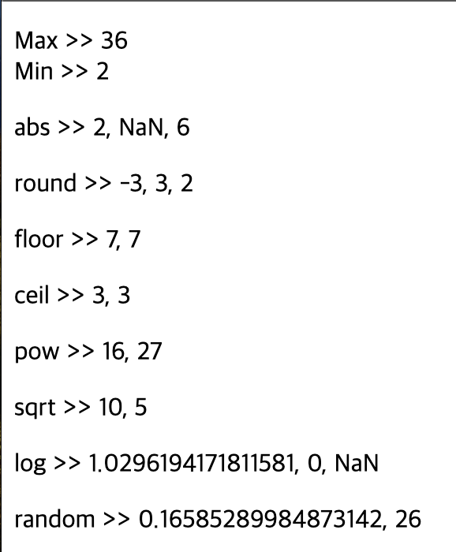
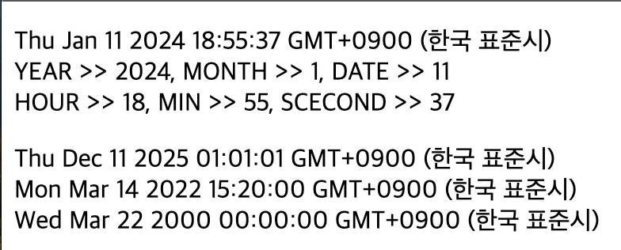
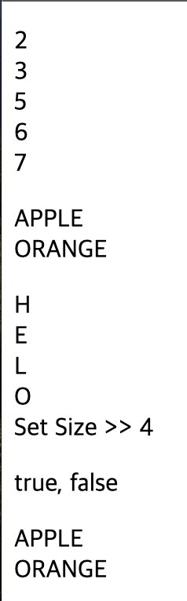
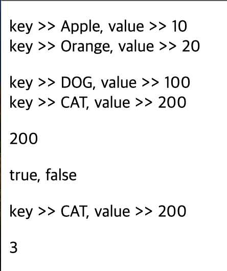

# 2024 01 11

### Math 예제
```
    <p id="math1"></p>
    <p id="math2"></p>
    <p id="math3"></p>
    <p id="math4"></p>
    <p id="math5"></p>
    <p id="math6"></p>
    <p id="math7"></p>
    <p id="math8"></p>
    <p id="math9"></p>

    <script>
        let max = Math.max(5,2,3,36,23);
        let min = Math.min(5,2,3,36,23);
        let txt1 = "";
        txt1 += "Max >> " + max + "<br>";
        txt1 += "Min >> " + min + "<br>";
        document.getElementById("math1").innerHTML = txt1;

        let a = Math.abs(-2);
        let b = Math.abs("A");
        let c = Math.abs(6);
        let txt2 = "abs >> " + a + ", " + b + ", " + c;
        document.getElementById("math2").innerHTML = txt2;

        let f1 = Math.round(-3.2);
        let f2 = Math.round(2.5);
        let f3 = Math.round(2.4);
        let txt3 = "round >> " + f1 + ", " + f2 + ", " + f3;
        document.getElementById("math3").innerHTML = txt3;

        let fl1 = Math.floor(7.8);
        let fl2 = Math.floor(7.4);
        let txt4 = "floor >> " + fl1 + ", " + fl2;
        document.getElementById("math4").innerHTML = txt4;

        let c1 = Math.ceil(2.8);
        let c2 = Math.ceil(2.4);
        let txt5 = "ceil >> " + c1 + ", " + c2;
        document.getElementById("math5").innerHTML = txt5;

        let p1 = Math.pow(2,4);
        let p2 = Math.pow(3,3);
        let txt6 = "pow >> " + p1 + ", " + p2;
        document.getElementById("math6").innerHTML = txt6;

        let s1 = Math.sqrt(100);
        let s2 = Math.sqrt(25);
        let txt7 = "sqrt >> " + s1 + ", " + s2;
        document.getElementById("math7").innerHTML = txt7;

        let l1 = Math.log(2.8);
        let l2 = Math.log(1);
        let l3 = Math.log("A");
        let txt8 = "log >> " + l1 + ", " + l2 + ", " + l3;
        document.getElementById("math8").innerHTML = txt8;

        let random1 = Math.random();
        let random2 = Math.floor((Math.random()*100)+1);
        let txt9 = "random >> " + random1 + ", " + random2;
        document.getElementById("math9").innerHTML = txt9;
    </script>
```
   
- max와 min은 각각 주어진 숫자에 대한 최댓값과 최솟값을 구한다
- abs()메서드는 숫자의 절댓값을 구하는데 사용한다
    - 0이나 양수인경우는 그대로 반환하지만 음수면 양수로 변환한다
    - 숫자가 아닌경우에는 NaN을 반환한다
- round()메서드는 숫자의 반올림을 구하는데 사용한다
- floor()메서드는 숫자에서 소수점 이하의 값을 버린다
    - round()같이 반올림을 하지않는다
- ceil()메서드는 floor()메서드와 반대로 소수점 이하를 무조건 올림한다
- pow()메서드는 x에대한 y의 거듭제곱을 구하는데 사용한다
    - pow(2,4)면 2x2x2x2의 값이 구해진다
- sqrt()메서드는 숫자의 제곱근을 구하는데 사용한다
- log()메서드는 숫자의 자연 로그 값을 구하는데 사용한다
    - 음수라면 NaN을 반환하고 0이라면 -Infinity를 반환한다
- random()메서드는 0~1사이에 무작위 값을 얻는데 사용한다(1포함X)


### Date 예제
```
    <p id="date1"></p>
    <p id="date2"></p>

    <script>
        const now = new Date();
        const year = now.getFullYear();
        const month = now.getMonth() + 1;
        const date = now.getDate();
        const hour = now.getHours();
        const min = now.getMinutes();
        const second = now.getSeconds();
        let txt1 = now + "<br>";
        txt1 += "YEAR >> " + year + ", MONTH >> " + month + ", DATE >> " + date + "<br>";
        txt1 += "HOUR >> " + hour + ", MIN >> " + min + ", SCECOND >> " + second;
        document.getElementById("date1").innerHTML = txt1;

        const a = new Date(2025,11,11,1,1,1);
        const b = new Date(2022,2,14,15,20);
        const c = new Date(2000,2,22);
        let txt2 = a + "<br>" + b + "<br>" + c;
        document.getElementById("date2").innerHTML = txt2;
    </script>
```
   
- new Date()로 현재 날짜와 시간을 가진 Date객체를 생성할수 있다
- new Date()로 생성된 객체는 연,월,일,시,분,초를 가져올수 있는 메서드가 있다
    - getFullYear()은 4자리로된 연도를 반환한다
    - getMonth()는 월을 반환한다
        - 0~11 까지이기 때문에 +1을 해줘야 한다
    - getDate()로 일자를 반환한다
        - 월과 다르게 1부터 시작해 31까지 이다
    - getHours()로 시를 가져올수 있다
    - getMinutes()로 분을 가져올수 있다
    - getSeconds()로 초를 가져올수 있다
- new Date(년,월,일,시,분,초)로 시간을 설정할수 있다
    - 사용하는 인수로 년,월,일만 사용해도 문제없다

### Set 예제
```
    <p id="set1"></p>
    <p id="set2"></p>
    <p id="set3"></p>
    <p id="set4"></p>
    <p id="set5"></p>
    <script>
        const set1 = new Set([2,3,5,5,6,6,7,7]);
        let txt1 = "";
        for(let value of set1){
            txt1 += value + "<br>";
        }
        document.getElementById("set1").innerHTML = txt1;

        const set2 = new Set();
        set2.add("APPLE");
        set2.add("ORANGE");
        let txt2 = "";
        set2.forEach(function(value){
            txt2 += value + "<br>";
        })
        document.getElementById("set2").innerHTML = txt2;

        const set3 = new Set("HELLO");
        let txt3 = "";
        for(let value of set3){
            txt3 += value + "<br>";
        }
        txt3 += "Set Size >> " + set3.size;
        document.getElementById("set3").innerHTML = txt3;

        const set4 = new Set(["APPLE","ORANGE","BANANA"]);
        let txt4 = set4.has("APPLE") + ", " + set4.has("MILK");
        document.getElementById("set4").innerHTML = txt4;
        
        set4.delete("BANANA");
        let txt5 = "";
        for(let value of set4){
            txt5 += value + "<br>";
        }
        document.getElementById("set5").innerHTML = txt5;
    </script>
```
   
- new Set()을 이용해 Set객체를 만들수 있다
    - set1은 배열을 이용해 Set객체를 만든것이다
    - Set객체에는 요소의 순서가 없고 인덱스를 사용하지 않아 For Of문으로 조회할수 있다
    - Set은 중복을 허용하지 않는다
- add()로 Set의 요소를 추가할수 있다
- size로 요소의 개수를 구할수 있다
    - Set은 중복을 허용하지 않기 때문에 중복인값이 있다면 하나로 인식된다
- has()메서드로 Set에 특정요소가 있는지 확인할수 있다
    - 있다면 true, 없다면 false를 반환한다
- delete()메서드로 특정 요소를 삭제할수 있다

### Map 예제
```
    <p id="map1"></p>
    <p id="map2"></p>
    <p id="map3"></p>
    <p id="map4"></p>
    <p id="map5"></p>
    <p id="map6"></p>

    <script>
        const fruits = new Map([
            ["Apple",10],
            ["Orange",20]
        ]);
        let txt1 = "";
        fruits.forEach(function(value,key){
            txt1 += "key >> " + key + ", value >> " + value + "<br>";
        })
        document.getElementById("map1").innerHTML = txt1;

        const pets = new Map();
        pets.set("DOG",100);
        pets.set("CAT",200);
        let txt2 = "";
        pets.forEach(function(value,key){
            txt2 += "key >> " + key + ", value >> " + value + "<br>";
        })
        document.getElementById("map2").innerHTML = txt2;
        document.getElementById("map3").innerHTML = pets.get("CAT");
        document.getElementById("map4").innerHTML = pets.has("CAT") + ", " + pets.has("bird");
        
        pets.delete("DOG");
        let txt3 = "";
        pets.forEach(function(value,key){
            txt3 += "key >> " + key + ", value >> " + value + "<br>";
        })
        document.getElementById("map5").innerHTML = txt3;

        const member = new Map([
            ["Lee",100],
            ["Kim",200],
            ["Park",300]
        ]);
        document.getElementById("map6").innerHTML = member.size; 
    </script>
```
   
- 배열을 이용하면 쉽게 객체를 만들수 있다
    - Map은 키와 값으로 되어있다
    - forEach()메서드를 이용하여 Map객체의 요소를 얻을수 있다
- set()메서드로 값을 추가할수 있다
    - 키와 값으로 구성되어야한다
- get()메서드로 특정 키에해당하는 값을 가져올수 있다
    - get(key)를 하면 해당 key에 대한 value를 가져올수 있다
- has()메서드로 해당 key가 있는지 확인할수 있다
    - 있다면 true, 없다면 false를 반환한다
- delete()메서드로 특정 키를 가진 요소를 제거한다
- size로 요소의 개수를 구하는데 사용한다