# 2024 01 12

## DOM
- XML이나 HTML 문서의 구조화된 표현
- DOM구조의 접근하여 HTML의 문서의 구조, 스타일, 내용등을 변경할수 있다
- HTML문서에 접근하여 문서를 읽고 조작할수 있는 API를 제공하는 인터페이스라고 할수 있다 

### DOM 예제1
```
    <p id="dom1"></p>
    <form name = "form1">
        Name : <input type="text" name="name">
        <button onclick="get_name()">Button</button>
    </form>
    <script>
        document.getElementById("dom1").innerHTML = "Hello";

        window.onload = function(){
            let element = document.createElement("h1");
            let text = document.createTextNode("Title");
            element.appendChild(text);
            document.body.appendChild(element);
        }

        function get_name(){
            let text = document.form1.name.value;
            alert(text);
        }
    </script>
```
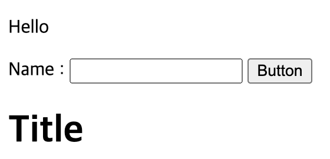   
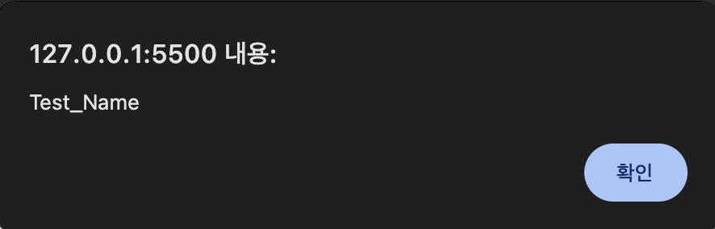   
- Document객체의 getElementById로 id가 dom1인 p요소를 가져온다
    - innerHtml로 p태그의 내용을 Hello로 변경된다
- window.onload는 자바스크립트 문서가 로드될 때 자동으로 호출된다
    - document.createElement("h1")는 h1요소를 생성해 변수에 저장한다
    - document.createTextNode("Title")는 텍스트 노드를 생성하여 변수에 저장한다
    - element.appendChild(text)는 h1요소에 텍스트를 추가한다
    - document.body.appendChild(element)는 h1요소를 body에 추가한다
- form이라는 태그안에 input태그와 button태그를 만든다
    - document.form1.name.value는 form태그안에있는 input태그의 name의 value를 의미하며 input태그에 입력된 텍스트를 의미한다
    - alert로 버튼을 클릭했을때 입력한 텍스트를 알람으로 띄워준다

### DOM 예제2
```
    <p id="p1">Hello!</p>
    <button onclick="changeColor('red')";>RED</button>
    <button onclick="changeColor('blue')";>BLUE</button>

    <div id="parent">
        <p>HEL</p>
        <p>LO!</p>
        <p class="ch">FR</p>
        <p class="ch">IE</p>
        <p class="ch">ND!</p>
        <p class="ch2">CHILD2</p>
        <p class="ch2">CHILD2</p>
    </div>
    <h1 id="title">Title</h1>
    <p id="sub_title">Sub_Title</p>
    <ul>
        <li>First</li>
        <li class="item">ITEM1</li>
        <li class="item">ITEM2</li>
        <li class="item">ITEM3</li>
    </ul>
    <script>
        function changeColor(color){
            const elem = document.getElementById("p1");
            elem.style.color = color;
        }

        const x = document.getElementById("parent");
        const y = x.getElementsByTagName("p");
        y[0].style.color="red";

        const z = x.getElementsByClassName("ch");
        for(let i=0;i<z.length;i++){
            z[i].style.color="blue";
        }

        const ch_x = document.querySelector("p.ch2");
        ch_x.style.backgroundColor="red";

        const title_x = document.querySelectorAll("h1#title");
        const sub_y = document.querySelectorAll("p#sub_title");
        const item_z = document.querySelectorAll("li.item");
        title_x[0].style.backgroundColor="red";
        sub_y[0].style.backgroundColor="green";
        item_z[2].style.backgroundColor="blue";
    </script>
```
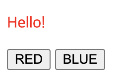   
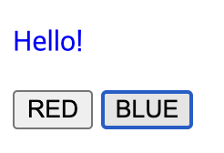   
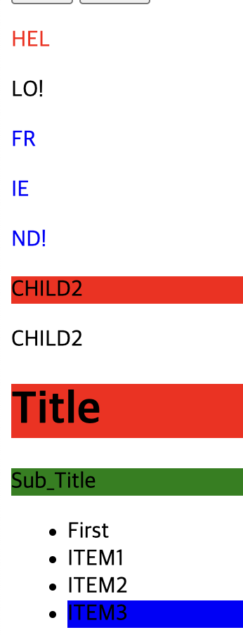   
- 버튼을 클릭하면 changeColor함수가 호출되며 red,blue가 color에 복사가 된다
    - p태그의 id, 즉 p태그를 elem에 저장한다
    - p태그의 style.color = color로 button을 클릭시 red,blue의 값을 넣어줘 버튼을 클릭시 p태그의 글자의 색을 변경한다
- x에 div의 요소를 저장한다
    - y에 div요소에 p태그를 y에 저장한다
    - y에 index값으로 글자색을 변경시킨다
- z에는 x에안에있는 요소중 class이름이 ch인 요소를 저장시킨다
    - for문을 돌려 class이름이 ch인 요소의 글자색을 변경시킨다
- ch_x에 p.ch2는 p태그의 클래스이름이 ch2를 의미한다
    - 배경색을 red로 변경하는데 querySelector는 가장 첫번째 요소의 색만 변경한다
- title_x는 h1태그의 id가 title인 h1태그를 저장한다
    - sub_y는 p태그의 id가 sub_title인 p태그를 저장한다
    - item_z는 li태그의 class이름이 item인 태그를 저장한다
    - querySelectorAll는 요소들의 콜렉션을 반환하기에 인덱스를 통해 접근해 배경색을 변경시킨다

### DOM 예제3
```
    <p id="p1">
        <span style="color:red">Hello</span>
    </p>

    <ul>
        <li>First</li>
        <li>Second</li>
        <li></li>
        <li></li>
    </ul>

    <p id="p2">Hello2</p>

    <script>
        const x = document.getElementById("p1");
        alert(x.innerHTML);
        alert(x.innerText);

        const list = document.querySelectorAll("li");
        list[2].innerHTML = "<span style='color:red'>Text1</span>";
        list[3].innerText = "Text2";

        const p = document.getElementById("p2");
        p.style.color="red";
        p.style.backgroundColor="yellow";
        p.style.border="solid 5px blue";
    </script>
```
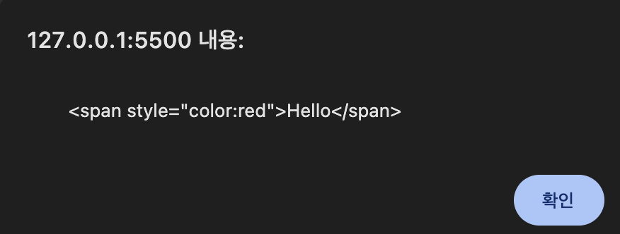   
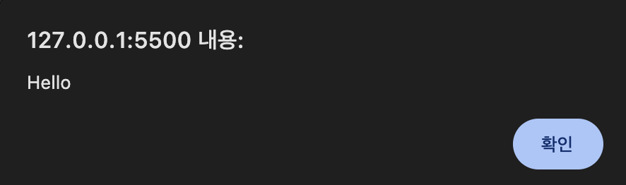   
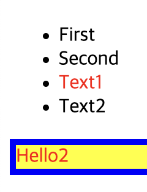   
- innerHTML은 해당 요소에 내용을 가져온다
    - html코드를 포함하여 가져온다
- innerText는 요소에 텍스트만 가져온다
- list[2].innerHTML로 HTML코드를 포함한 텍스트를 설정한다
    - 텍스트만 설정할수도 있다
- innerText로 텍스트를 설정할수 있다
- id가 p2인 p태그를 p에 저장한다
    - 해당 p로 css style을 지정할수 있다

### DOM 예제4
```
    <p id="p1"></p>
    <p id="p2"></p>

    <form name="f1">
        Name : <input type="text" name="name"><br>
        ID : <input type="text" name="id"><br>
    </form>
    <button onclick="getInput()">OK</button>
    <p id="p3"></p>

    <ul>
        <li><a href="https://google.com">Google</a></li>
    </ul>
    <p id="p4"></p>
    <p id="p5"></p>
    <script>
        document.getElementById("p1").innerHTML = document.URL;
        document.getElementById("p2").innerHTML = document.title;
        document.title = "NEW TITLE";

        function getInput(){
            const f = document.forms["f1"];
            let txt1 = "";
            for(let i=0;i<f.length;i++){
                txt1 += f.elements[i].value + "<br>";
            }
            document.getElementById("p3").innerHTML = txt1;
        }

        document.getElementById("p4").innerHTML = "링크수 >> " + document.links.length;
        document.getElementById("p5").innerHTML = "Link >> " + document.links[0].href;
    </script>
```
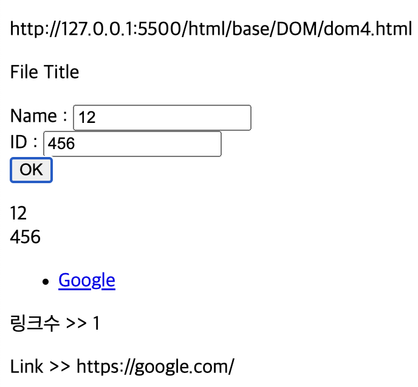   
- document.URL로 문서의 URL주소르 반환한다
- document.title로 해당 문서의 제목을 반환한다
    - document.title = "문서명"으로 문서의 제목을 변경할수 있다
- forms로 form의 요소에 대한 정보를 얻을수 있다
    - form이 여러개인경우 인덱스를 통해 각각의 form에 접근할수 있다, forms[index]로 접근이 가능하다
    - const f = document.forms["f1"]는 form의 name이 f1인 form의 요소를 가진다
    - f.element[index]로 input요소에 접근이 가능하다
- document.links로 문서에서 a태그를 포함한 모든 링크 요소로 구성된 HTML Collection요소를 반환한다
    - document.links.length는 링크의 개수를 반환한다
    - document.links[index].href로 해당 링크의 주소를 반환한다

### DOM 예제 5
```
    <form name="form1">
        ID : <input type = "text" name="id">
        Phone : <input type = "text" id="num">
    </form>
    <button onclick="validateForm()">OK</button>
    <p id="id_check"></p>
    <p id="phone_check"></p>

    <script>
        function validateForm(){
            if(document.forms["form1"]["id"].value==""){
                document.getElementById("id_check").innerHTML = "ID check!";
            }
            let num = document.getElementById("num").value;
            if(isNaN(num)||num<1||num>10){
                document.getElementById("phone_check").innerHTML = "1~10 number";
            }else{
                document.getElementById("phone_check").innerHTML = "Phone OK";
            }
        }
    </script>
```
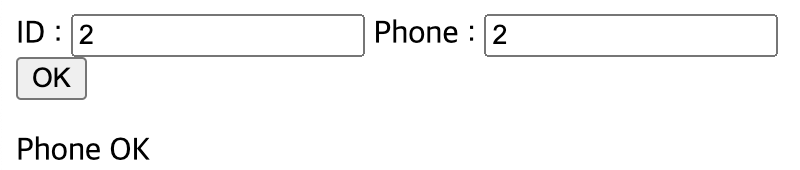   
- id는 forms를 통해 id에 값을 넣었는지 확인한다
    - id를 적지 않았다면 ID check라는 문구를 반환한다
- Phone은 input태그의 id를 가져와 값을 넣었는지 확인하고 숫자 1~10사이의 숫자를 넣었는지 확인한다
    - 아무것도 적지않거나 조건에 맞지 않다면 1~10 number를 반환하고  조건에 맞다면 Phone OK를 반환한다

### DOM 예제6-1
```
    <div id="box1">
        <p>First</p>
        <p>Second</p>
        <p id="three">Three</p>
        <p>Four</p>
    </div>

    <script>
        const elem1 = document.createElement("p");
        const text_node1 = document.createTextNode("NEW!");
        elem1.appendChild(text_node1);
        document.getElementById("box1").append(elem1);
    </script>
```
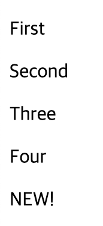   
- createElement는 새로운 노드를 생성한다 p태그 노드를 생성해 elem1에 저장한다
- createTextNode으로 새로운 텍스트 노드를 생성한다
- appendChild는 text_node1을 elem1의 자식을 추가한다
- id가 box1안에 elem1을 추가한다
    - 위 과정을 걸쳐 Four다음에 NEW!가 새로 만들어진걸 볼수있다

### DOM 예제6-2
```
    <div id="box1">
        <p>First</p>
        <p>Second</p>
        <p id="three">Three</p>
        <p>Four</p>
        <p id="del">DELETE!</p>
    </div>

    <script>
        const elem1 = document.createElement("p");
        const text_node2 = document.createTextNode("ORANGE");
        const p = document.getElementById("three");
        elem1.appendChild(text_node2);
        document.getElementById("box1").insertBefore(elem1,p);

        const elem2 = document.getElementById("del");
        elem2.remove();

    </script>
```
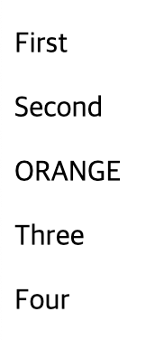   
- insertBefore로 ORANGE라는 단어를 가진p태그를 p태그의 id가 three인 태그 앞에 삽입시킨다
- elem2로 p태그의 아이디가 del인 태그를 remove함으로써 삭제 시킬수 있다

### DOM 예제6-3
```
    <div id="box1">
        <p>First</p>
        <p>Second</p>
        <p id="three">Three</p>
        <p>Four</p>
        <p id="del">DELETE!</p>
    </div>

    <script>
        const elem1 = document.createElement("p");
        const text_node3 = document.createTextNode("NEW NEXT");
        elem1.append(text_node3);
        const p2 = document.getElementById("del");
        document.getElementById("box1").replaceChild(elem1,p2);
    </script>
```
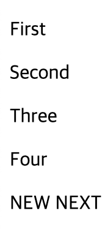   
- replaceChild는 기존에 있던 노드를 다른 노드로 변경할때 사용한다
- 기존에 있던 p태그의 아이디가 del인 노드를 새로 만든 elem1으로 변경한다