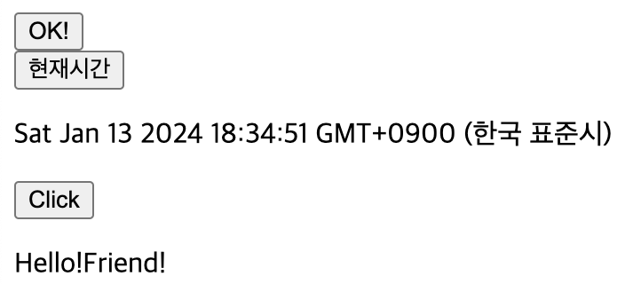
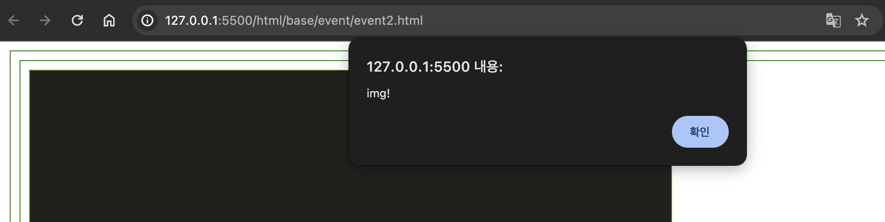
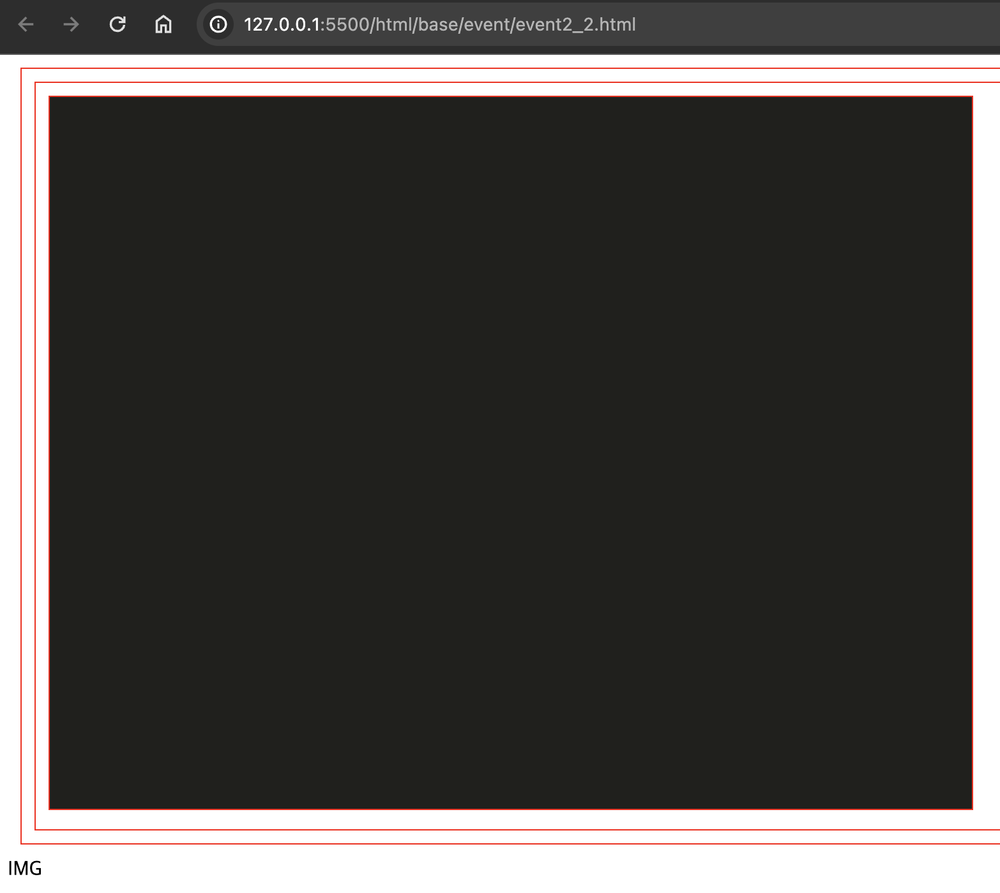
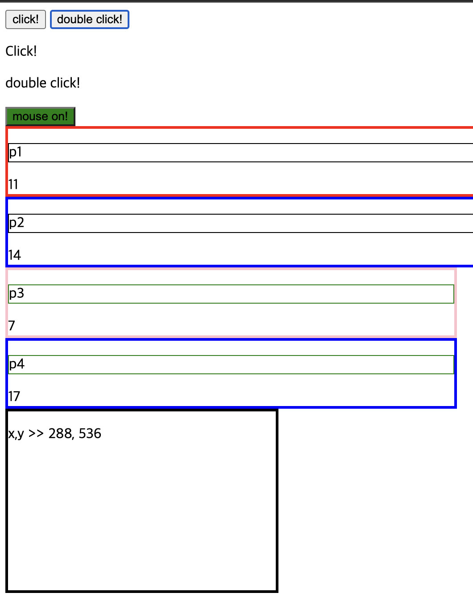
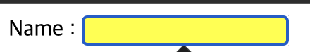
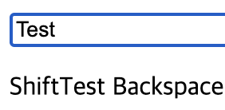
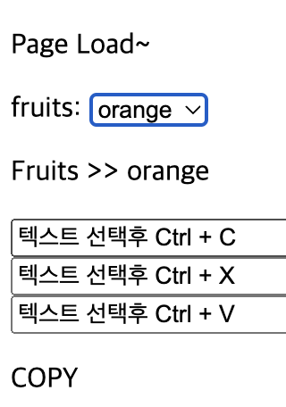

# 2024 01 13

## 이벤트
- 웹페이지에서 발생하는 사건
- 마우스,키보드 조작 및 HTML문서 로드나 에러등
- 이벤트를 처리하는 함수를 이벤트 핸들러 또는 이벤트 리스너라고 한다

### 이벤트 예제1
```
    <button onclick="changeText(this)">Click!</button><br>
    
    <button onclick="document.getElementById('time').innerHTML = Date()">현재시간</button>
    <p id="time"></p>

    <button id="btn">Click</button>
    <p id="hello"></p>
    
    <script>
        function changeText(elem){
            elem.innerHTML = "OK!";
        }

        let txt = "";
        document.getElementById("btn").addEventListener("click",function(){
            txt += "Hello!";
            document.getElementById("hello").innerHTML = txt;
        });
        document.getElementById("btn").addEventListener("click",function(){
            txt += "Friend!";
            document.getElementById("hello").innerHTML = txt;
        });
    </script>
```
   
- button의 changeText(this)는 버튼을 클릭하면 버튼의 텍스트가 변경된다
    - changeText함수는 버튼이 클릭되면 innerHTML로 텍스트를 변경시킨다
- button에 onclick속성에 설정된 코드로 버튼을 클릭하면 p태그의 id가 time인 태그에 현재 일시가 출력된다
- button의 id가 btn인 버튼은 클릭시 addEventListener로 클릭시 Hello!Friend가 p태그의 id가 hello인 태그에 출력된다
    - 위에 두개같이 onclick에 설정하는 이벤트는 핸들러는 하나만 사용이 가능하다
    - 두개 이상에 이벤트가 필요할 경우 addEventListener를 사용하면 여러개의 이벤트를 사용할수 있다

### 이벤트 예제2-1
```
    <style>
        div, p, img {margin : 10px; border: 1px solid green;}
    </style>
    <div onclick="alert('div!')">
        <p onclick="alert('p!')">
            
        </p>
    </div>
```
   
- 이미지를 클릭하면 onclick이벤트가 발생하며 alert로 메시지가 출력되며 이 클릭 이벤트는 상위 객체인 p요소로 전달된다
- 같은 방식으로 div요소로 전달된다
- 처음 이미지를 클릭시 img의 alert메시지가 뜨고 난후 p태그의 알림, div의 알림이 순차적으로 뜨게된다

### 이벤트 예제2-2
```
    <style>
        div,p,img{margin:10px;border:1px solid red;}
    </style>
    <div onclick="func(event)">
        <p>
            
        </p>
    </div>
    <span id="spn"></span>
    
    <script>
        function func(event){
            let text = event.target.tagName;
            document.getElementById("spn").innerHTML = text;
        }
    </script>
```
   
- div의 func(event)는 DOM과 관련된 이벤트가 발생되면 관련된 정보를 event객체에 전달한다
    - 발생된 event객체를 func의 매개변수로 전달한다
- event.tagName은 이벤트를 발생시킨 요소의 태그이름을 나타낸다
    - 태그이름을 text에 저장해 id가 spn인 span태그에 출력시킨다
    - img를 클릭하면 img가 p태그를 클릭하면 p를, div를 클릭하면 div 를 출력한다

### 이벤트 예제3
```

    <button onclick="showMessage1()">click!</button>
    <button ondblclick="showMessage2()">double click!</button>
    <p id="click1"></p>
    <p id="click2"></p>

    <button onmouseover="changeBg1(this)" onmouseout="changeBg2(this)">mouse on!</button>

    <div id="box1" onmouseenter="increaseX()">
        <p id="p1">p1</p>
        <span id="spn1"></span>
    </div>
    <div id="box2" onmouseover="increaseY()">
        <p id="p2">p2</p>
        <span id="spn2"></span>
    </div>
    <div id="box3" onmouseleave="increase2X()">
        <p id="p3">p3</p>
        <span id="spn3"></span>
    </div>
    <div id="box4" onmouseout="increase2Y()">
        <p id="p4">p4</p>
        <span id="spn4"></span>
    </div>

    <div id="box5" onmousemove="showCoord(event)">
        <p id="p5"></p>
    </div>

    <script>
        function showMessage1(){
            document.getElementById("click1").innerHTML = "Click!";
        }
        function showMessage2(){
            document.getElementById("click2").innerHTML = "double click!";
        }

        function changeBg1(x){
            x.style.backgroundColor = "Green";
        }
        function changeBg2(x){
            x.style.backgroundColor = "";
        }

        let x = 0, y = 0;
        function increaseX(){
            x += 1;
            document.getElementById("spn1").innerHTML = x;
        }
        function increaseY(){
            y += 1;
            document.getElementById("spn2").innerHTML = y;
        }
        let xx = 0, yy = 0;
        function increase2X(){
            xx += 1;
            document.getElementById("spn3").innerHTML = xx;
        }
        function increase2Y(){
            yy += 1;
            document.getElementById("spn4").innerHTML = yy;
        }

        function showCoord(e){
            let text = "x,y >> " + e.clientX + ", " + e.clientY;
            document.getElementById("p5").innerHTML = text;
        }
    </script>
```
   
- onclick과 ondblckick이벤트는 각각 한번 클릭했을때와 두번 클랙했을 때의 이벤트이다
- onmouseover와 onmouseout이벤트는 버튼 요소에 마우스를 올렸다 내렸을 때의 이벤트이다
    - 마우스를 올리면 버튼의 색을 green색으로 변경하고 버튼에 마우스를 올리지 않으면 색을 주지 않는다
- onmouseenter과 onmouseover의 차이점으로는 자신의 요소만인지 자식요소를 포함하는지의 차이이다
    - onmouseenter는 자신의 영역 안에서만 카운트가 올라간다
    - onmouseover는 자신의 자식요소로 마우스를 이동해도 카운트가 올라간다
- onmouseleave와 onmouseout는 onmouseenter, onmouseover와 반대이다
    - onmouseleave는 자신의 요소에서 마우스가 벗어날때만 카운트가 올라간다
    - onmouseout는 자신과 자식의 요소에서 벗어날때도 카운트가 올라간다
- onmousemove는 마우스가 자신의 요소안에서 움직일때 동작한다
    - event객체의 clientX와 clientY는 각각 브라우저 화면을 기준으로 X,Y의 좌표를 의미한다

### 이벤트 예제4
```
    Name : <input type="text" id="name">

    <script>
        const x = document.getElementById("name");
        x.onfocus = function(){changeBgcolor1();};
        x.onblur = function(){changeBgcolor2();};
        function changeBgcolor1(){
            x.style.backgroundColor = "yellow";
        }
        function changeBgcolor2(){
            x.style.backgroundColor = "";
        }
    </script>
```
   
- FocusEvent로 텍스트나 입력창을 마우스로 클릭시 커서가 깜빡이는걸 말한다
    - onfocus는 요소가 포커스를 얻었을때
        - 배경색을 yello로 변경한다
    - onblur은 요소가 포커스를 잃었을때
        - 배경색을 없앤다

### 이벤트 예제5
```
    <input placeholder="Key Input">
    <p id="keyInput"></p>

    <script>
        const input = document.querySelector("input");
        let text = "";

        input.addEventListener("keydown",showKey);
        function showKey(e){
            text += e.key;
            document.getElementById("keyInput").innerHTML = text;
        }
    </script>
```
   
- onkeydown은 사용자가 키를 눌렀을때를 의미한다
    - input태그에서 키보드를 눌렀을때의 이벤트를 등록한다
    - e.key는 이벤트가 발생했을때 사용자가 누른 키 값을 의미한다
    - 사용자가 누른 키보드의 키값을 텍스트로 p태그에 보여준다
- onkeyup은 사용자가 키를 눌렀다가 떼었을때를 의미한다

### 이벤트 예제6
```
<body onload="func()">
    <p id="load"></p>

    <label>
        fruits:
        <select id="fr" name="fruit">
            <option value="">select</option>
            <option valie="orange">orange</option>
            <option valie="apple">apple</option>
            <option valie="banana">banana</option>
        </select>
    </label>
    <p id="fruits_text"></p>

    <input type="text" id="input1" size="80"><br>
    <input type="text" id="input2" size="80"><br>
    <input type="text" id="input3" size="80">
    <p id="show"></p>

    <script>
        function func(){
            document.getElementById("load").innerHTML = "Page Load~";
        }

        const f = document.getElementById("fr");
        f.addEventListener("change",(event)=>{
            document.getElementById("fruits_text").innerHTML = "Fruits >> " + event.target.value;
        });

        const x = document.getElementById("input1");
        const y = document.getElementById("input2");
        const z = document.getElementById("input3");
        x.value="텍스트 선택후 Ctrl + C";
        y.value="텍스트 선택후 Ctrl + X";
        z.value="텍스트 선택후 Ctrl + V";
        x.addEventListener("copy",func1);
        y.addEventListener("cut",func2);
        z.addEventListener("paste",func3);
        function func1(){
            document.getElementById("show").innerHTML = "COPY";
        }
        function func2(){
            document.getElementById("show").innerHTML = "CUT";
        }
        function func3(){
            document.getElementById("show").innerHTML = "PASTE";
        }
    </script>
</body>
```
   
- onload이벤트는 객체가 로드된 직후 발생한다
    - 페이지의 모든 내용물이 로드된 직후 func()함수의 이벤트가 발생되어 텍스트가 출력된다
- onchange 이벤트는 요소의 값이 변경될때 사용한다
    - 선택박스등 여러개의 선택요소중 하나를 선택할때 사용한다
    - event.target.value는 select에서 선택한 항목의 값이다
- oncopy,oncut,onpaste는 각각 복사, 오려두기, 붙이기 작업이 실행될때 발생한다
    - 각각 텍스트에 ctrl+c, ctrl+x,ctrl+v를 실행했을때 p태그에 어떤 실행을 했는지 텍스트로 보여준다