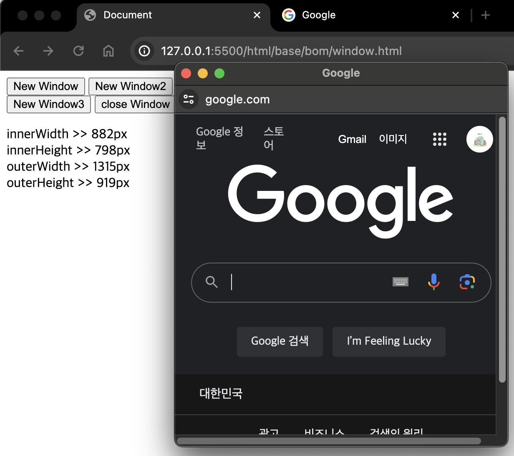
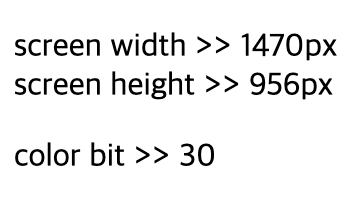
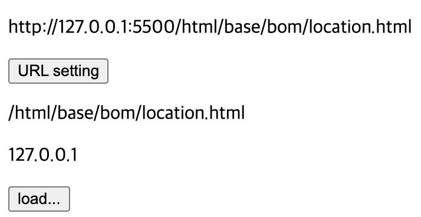
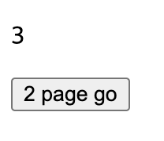
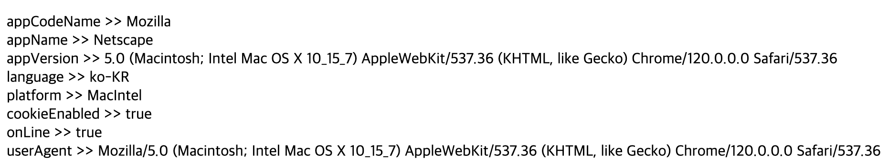
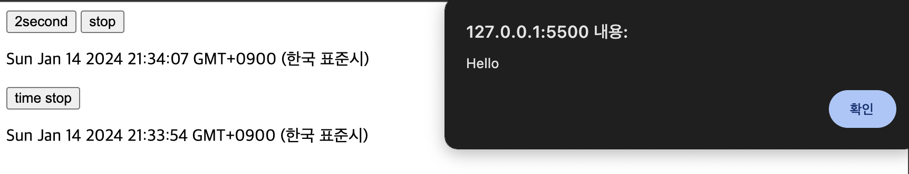

# 2024 01 14

## 브라우저 모델객체(BOM)
- 브라우저에 대한 정보를 이용하거나 제어하려 할 때 필요한것이다
- Window, Document, Screen, Location, History,  Navigator이 있다

### Window 예제
```
    <button onclick="newWin()">New Window</button>
    <button onclick="newWin2()">New Window2</button>
    <br>
    <button onclick="newWin3()">New Window3</button>
    <button onclick="closeWin()">close Window</button>
    <br>
    <p id="show"></p>

    <script>
        function newWin(){
            window.open("https://www.google.com");
        }
        function newWin2(){
            window.open("https://www.google.com","_blank",
            "toolbar=yes,scrollbars=yes,resizable=yes,top=500,left=500,width=400,height=400");
        }

        let window1;
        function newWin3(){
            window1 = window.open("https://www.google.com");
        }
        function closeWin(){
            console.log(window1);
            window1.close();
        }

        let text = "";
        text += "innerWidth >> " + window.innerWidth + "px<br>";
        text += "innerHeight >> " + window.innerHeight + "px<br>";
        text += "outerWidth >> " + window.outerWidth + "px<br>";
        text += "outerHeight >> " + window.outerHeight + "px<br>";
        document.getElementById("show").innerHTML = text;
    </script>
```
   
- newWin()함수는 브라우저의 새창을 여는데 사용된다
- newWin2()함수는 브라우저의 창크기등을 설정해 새창을 연다
    - toolbar는 브라우저에 툴바 사용여부이다
    - scrollbars는 브라우저에 스크롤바 사용여부이다
    - resizeable은 창의 크기 조절가능여부이다
    - top은 창의 상단위치를 의미한다
    - left는 창의 좌측위치를 의미한다
    - width와 height는 창의 너비와 높이를 의미한다
- newWin3()은 창을 열고 그 창의 객체를 window1에 저장한다
    - closeWin()에서 window1.close()로 newWin3()에서 연 브라우저 창을 닫는다
- innerWidth, innerHeight는 브라우저 창에서 창 틀을 제외하고 스크롤을 포함한 창의 너비와 높이를 나타낸다
    - outerWidth, outerheight는 브라우저 창 전체의 너비와 높이를 나타낸다

### Screen 예제
```
    <p id="screen1"></p>
    <p id="screen2"></p>

    <script>
        let txt1 = "";
        txt1 += "screen width >> " + screen.width + "px<br>";
        txt1 += "screen height >> " + screen.height + "px<br>";
        document.getElementById("screen1").innerHTML = txt1;

        let txt2 = "color bit >> " + screen.colorDepth;
        document.getElementById("screen2").innerHTML = txt2;
    </script>
```
   
- screen.width와 height는 사용하고 있는 pc의 해상도의 가로,세로 px을 나타낸다
- screen.colorDepth는 사용하고 있는 pc의 색상당 비트수를 나타낸다

### Location 예제
```
    <p id="loc1"></p>
    <button onclick="setURL()">URL setting</button>
    <p id="loc2"></p>
    <p id="loc3"></p>
    <button onclick="loadDoc()">load...</button>

    <script>
        document.getElementById("loc1").innerHTML = location.href;
        function setURL(){
            location.href="https://www.google.com";
        }

        document.getElementById("loc2").innerHTML = location.pathname;
        document.getElementById("loc3").innerHTML = location.hostname;

        function loadDoc(){
            location.assign("https://www.google.com");
        }
    </script>
```
   
- location.href는 현재 웹페이지의 URL주소를 가져온다
- setURL()은 버튼을 누르면 google 페이지로 넘어가게 된다
- location.pathname은 현재 문서의 파일 경로를 나타낸다
- location.hostname은 현재 문서가 사용중인 호스트 이름을 가져온다
- loadDoc()의 location.assign()은 인수로 설정된 구글사이트를 불러온다

### History 예제
```
    <p id="history1"></p>
    <button onclick="goPage2()">2 page go</button>

    <script>
        document.getElementById("history1").innerHTML = history.length;

        function goPage2(){
            history.go(-2);
        }
    </script>
```
   
- histoty.length는 히스토리 목록에 저장된 URL주소의 개수를 얻는데 사용된다
    - 현재 페이지는 이전에 만들었던 screen.html과 location.html이 저장되있고 현재 페이지 까지 합쳐 3개가 나온다
- history.go(-2)는 이전페이지로 가나 두번이동한다
    - screen.html -> location.html -> history.html 순이기 때문에 screen.html로 이동하게 된다

### Navigator 예제
```
    <p id="nav"></p>

    <script>
        let txt="";
        txt += "appCodeName >> " + navigator.appCodeName + "<br>";
        txt += "appName >> " + navigator.appName + "<br>";
        txt += "appVersion >> " + navigator.appVersion + "<br>";
        txt += "language >> " + navigator.language + "<br>";
        txt += "platform >> " + navigator.platform + "<br>";
        txt += "cookieEnabled >> " + navigator.cookieEnabled + "<br>";
        txt += "onLine >> " + navigator.onLine + "<br>";
        txt += "userAgent >> " + navigator.userAgent;
        document.getElementById("nav").innerHTML = txt;
    </script>
```
   
- appCodeName은 브라우저 코드 이름
- appName은 브라우저 이름
- appVersion은 브라우저 버전
- language는 브라우저 언어
- platform은 브라우저가 실행되는 운영체제
- cookieEnabled는 쿠키 사용여부
- onLine은 브라우저 온라인 여부
- userAgent는 브라우저가 서버에 보낸 브라우저 관련 user-agent 헤더 정보이다

### 타이머 예제
```
    <button onclick="execFunc = setTimeout(func1,2000)">2second</button>
    <button onclick="clearTimeout(execFunc)">stop</button>

    <p id="time"></p>
    <button onclick="clearInterval(execTimer)">time stop</button>
    <p id="time2"></p>
    <script>
        function func1(){
            alert("Hello");
        }

        setInterval(func2,1000);
        function func2(){
            const d = new Date();
            document.getElementById("time").innerHTML = d;
        }

        let execTimer = setInterval(func3,1000);
        function func3(){
            const d = new Date();
            document.getElementById("time2").innerHTML = d;
        }
    </script>
```
   
- 자바스크립트를 사용할때 페이지가 로드되거나 버튼이 클릭되었을때 특정함수를 바로 실행하지 않고 특정 시간이 지난후 실행되게 하고싶을때 사용한다
- setTimeout()은 밀리초가 경과한후 특정 함수를 실행한다
    - setTimeout(func1,2000)은 버튼을 누른후 2초뒤 func1함수가 실행되어 Hello를 알람창으로 보여준다
    - clearTimeout()는 실행된 함수를 중지시킨다
- setInterval()은 특정 함수를 반복실행한다
    - fun2는 1초마다 현재 일시를 화면에 표시해준다
        - 반복실행되기 때문에 시계처럼 시간이 계속 변경된다
    - fun3는 fun2와 같으나 clearInterval()로 버튼을 클릭하면 시간이 바뀌는 것을 멈출수 있다
        - 실행중인 함수를 중지시킨다