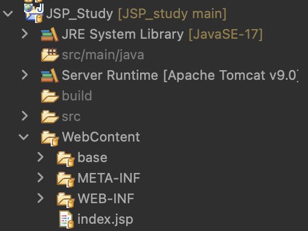
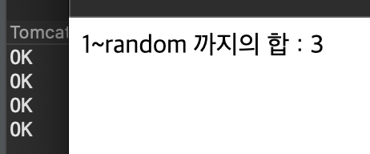
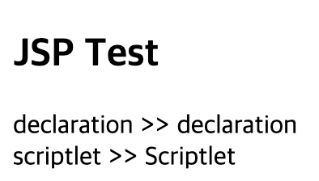
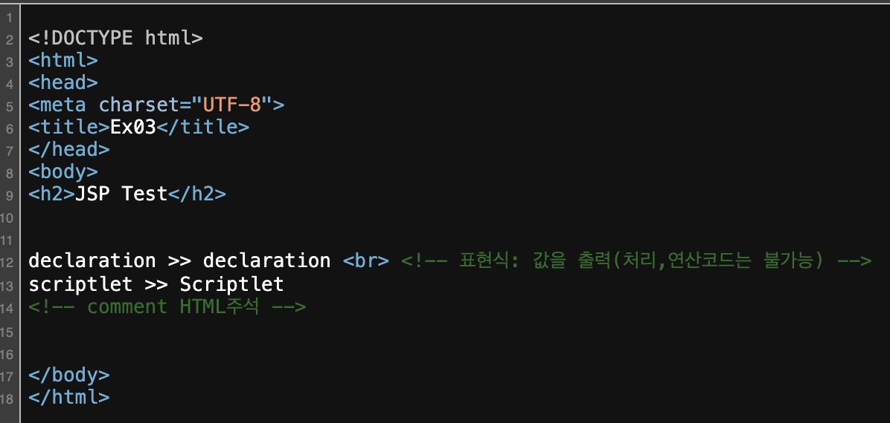

# 2024 02 28

### JSP 파일 구조
   
- src폴더는 java파일이 사용된다
- WebContent폴더는 기본폴더로 jsp파일등이 사용된다
    - HTML,CSS,JS,JSP,img등등
- WEB-INF폴더 안에있는 lib폴더는 외부에서 만들어진 api등을 넣어 사용한다
- web.xml파일은 tomcat이 동작할때의 설정파일이다


### 예제
```
<%@ page language="java" contentType="text/html; charset=UTF-8"
    pageEncoding="UTF-8"%>
<!DOCTYPE html>
<html>
<head>
<meta charset="UTF-8">
<title>Ex02</title>
</head>
<body>
<%
	int total = 0;
	for(int i=1;i<10;i++){
		total += i;
	}
%>
1~10까지의 합 : <%=total %>
</body>
</html>
```
   
- 1~10까지의 합을 구하는 코드
- <%  %>로되어있는 코드는 tomcat이 처리를 하는 코드이다
- HTML코드는 서버에서 처리되는것이 아니다

### 예제2
```
<%
	java.util.Random ran = new java.util.Random();
	int total = 0;
	for(int i=1; i <= ran.nextInt(10); i++){
		total += i;
	}
	System.out.println("OK");
%>
1~random 까지의 합 : <%=total %>
```
   
- 이전예제는 1~10까지의 수를 더하는 예제였지만 이번은 1~random의 합을 구하는 예제이다
- <%%>코드 안에는 자바코드를 사용할수 있다
- random을 사용했기에 실행시마다 결과가 달라진다
- 새로고침을 할때마다 결과가 달라지고 eclipse의 console창에는 새로고침을 할때마다 "OK"라는 단어가 출력된다

### 예제3
```
<%
	//Scriptlet : java코드를 작성하는 영역(연산,처리)
	String str = "Scriptlet";
	String comment = "comment";
%>

declaration >> <%= declaration %> <br> <!-- 표현식: 값을 출력(처리,연산코드는 불가능) -->
scriptlet >> <%= str %>
<!-- <%= comment%> HTML주석 -->
<%-- <%= comment%> JSP주석--%>
<%!
	//declaration(member field, member method)
	String declaration = "declaration";
%>
```
    
    
- <% %>는 자바코드를 작성하는 코드이다
- <%= %>는 값을 출력하는 코드이며 처리,연산코드는 불가능하다
- <%! %>는 멤버필드,멤버 메소드를 정의하는 코드이다
- <%-- -->는 JSP파일에서의 주석처리다
    - 코드페이지를 보면 HTML주석은 보여지지만 JSP코드주석은 보여지지 않는다