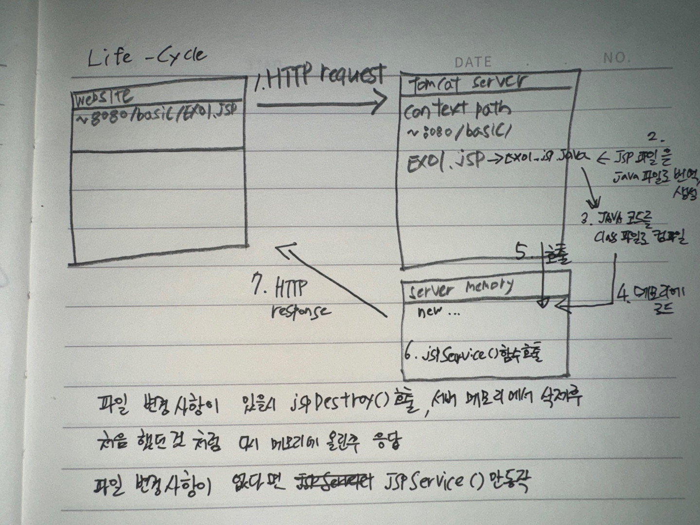
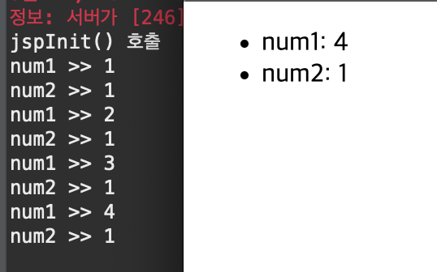
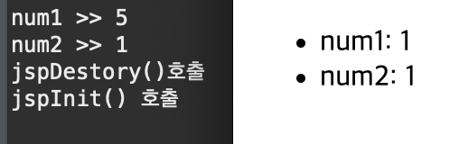
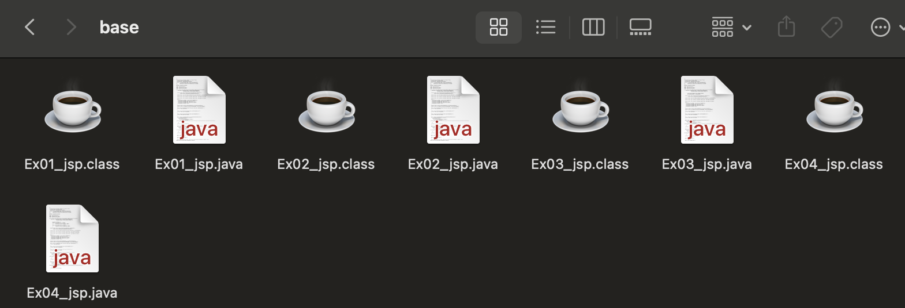

# 2024 03 27

### Life_Cycle

- jsp파일이 처리되어 응답되기까지 서버측에서 이루어지는 과정

### Ex01
```
<%!
	private int num1 = 0;
	public void jspInit(){ // 오버라이딩
		System.out.println("jspInit() 호출");
	}
	public void jspDestroy(){ // 오버라이딩
		System.out.println("jspDestory()호출");
	}
%>
<%
	int num2 = 0;
	num1++;
	num2++;
	/*
	System.out.println("num1 >> " + num1);
	System.out.println("num2 >> " + num2);
	*/
%>
<ul>
	<li>num1: <%= num1 %></li>
	<li>num2: <%= num2 %></li>
</ul>
```
   
- 새로고침을 할때마다 num1의 값이 1씩 증가한다
    - 메모리에 값이 유지되기 때문에
- num2는 증가하지 않는다

### Ex01예제 파일 코드수정
   
- 기존 메모리가 삭제된후 다시 파일을 만들었기 떄문에 num1, num2의 값이 1부터 시작하게 된다
- jspDestory()로 메모리에 있던걸 삭제후 jsp파일을 java파일로 만든후 컴파일하여 메모리에 로드했기떄문이다

   
- 톰캣이 변환 시켜준다
- 파일을 지우고 이클립스에서 실행시킨다면 실행을 요청한 파일은 다시 파일이 생성된다
- 파일이 수정된다면 jspDestory()를 호춣하여 메모리에서 기존에 있던걸 삭제한후 jsp파일을 다시 java파일로 만든후 컴파일을해 메모리에 다시 저장한다