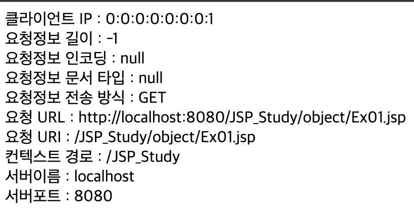
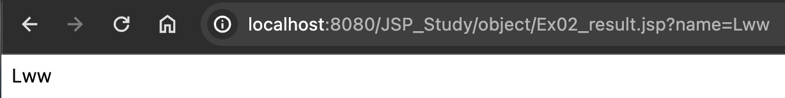
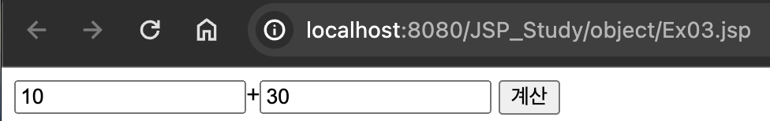
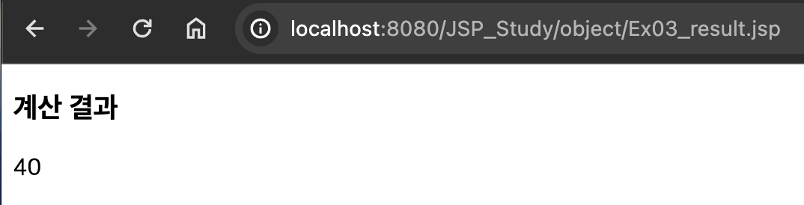
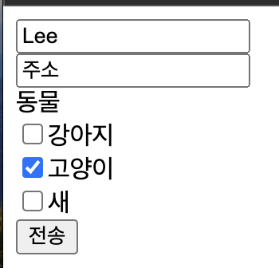
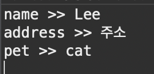

# 2024 03 29

### 기본객체 Ex01
```
클라이언트 IP : <%= request.getRemoteAddr() %><br>
요청정보 길이 : <%= request.getContentLength()%><br>
요청정보 인코딩 : <%= request.getCharacterEncoding()%><br>
요청정보 문서 타입 : <%= request.getContentType()%><br>
요청정보 전송 방식 : <%= request.getMethod()%><br>
요청 URL : <%= request.getRequestURL()%><br>
요청 URI : <%= request.getRequestURI()%><br>
컨텍스트 경로 : <%= request.getContextPath()%><br>
서버이름 : <%= request.getServerName()%><br>
서버포트 : <%= request.getServerPort()%><br>
```
   
- 사용자가 서버로 요청 했을때 요청정보들이 서버쪽에서 저장해두기위한 객체 request

### 기본객체 Ex02
```
<body>
<form action="Ex02_result.jsp">
	<input type="text" name="name" placeholder="문자열입력">
	<input type="submit" value="전송">
</form>
</body>
```
   
- 값을 입력받기위한 form
- 값을 입력하고 전송 버튼을 누르면 페이지가 Ex02_result.jsp로 화면이 이동된다
   
```
<body>
<%
	String name = request.getParameter("name");
	System.out.println("전송받은값 >>" + name);
%>
<%= name%>
</body>
```
   
- getparameter은 form에서 입력해 전송된 값을 가져온다
    - 괄호안 name으로 어떤 전송된 값중 어떤 값을 가져올지 정한다
- method방식이 get으로 설정되있기 때문에 주소창에 어떤 결과 값이 넘어갔는지 알수있다

### 기본객체 Ex03
```
<body>
<form action="Ex03_result.jsp" method="post">
	<input type="text" name="num1">+<input type="text" name="num2">
	<input type="submit" value="계산">
</form>
</body>
```
   
- form 태그로 두개의 값을 입력받아 더하는 입력폼이다
- form 태그에서 method방식을 post방식으로 설정한다   

```
<body>
<%
	String num1 = request.getParameter("num1");
	String num2 = request.getParameter("num2");
	int n1 = Integer.parseInt(num1);
	int n2 = Integer.parseInt(num2);
	int result = n1 + n2;
%>
<h3>계산 결과</h3>
<%= result %>
</body>
```
   
- 입력받은 값 두개를 각각 가져와 num1,num2에 저장한다
- num1,num2를 정수형으로 변환하고 두값을 더한 값을 출력한다
- post방식으로 값을 가져왔기 때문에 주소창에 값이 보이지 않는다

### 기본객체 Ex04
```
<form action="Ex04_result.jsp" method="post">
	<input type="text" name="name" placeholder="Name"><br>
	<input type="text" name="address" placeholder="address"><br>
	동물<br>
	<input type="checkbox" name="pet" value="dog">강아지<br>
	<input type="checkbox" name="pet" value="cat">고양이<br>
	<input type="checkbox" name="pet" value="bird">새<br>
	<input type="submit" value="전송">
</form>
</body>
```
   
- 이름,주소,체크박스로 여러개의 동물을 선택할수 있는 입력폼

```
<body>
<%
	request.setCharacterEncoding("utf-8");
	String name = request.getParameter("name");
	String address = request.getParameter("address");
	String[] pets = request.getParameterValues("pet");// 전송하는데이터가 여러개일때
	
	System.out.println("name >> " + name);
	System.out.println("address >> " + address);
	for(String pet : pets){
		System.out.println("pet >> " + pet);
	}
%>
</body>
```
   
- 이름이나 주소는 하나의 값만 가져와 출력할것이기 때문에 getParameter()를 사용
- 동물의 name값은 모두 pet으로 동일하기 때문에 getParameterValues로 가져와 배열에 저장시킨다