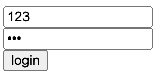
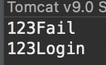
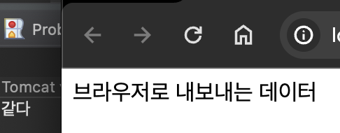
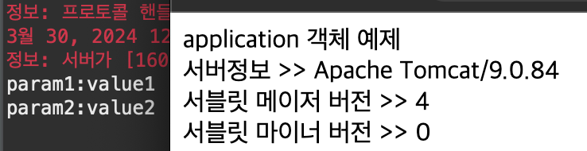

# 2024 03 30

### 기본객체 Ex05
```
<body>
구글로 이동
<%
	response.sendRedirect("https://www.google.com/");
%>
</body>
```
- 해당페이지로 이동시 구글페이지로 이동이된다
- 브라우저에서 서버에 요청을 했을때 처리할것을 처리한후 결과값을 응답해줄때 다른곳으로 요청할 위치를 응답에 넣어줘 다시 요청을 하게된다

### 기본객체 Ex06
```
<form action="ex06_result.jsp" method="post">
	<input type="text" name="userid" placeholder="ID"><br>
	<input type="password" name="userpw" placeholder="PW"><br>
	<input type="submit" value="login">	
</form>
```
   
- 로그인을 하기 위한 로그인폼

```
<%
	String userid = request.getParameter("userid");
	String userpw = request.getParameter("userpw");
	
	if(userid.equals(userpw)){
		System.out.println(userid + "Login");
		response.sendRedirect(request.getContextPath());
	}else{
		System.out.println(userid + "Fail");
		response.sendRedirect("Ex06_LoginForm.jsp");
	}
%>
```
   
- 로그인폼에서 입력한 id,pw가 같다면 로그인 성공으로 최상위로 리다이렉트를 해준다
- 로그인이 실패한다면 다시 로그인폼으로 리다이렉트한다
- 로그인에 성공한다면 아이디와 Login이라는 문자가 출력되고 실패한다면 아이디와 Fail이 출력된다
- 리다이렉트는 처리결과 페이지가 따로 없을때 활용한다

### 기본객체 Ex07
```
<%
	HttpServletRequest httpRequest = (HttpServletRequest)pageContext.getRequest();
	if(request == httpRequest){
		System.out.println("같다");
	}
	pageContext.getOut().println("브라우저로 내보내는 데이터");
%>
```
   
- pageContext는 기본객체에 대한 접근이 가능하게 한다
- getRequest()로 꺼내왔을때 자동으로 생성되는 request객체와 같은지를 확인한다
- getOut()객체로 출력을 한다, 응답해주는 기능

### 기본객체 Ex08
```
<%
	Enumeration enumData = application.getInitParameterNames();
	while(enumData.hasMoreElements()){
		String initParamName = (String)enumData.nextElement();
		String initParamValue = application.getInitParameter(initParamName);
		System.out.println(initParamName + ":" + initParamValue);
	}
%>
application 객체 예제<br>
서버정보 >> <%= application.getServerInfo()%><br>
서블릿 메이저 버전 >> <%= application.getMajorVersion()%><br>
서블릿 마이너 버전 >> <%= application.getMinorVersion()%>
```

```
  <!-- 초기화 파라미터 설정(initParam) -->
  <context-param>
  	<param-name>param1</param-name>
  	<param-value>value1</param-value>
  </context-param>
    <context-param>
  	<param-name>param2</param-name>
  	<param-value>value2</param-value>
  </context-param>
```
   
- web.xml파일에 context-param은 서버를 실행했을때 최초로 생성되는 기본객체가 application인데 서버가 실행될때 만들어져 종료될때까지 남아있는다
- 초기에 필요한 데이터가 있다면 미리 설정을 해둔것이다
- 지정된 값들은 applicaton.getParameterNames()로 꺼내볼수 있다
- application객체로는 서버의 정보, 서블릿의 버젼을 확인해볼수 있다