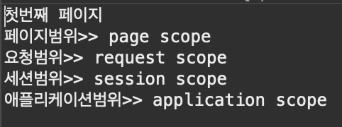

# 2024 03 31

### 기본객체 Ex09

##### Ex10.jsp
```
<%
	pageContext.setAttribute("name", "page scope");
	request.setAttribute("name", "request scope");
	session.setAttribute("name", "session scope");
	application.setAttribute("name", "application scope");
	System.out.println("첫번째 페이지");
	System.out.println("페이지범위>> " + pageContext.getAttribute("name"));
	System.out.println("요청범위>> " + request.getAttribute("name"));
	System.out.println("세션범위>> " + session.getAttribute("name"));
	System.out.println("애플리케이션범위>> " + application.getAttribute("name"));
	
	request.getRequestDispatcher("Ex10_2.jsp").forward(request, response);
%>
```
   
- pageContext,request,session,application은 setAttribute로 데이터를 저장할수 있다
- name이라는 이름으로 값을 저장한다
- getAttribute로 name의 값을 출력할수 있다
- 출력이 끝난다면 Ex10_2.jsp로 request,response를 전달한다

##### Ex_10_2.jsp
```
<body>
하나의 페이지 범위 >> <%= pageContext.getAttribute("name") %><br>
하나의 요청 범위 >> <%= request.getAttribute("name") %><br>
하나의 세션 범위 >> <%= session.getAttribute("name") %><br>
하나의 애플리케이션 범위 >> <%= application.getAttribute("name") %><br>
<a href="Ex10_3.jsp">세번째 페이지 요청</a>
</body>
```
   
- pageContext는 하나의 페이지에서만 유지되기때문에 값이 나오지 않는다
- request는 값을 넘겨줬기 때문에 값이 유지된다
- session은 브라우저가 변경되지 않았기 때문에 값이 유지된다

##### Ex10_3.jsp
```
<body>
하나의 페이지 범위 >> <%= pageContext.getAttribute("name") %><br>
하나의 요청 범위 >> <%= request.getAttribute("name") %><br>
하나의 세션 범위 >> <%= session.getAttribute("name") %><br>
하나의 애플리케이션 범위 >> <%= application.getAttribute("name") %><br>
<a href="<%= request.getContextPath()%>">처음으로</a>
</body>
```
   
- request는 값을 보내주지 않기때문에 값이 나오지 않는다