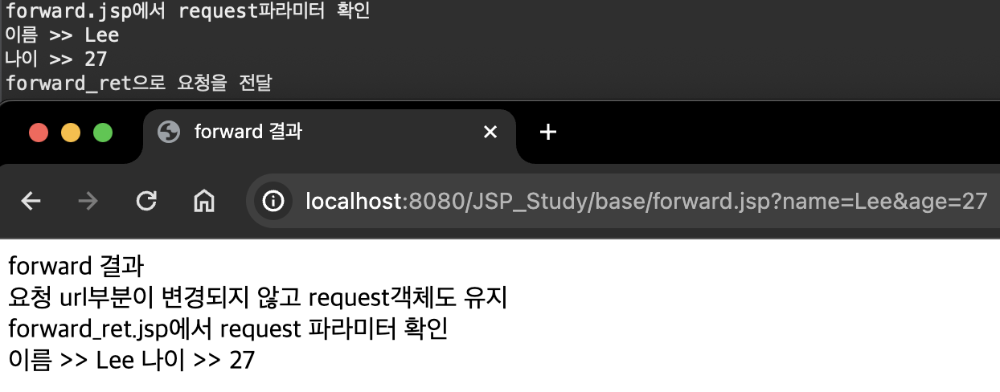
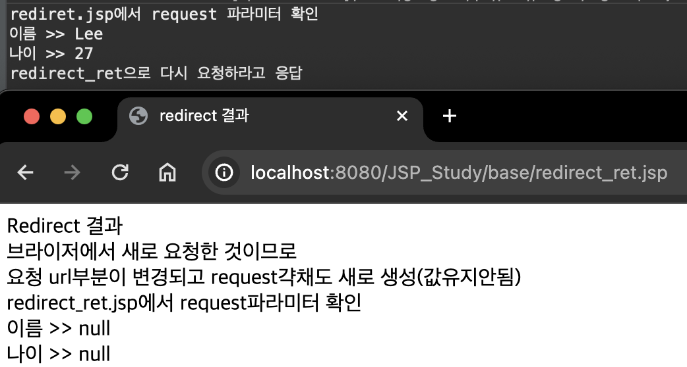
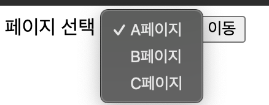
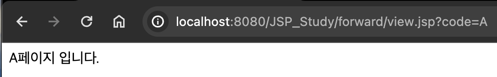

# 2024 04 02

### Forward&Redirect
- forward는 요청을 다른페이지로 전달해준다
    - 요청을 구분하여 처리할 서블릿을 결정하는 경우
    - 처리를 여러단계의 서블릿으로 구분하여 필요한 단계로 바로 이동하는 경우
    - 브라우저에 표시되는 경로를 숨기고 싶은 경우
    - 요청시 생성된 request,response객체의 값이 유지된다
- redirect는 다시요청한다
    - 요청을 검증하여 알맞은 페이지로 요청을 하도록 처리하는 경우
    - 에러 또는 예외 처리에 대한 결과 페이지를 처리하는 경우
    - 브라우저에 주소 창에 경로가 표시된다
    - 새로운 요청입므로 request,response객체는 새로 생성된다

#### 예제1
##### reqres.jsp
```
	<form action="forward.jsp" method="get">
		이름 : <input type="text" name="name"><br>
		나이 : <input type="text" name="age">
		<input type="submit" value="forward 요청">
	</form>
	<hr></hr>
	<form action="redirect.jsp" method="get">
		이름 : <input type="text" name="name"><br>
		나이 : <input type="text" name="age">
		<input type="submit" value=redirect 요청">
	</form>
```
- 첫번째 form은 forward.jsp 파일로 요청을 한다
- 두번째 formdms redirect.jsp 파일로 요청을 한다
- 브라우저에서 서버에 요청
    - 서버는 요청받은 url자원을 처리하고 응답한다

##### forward.jsp
```
<%@ page language="java" contentType="text/html; charset=UTF-8"
    pageEncoding="UTF-8"%>
<%
	String name = request.getParameter("name");
	String age = request.getParameter("age");
	System.out.println("forward.jsp에서 request파라미터 확인");
	System.out.println("이름 >> " + name);
	System.out.println("나이 >> " + age);
	System.out.println("forward_ret으로 요청을 전달");
	RequestDispatcher dispatcher = request.getRequestDispatcher("forward_ret.jsp");
	dispatcher.forward(request, response);
%>
```
- 요청을 받았을 때 request기본객체로 name,age를 꺼낸다
- 이클립스 콘솔창에 값을 출력한다
- request객체에서 getRequestDispatcher를 꺼내와 포워딩할 페이지를 지정해준다
- dispatcher객체를 이용해 forward작업을하면 request,response가 forward_ret.jsp에 전달이된다

##### forward_ret.jsp
```
<body>
<%
	String name = request.getParameter("name");
	String age = request.getParameter("age");
%>
forward 결과<br>
요청 url부분이 변경되지 않고 request객체도 유지<br>
<%= "forward_ret.jsp에서 request 파라미터 확인" %><br>
<%= "이름 >> " + name %>
<%= "나이 >> " + age %>
</body>
```
   
- request객체에서 값을 꺼내는데 그 값은 forward.jsp에서 가지고있는 값이 유지가 된것이다

##### redirect.jsp
```
<%
	String name = request.getParameter("name");
	String age = request.getParameter("age");
	System.out.println("rediret.jsp에서 request 파라미터 확인");
	System.out.println("이름 >> " + name);
	System.out.println("나이 >> " + age);
	System.out.println("redirect_ret으로 다시 요청하라고 응답");
	response.sendRedirect("redirect_ret.jsp");
%>
```
- request를 다른곳에 연결하는 것이 아닌 응답을 준다
- 다시 요청을 한다

##### redirect_ret.jsp
```
<body>
<%
	String name = request.getParameter("name");
	String age = request.getParameter("age");
%>
Redirect 결과<br>
브라이저에서 새로 요청한 것이므로<br>
요청 url부분이 변경되고 request갹채도 새로 생성(값유지안됨)<br>
<%= "redirect_ret.jsp에서 request파라미터 확인" %><br>
<%= "이름 >> " + name %><br>
<%= "나이 >> " + age %><br>
</body>
```
   
- 브라우저에 새로 요청한것이기때문에 요청url도 변경이되고 request객체도 새로 생성이된다
- 처음 전달했던 값이 유지되지 않는다

#### 예제2
#####  select.jsp
```
<body>
<form action="<%= request.getContextPath() %>/forward/view.jsp">
	페이지 선택 : 
		<select name="code">
			<option value="A">A페이지</option>
			<option value="B">B페이지</option>
			<option value="C">C페이지</option>
		</select>
		<input type="submit" value="이동">
</form>
</body>
```
   
- select에 option으로 A,B,C중 하나를 선택해 view.jsp에서 처리를 한다

##### view.jsp
```
<%
	String code = request.getParameter("code");
	String url = "";
	
	if(code.equals("A")){
		url = "/forward/a.jsp";	
	}else if(code.equals("B")){
		url = "/forward/b.jsp";		
	}else if(code.equals("C")){
		url = "/forward/c.jsp";
	}
	
	// forward
	//방법1
	//RequestDispatcher dispatcher = request.getRequestDispatcher(url);
	//dispatcher.forward(request, response);
	
	//방법2
	//request.getRequestDispatcher(url).forward(request,response);
%>
<jsp:forward page="<%= url %>"/>
```
- RequestDispatcher는 브라우저에서 요청을 제어할수 있는 객체이다
- request, response객체를 그대로 이어서 다음 페이지에 연결해 주는것이다
- jsp에서 제공하는 액션태그를 사용하여 forward를 할수도있다

##### a.jsp
```
<body>
A페이지 입니다.
</body>
```
- b.jsp, c.jsp도 이와 같이 만든다
   
- 주소창을 보면 view.jsp?code=A로 나오게된다
    - B,C를 선택시 각각에 맞는 jsp파일로 이동된다
