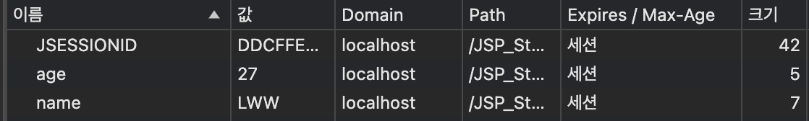
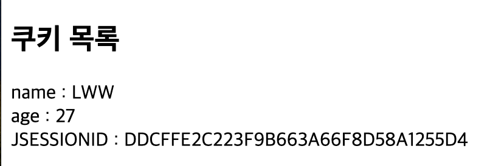
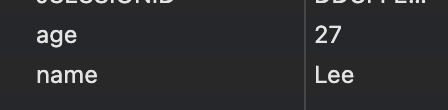
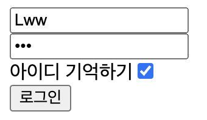
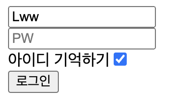
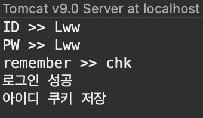

# 2024 04 03

### cookie
- 쿠키는 서버가 만든다
    - 쿠키를 만드는 jsp파일이있다면 생성
    - response헤더에 쿠키를 추가해 응답해준다
- 브라우저에 저장할수있는 데이터
- 쿠키는 서버에서 생성하고 브라우저에 응답하여 저장하도록 하는 데이터 조각이다
- 브라우저는 저장된 쿠키를 해당 사이트에 자원 요청시 포함하여 전송한다
- 브라우저가 사이트를 이용하면서 유지할 값이 있다면 사용한다
- 쿠키생성 순서
    - 브라우저에서 서버로 자원요청
    - 서버에서 쿠키 생성 및 응답에 포함
    - 브라우저는 응답받은 쿠키를 저장소에 저장
    - 해당 사이트로 요청시 쿠키를 함께 전송
    - 요청 정보에서 쿠키 정보를 확인
- 쿠키의 구성요소
    - 이름
    - 값
    - 유효시간(쿠키가 유지되는 시간, 초단위, 설정하지않으면 세션이 유지되는 시간)
    - 도메인(쿠키를 생성한 사이트)
    - 경로(쿠키를 전송할 요청 URL)
- 웹서비스를 이용하는 동안 유지할 데이터를 저장하는 용도(공개되도 괜찮은 정보만)
- 세션쿠키는 브라우저를 닫으면 사라진다
    - 쿠키를 만들때 시간을 주면 브라우저를 닫아도 해당 시간까지는 쿠키가 유지된다

##### makeCookie.jsp
```
<%
	Cookie cookie1 = new Cookie("name","LWW");//쿠키의 이름,값과 같이 맵형식으로 데이터를 저장한다
	Cookie cookie2 = new Cookie("age","27");
	System.out.println("name >> " + cookie1.getValue());
	System.out.println("age >> " + cookie2.getValue());

    response.addCookie(cookie1);
	response.addCookie(cookie2);
%>
<body>
쿠키가 생성되었습니다.
</body>
```
   
   
- response.addCookie로 응답에 쿠키를 추가한다
- 개발자도구에 애플리케이션에서 쿠키를 확인해볼수 있다

##### viewCookie.jsp
```
<body>
<h2>쿠키 목록</h2>
<%
	Cookie[] cookies = request.getCookies();
	for(Cookie cookie : cookies){
%>
		<%= cookie.getName()%> : <%= cookie.getValue() %><br>
<%
	}
%>
</body>
```
   
- request에서 쿠키목록을 가져와 출력시킨다

##### modifyCookies.jsp
```
<%
	Cookie[] cookies = request.getCookies();
	// 쿠키가 있다면 동작
	if(cookies != null && cookies.length > 0){
		for(int i=0; i<cookies.length;i++){
			if(cookies[i].getName().equals("name")){
				Cookie cookie = new Cookie("name","Lee");
				response.addCookie(cookie);
			}
		}
	}
%>
```
   
- 쿠키중에 같은 이름의 쿠키의 값을 변경시기고 싶다면 같은 키값에 값을 변경시켜주면된다
- if문으로 쿠키가 있다면 request로 받아온 쿠키들 중에서 키값이 name인 쿠키가 있다면 새로 쿠키를 만들면 쿠키의 값이 변경된다

##### deleteCookie.jsp
```
<body>
<%
	Cookie[] cookies = request.getCookies();
	if(cookies != null && cookies.length > 0){
		for(int i=0; i<cookies.length;i++){
			if(cookies[i].getName().equals("name")){
				Cookie cookie = new Cookie("name","");
				cookie.setMaxAge(0);
				response.addCookie(cookie);
			}
		}
	}
%>
쿠키가 삭제되었습니다
</body>
```
   
- 쿠키를 삭제시키는 방법은 수정하는 방법과 같으나 setMaxAge(0)으로 주어 유효시간이 없게 만들면 쿠키가 사라진걸 확인할수 있다

##### urlCookie.jsp
```
<%
	Cookie cookie = new Cookie("cat","고양이");
	cookie.setPath(request.getContextPath()+"/path");
	response.addCookie(cookie);
%>
```
- 해당 경로에 갔을때 쿠키를 준다
- 다른 경로로 갔을때는 쿠키를 주지 않는다

##### makeCookieWithMaxTime.jsp
```
<body>
<%
	Cookie cookie4 = new Cookie("timeCookie","timecookie");
	cookie4.setMaxAge(60*60);
	response.addCookie(cookie4);
%>
유효시간이 1시간인 쿠키
</body>
```
   
- 유효시간이 1시간이 쿠키를 생성
    - 시간이 지난다면 쿠키는 사라진다
- 쿠크는 유효시간이 지나면 다시 사용하지 못한다
- 시간이 지정되지 않으면 세션쿠키라고하며 브라우저가 종료되면 사라진다
- 시간을 지정하면 해당 시간동안 브라우저에서 유지된다
    - 브라우저를 닫아도 유지한다

##### loginForm.jsp
```
<body>
<%
	String checked = "";
	String userid = "";
	Cookie[] cookies = request.getCookies();
	if(cookies != null && cookies.length > 0){
		for(int i=0;i<cookies.length;i++){
			if(cookies[i].getName().equals("remember")){
				checked = "checked";
				userid = cookies[i].getValue();
			}
		}
	}
%>
<form action="LoginProc.jsp" method="post">
	<input type="text" name="userid" placeholder="ID" value="<%= userid%>"><br>
	<input type="password" name="userpw" placeholder="PW"><br>
	아이디 기억하기<input type="checkbox" name="remember" value="chk" <%= checked %>><br>
	<input type="submit" value="로그인">
</form>
</body>
```
   
- 로그인폼으로 체크박스에 체크를 한상태로 로그인에 성공한다면 쿠키가 생성된다
- 다시 로그인폼으로 돌아온다면 쿠키가 생성되있기 떄문에 아이디박스에 로그인했을때 쓴 아이디가 저장된상태로 나오게 되며 체크박스는 유지된다

##### LoginProc.jsp
```
<%

	String userid = request.getParameter("userid");
	String userpw = request.getParameter("userpw");
	String remember = request.getParameter("remember");
	System.out.println("ID >> " + userid);
	System.out.println("PW >> " + userpw);
	System.out.println("remember >> " + remember);

	if(userid.equals(userpw)){
		System.out.println("로그인 성공");
		if(remember != null){
			Cookie rememberCookie = new Cookie("remember",userid);
			rememberCookie.setMaxAge(60*60);
			response.addCookie(rememberCookie);
			System.out.println("아이디 쿠키 저장");
		}else{
			Cookie rememberCookie = new Cookie("remember",userid);
			rememberCookie.setMaxAge(0);
			response.addCookie(rememberCookie);
			System.out.println("아이디 쿠키 삭제");
		}
		response.sendRedirect("loginSuccess.jsp");
	}else{
		System.out.println("로그인 실패");
		response.sendRedirect("loginForm.jsp");
	}
%>
</body>
```
   
   
- 로그인폼에서 값을 가져와 아이디와 비밀번호가 같다면 로그인을 성공시키고 체크박스에 체크가 되어있다면 해당 아이디를 쿠키로 만든다
    - 유효시간 1시간짜리 쿠키를 생성한다
    - 체크박스가 해제되어있다면 아이디 쿠키를 삭제시킨다
- 로그인에 성공한다면 loginSuccess.jsp파일로 이동하게되고 실패한다면 다시 로그인폼으로 이동하게된다
