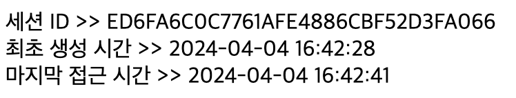
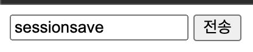
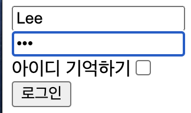
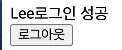

# 2024 04 04

### session
```
<%@ page language="java" contentType="text/html; charset=UTF-8"
    pageEncoding="UTF-8" session="true"%>
```
- true가 기본값이며 false로 바꾸면 session을 만들지 않는다
- session은 브라우저를 식별한다
- 쿠키는 브라우저가 기억하고있지만 세션은 서버에서 생성이된다
- JSP에서 최초 요청시 내장객체로 세션이 생성된다
    - session.setAttribute("key",value)
    - session. getAttribute("key")
- 중요한 정보를 저장하는데 용이하다
    - 세션은 클라이언트에서 알수 없다
    - 세션에 어떤 값이 저장되어 있는지 확인할수 없다 
- 세션은 쿠키안에 담아 보내주게된다
    - 서버에서 요청된 내용안에서 쿠키정보를 확인한후 어떤 브라우저인지 식별한다
    - 브라우저를 종료하거나 session.invalidate()를 호출하면 세션은 사라진다
    - 사라진후 다시 요청을 한다면 쿠키정보가 서버에 가면 서버는 세션정보가 없기 때문에 새로운 세션을 만들고 응답을해 쿠키에 다시 저장시킨다 

#### sessionInfo.jsp
```
<%@ page language="java" contentType="text/html; charset=UTF-8"
    pageEncoding="UTF-8"%>
<%@ page session="true"%>
<%@ page import="java.util.Date, java.text.SimpleDateFormat" %>  
<%
	Date creationtime = new Date();
	SimpleDateFormat formatter = new SimpleDateFormat("yyyy-MM-dd HH:mm:ss");
	creationtime.setTime(session.getCreationTime()); //세션이 최초로 생성된 시간	
	
	Date lastAccessTime = new Date();
	lastAccessTime.setTime(session.getLastAccessedTime()); //마지막 접근 시간
%>
<!DOCTYPE html>
<html>
<head>
<meta charset="UTF-8">
<title>세션 확인</title>
</head>
<body>
세션 ID >> <%= session.getId() %><br>
최초 생성 시간 >> <%= formatter.format(creationtime) %><br>
마지막 접근 시간 >> <%= formatter.format(lastAccessTime)%>
</body>
</html>
```
   
- 마지막 접근시간은 새로고침을 할시 현재시간으로 변경된다
- 최초 생성시간은 브라우저마다 시간이 다르다
- session.invalidate()로 세션정보를 없앨수 있다, 삭제보다는 무효화
    - 제거후 sessionInfo.jsp를 새로고침하면 세션ID가 달라진다

#### 세션 유효시간 설정
```
<%
session.setMaxInactiveInterval(10);
%>
```
- 세션이 만들어지고나서 10초간 사용하지 않는다면 세션의 ID가 변경된다
- web.xml에서 기본설정을 줘도 페이지에 따로 시간을 정해놨다면 해당 코드로 유효시간이 결정된다
   
```
  <session-config>
  	<session-timeout>1</session-timeout>
  </session-config>
```
- web.xml에서 유효시간을 설정할수있다
    - 유효시간은 1분단위이다
    - web.xml을 수정하면 서버를 재시작 해야한다
- 모든 페이지에서 유효시간을 1분으로 만든다

#### 세션 정보 저장

##### sessionData.jsp
```
<form action = "sessionSave.jsp">
	<input type="text" name="data">
	<input type="submit" value="전송">
</form>
```
   
- 값을 입력후 전송버튼을 클릭하면 sessionSave.jsp로 이동한다

##### sessionSave.jsp
```
<%
	String data = request.getParameter("data");
	session.setAttribute("saveData", data);
	response.sendRedirect("sessionDataSave.jsp");
%>
```
- request.getParameter로 sessionData.jsp에서 입력한 값을 가져온다
- session.setAttribute()로 가져온 값을 저장시킨다


##### sessionDataSave.jsp
```
<body>
세션에 저장된 데이터 >> <%= session.getAttribute("saveData") %>
</body>
```
   
- session.getAttribute()로 세션에 저장해둔 정보를 꺼내올수 있다
- sessionData.jsp에서 입력한 값이 sessionSave.jsp에서 세션에 저장한후 가져온것이다

#### session Login

##### loginForm.jsp
```
<body>
<%
	String loginId = (String)session.getAttribute("loginId"); 
	if(loginId != null){
		System.out.println("로그인 상태");
		response.sendRedirect("loginSuccess.jsp");
	}else{
	String checked = "";
	String userid = "";
	Cookie[] cookies = request.getCookies();
	if(cookies != null && cookies.length > 0){
		for(int i=0;i<cookies.length;i++){
			if(cookies[i].getName().equals("remember")){
				checked = "checked";
				userid = cookies[i].getValue();
			}
		}
	}
%>
<form action="LoginProc.jsp" method="post">
	<input type="text" name="userid" placeholder="ID" value="<%= userid%>"><br>
	<input type="password" name="userpw" placeholder="PW"><br>
	아이디 기억하기<input type="checkbox" name="remember" value="chk" <%= checked %>><br>
	<input type="submit" value="로그인">
</form>
</body>
</html>
<%
	}
%>
```
   
- 쿠키를 할때 만든 파일에 session을 가져오는 session.getAttribute()로 세션에 저장된 값을 가지고 온다
    - 값은 Object로 저장되있기 떄문에 String으로 변환해줘야한다
- 가지고온 값이 null이 아니라면 로그인을 상태이기 때문에 loginSuccess.jsp로 이동한다

##### LoginProc.jsp
```
<body>
<%
	String loginId = (String)session.getAttribute("loginId");
	if(loginId != null){
		System.out.println("LoginProc.jsp >> 로그인 상태");
		response.sendRedirect("loginSuccess.jsp");
	}else{
		String userid = request.getParameter("userid");
		String userpw = request.getParameter("userpw");
		String remember = request.getParameter("remember");
		System.out.println("ID >> " + userid);
		System.out.println("PW >> " + userpw);
		System.out.println("remember >> " + remember);
		if(userid.equals(userpw)){
			System.out.println("로그인 성공");
			session.setAttribute("loginId", userid);
			
			if(remember != null){
				Cookie rememberCookie = new Cookie("remember",userid);
				rememberCookie.setMaxAge(60*60);
				response.addCookie(rememberCookie);
				System.out.println("아이디 쿠키 저장");
			}else{
				Cookie rememberCookie = new Cookie("remember",userid);
				rememberCookie.setMaxAge(0);
				response.addCookie(rememberCookie);
				System.out.println("아이디 쿠키 삭제");
			}
			response.sendRedirect("loginSuccess.jsp");
		}else{
			System.out.println("로그인 실패");
			response.sendRedirect("loginForm.jsp");
		}
	}	
%>
</body>
</html>
```
- loginForm.jsp와 마찬가지로 로그인을 한 상태라면 loginSuccess.jsp로 이동시킨다

##### loginSuccess.jsp
```
<body>
<%= session.getAttribute("loginId") %>로그인 성공<br>
<a href="logout.jsp"><button>로그아웃</button></a>
</body>
```
   
- 로그인에 성공했다면 어떤 계정으로 로그인을 했는지 보여준다

##### logout.jsp
```
<%
	System.out.println(session.getAttribute("loginId") + "로그아웃");
	session.invalidate();
	response.sendRedirect("loginForm.jsp");
%>
```
- 로그아웃을 한다면 session을 모두 없애고 다시 loginForm.jsp로 이동시킨다
