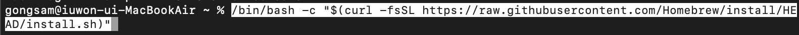
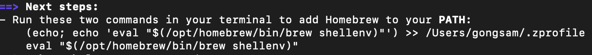
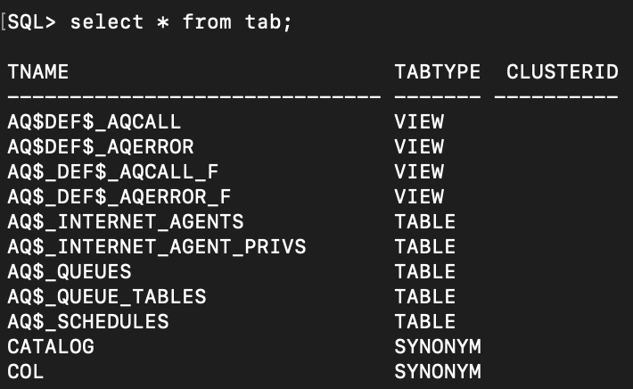
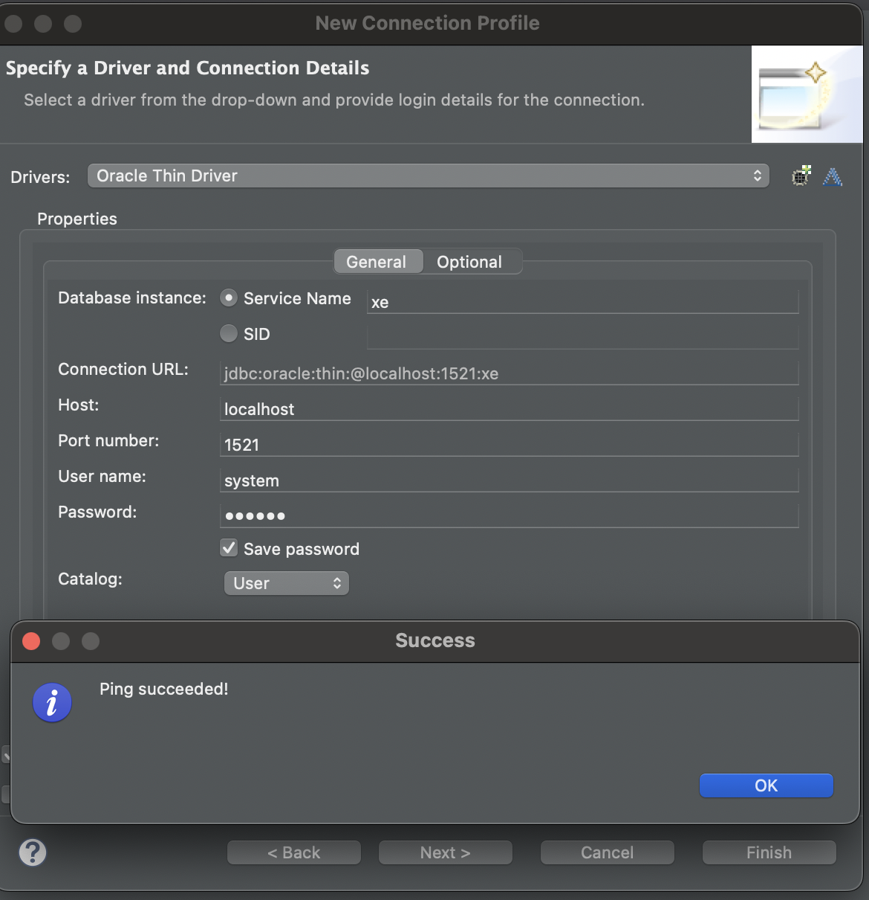

##### 2024 04 06

#### 오라클 설치
- https://brew.sh/

```
/bin/bash -c "$(curl -fsSL https://raw.githubusercontent.com/Homebrew/install/HEAD/install.sh)"
```
   
- 터미널에서 Homebrew사이트에서 명령어를 복사한후 입력한다
   
- 설치후 터미널에 입력된 echo부분 두개를 하나씩 복사해 입력해준다
- brew --version으로 설치가 되었는지 확인할수 있다
- 터미널 종료후 homebrew가 사라져있다면
    - 설치후 vi ~/.zshrc를 입력후 i키를 입력
    - export "PATH=/opt/homebrew/bin:$PATH"를 입력후 esc키를 누르고 :wq를 입력후 엔터
    - source ~/.zshrc로 수정사항을 적용한다
```
brew install colima
```
- homebrew로 콜리마를 설치한다
- colima start --memory 4 --arch x86_64로 실행
- https://www.docker.com/ 도커를 설치한다
    - 설치후 docker search oracle-xe-11g로 다운로드할 이미지를 검색한다
    - 검색 목록중 docker pull jaspeen/oracle-xe-11g 를 받는다
    - docker run --name oracle -d -p 8080:8080 -p 1521:1521 jaspeen/oracle-xe-11g 로 컨테이너 실행과 이름을 정한다
        - 이름은 oracle
    - docker exec -it my_oracle sqlplus로 sqlplus를 실행한다
        - name과 pw는 system,oracle이다
   
- sql문이 정상적으로 작동되는걸 볼수 있다

#### 이클립스 연동1
    
- 이클립스 우측 상단에 있는 Open Perspective를 클릭후 Database Development를 클릭한다
- 좌측 상단에 있는 Database Connections를 우클릭해 new를 클릭한다
- oracle을 선택후 자신이 설치할 버전을 고른후 JAR을 알맞게 설정해준다
- 위 사진처럼 설정후 테스트를 해서 OK가 떴다면 완료이다

#### 이클립스 연동2
```
<%@ page language="java" contentType="text/html; charset=EUC-KR"
    pageEncoding="EUC-KR"%>
<%@ page import = "java.sql.*" %>
<!DOCTYPE html>
<html>
<head>
<meta charset="EUC-KR">
<title>Insert title here</title>
</head>
<body>
	<%
		Connection conn = null;
		try{
			Class.forName("oracle.jdbc.driver.OracleDriver");
			conn = DriverManager.getConnection("jdbc:oracle:thin:@localhost:1521:xe", "system", "oracle");
			out.print("데이터베이스 연결이 성공했습니다.");
		} catch(SQLException ex) {
			out.print("데이터베이스 연결이 실패했습니다.");
			out.print("SQLException : " + ex.getMessage());
		}finally{
			if(conn != null) {
				conn.close();
			}
		}
	%>
</body>
</html>
```
   
- lib폴더에 ojdbc6.jar을 넣는다
- 위코드를 실행하면 데이터베이스에 연결이 되었는지 확인할수 있다
    - 연결에 실패하면 연결실패 메시지가 뜬다