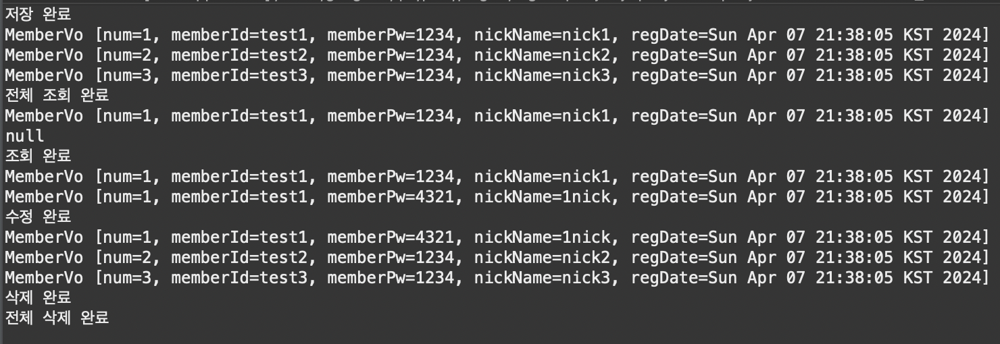
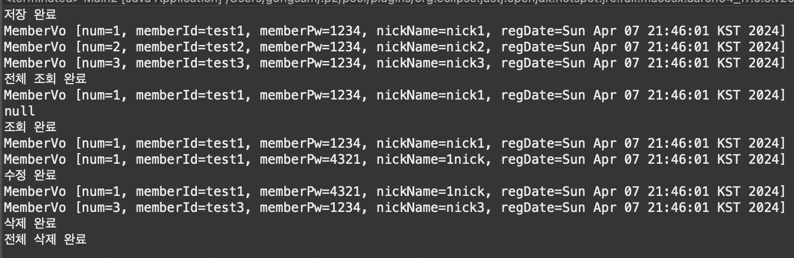
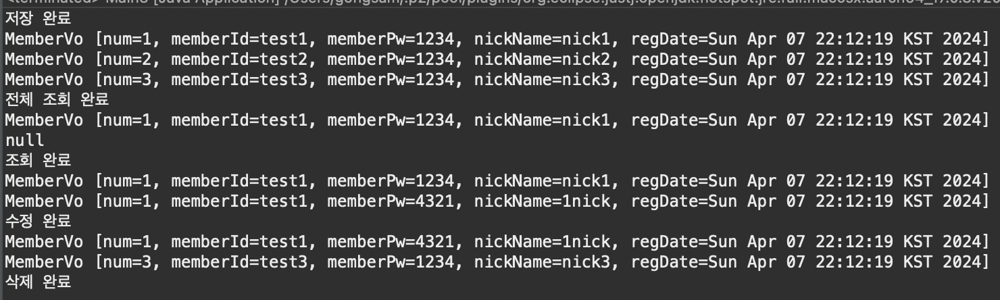

##### 2024 04 07

#### 예제1
##### MemberVo.java
```
public class MemberVo {

	private int num;
	private String memberId;
	private String memberPw;
	private String nickName;
	private Date regDate;
	
	public MemberVo(){
		
	}

	public MemberVo(int num, String memberId, String memberPw, String nickName) {
		super();
		this.num = num;
		this.memberId = memberId;
		this.memberPw = memberPw;
		this.nickName = nickName;
	}

	public int getNum() {
		return num;
	}

	public void setNum(int num) {
		this.num = num;
	}

	public String getMemberId() {
		return memberId;
	}

	public void setMemberId(String memberId) {
		this.memberId = memberId;
	}

	public String getMemberPw() {
		return memberPw;
	}

	public void setMemberPw(String memberPw) {
		this.memberPw = memberPw;
	}

	public String getNickName() {
		return nickName;
	}

	public void setNickName(String nickName) {
		this.nickName = nickName;
	}

	public Date getRegDate() {
		return regDate;
	}

	public void setRegDate(Date regDate) {
		this.regDate = regDate;
	}

	@Override
	public String toString() {
		return "MemberVo [num=" + num + ", memberId=" + memberId + ", memberPw=" + memberPw + ", nickName=" + nickName
				+ ", regDate=" + regDate + "]";
	}
	
}
```
- 숫자,id,pw,nickname,날짜에 대한 getter,setter와 그값을 볼수이는 toString을 설정한다

##### Main.java
```
public class Main {
	public static void main(String[] args) {
		Map<Integer, MemberVo> db = new HashMap<>();
		
		//C(INSERT)
		MemberVo vo1 = new MemberVo(1,"test1","1234","nick1");
		vo1.setRegDate(new Date());
		MemberVo vo2 = new MemberVo(2,"test2","1234","nick2");
		vo2.setRegDate(new Date());
		MemberVo vo3 = new MemberVo(3,"test3","1234","nick3");
		vo3.setRegDate(new Date());
		
		db.put(1, vo1);
		db.put(2, vo2);
		db.put(3, vo3);
		System.out.println("저장 완료");
		
		//R(SELECT)
		List<MemberVo> ls = new ArrayList<>(db.values());
		for(MemberVo tmp:ls) {
			System.out.println(tmp);
		}
		System.out.println("전체 조회 완료");
		
		MemberVo vo = null;
		vo = db.get(1);
		System.out.println(vo);
		vo = db.get(4);
		System.out.println(vo);
		System.out.println("조회 완료");
		
		//U(UPDATE)
		vo = db.get(1);
		System.out.println(vo);
		if(vo != null) {
			vo.setMemberPw("4321");
			vo.setNickName("1nick");
			db.put(vo.getNum(), vo);
		}
		System.out.println(vo);
		System.out.println("수정 완료");
		
		//D(DELETE)
		ls = new ArrayList<>(db.values());
		db.remove(2);
		for(MemberVo tmp:ls) {
			System.out.println(tmp);
		}
		System.out.println("삭제 완료");
		
		db.clear();
		System.out.println("전체 삭제 완료");	
	}
}
```
   
- db라는 Map형식에 데이터를 생성한다
    - db의 역할을할것이다
- MemberVo에서 getter,setter를 만들어 두었기 때문에 데이터를 저장하거나 가져올수 있다
- vo1,vo2,vo3는 데이터를 저장하는 db로 따지면 INSERT이다
    - put으로 키값과 데이터를 저장한다
- ls는 List로 저장한 값을 가지고있다
    - for문을써서 전체 조회를 할수 있다
    - 하나만 필요하다면 get을 써서 가져올수있다(키값으로)
- update는 하나의 값을 가져와 다시 값을 지정해주고 put으로 값을 넣는다
- delete는 remove(키값)으로 하나의 값을 삭제할수 있다
    - clear()로 전체 삭제가 가능하다

#### 예제2
##### MemberDao.java
```
public class MemberDao {
	//db역할
	private Map<Integer, MemberVo> db = new HashMap<>();
	
	//c
	public void insertMember(MemberVo vo) {
		vo.setRegDate(new Date());
		db.put(vo.getNum(),vo);
	}
	
	//R
	public MemberVo selectMember(int num) {
		return db.get(num);
	}
	
	public List<MemberVo> selectMemverAll(){
		return new ArrayList<MemberVo>(db.values());
	}
	
	//U
	public void updateMamber(MemberVo vo) {
		db.put(vo.getNum(), vo);
	}
	
	//D
	public void deleteMember(int num) {
		db.remove(num);
	}
	public void deleteMemberAll() {
		db.clear();
	}
}
```
- Main.java에서 작업하던 추가,검색,업데이트,삭제를 메소드로 만들어둔것이다
- 필요한 작업이있다면 해당 메소드를 사용하여 간단하게 할수 있다
- Dao의 역할
    - 데이터베이스에 저장된 값을 가져오거나 집어넣기 위함
    - 데이터베이스와 쿼리를 주고받기 위함
    - 데이터베이스와 소통

##### Main2.java
```
public class Main2 {
	public static void main(String[] args) {
		MemberDao memberDao = new MemberDao();
		
		//C(INSERT)
		MemberVo vo1 = new MemberVo(1,"test1","1234","nick1");
		vo1.setRegDate(new Date());
		MemberVo vo2 = new MemberVo(2,"test2","1234","nick2");
		vo2.setRegDate(new Date());
		MemberVo vo3 = new MemberVo(3,"test3","1234","nick3");
		vo3.setRegDate(new Date());
		
		memberDao.insertMember(vo1);
		memberDao.insertMember(vo2);
		memberDao.insertMember(vo3);
		System.out.println("저장 완료");
		
		//R(SELECT)
		List<MemberVo> ls = memberDao.selectMemverAll();
		for(MemberVo tmp:ls) {
			System.out.println(tmp);
		}
		System.out.println("전체 조회 완료");
		
		MemberVo vo = null;
		vo = memberDao.selectMember(1);
		System.out.println(vo);
		vo = memberDao.selectMember(4);
		System.out.println(vo);
		System.out.println("조회 완료");
		
		//U(UPDATE)
		vo = memberDao.selectMember(1);
		System.out.println(vo);
		if(vo != null) {
			vo.setMemberPw("4321");
			vo.setNickName("1nick");
			memberDao.updateMamber(vo);
		}
		vo = memberDao.selectMember(1);
		System.out.println(vo);
		System.out.println("수정 완료");
		
		//D(DELETE)
		memberDao.deleteMember(2);
		ls = memberDao.selectMemverAll();
		for(MemberVo tmp:ls) {
			System.out.println(tmp);
		}
		System.out.println("삭제 완료");
		
		memberDao.deleteMemberAll();
		ls = memberDao.selectMemverAll();
		for(MemberVo tmp:ls) {
			System.out.println(tmp);
		}
		System.out.println("전체 삭제 완료");	
	}
}
```
   
- MemberDao memberDao = new MemberDao()로 memberDao변수는 MemberDao.java에 있는 메소드를 사용할수 있다
- 필요한 작업이있다면 memberDao.(메소드)로 사용할수 있다

#### 예제3
##### MemberService.java
```
public class MemberService {
	private MemberDao memberDao;
	
	public MemberService(MemberDao memberDao) {
		this.memberDao = memberDao;
	}
	
	//등록
	public boolean regist(MemberVo vo) {
		//동일한 회원이 없을때
		if(memberDao.selectMember(vo.getNum()) == null) {
			memberDao.insertMember(vo);
			return true;
		}
		return false;
	}
	
	//조회
	public MemberVo read(int num) {
		return memberDao.selectMember(num);
	}
	
	//전체조회
	public List<MemberVo> listAll(){
		return memberDao.selectMemverAll();
	}
	
	//수정
	public void edit(MemberVo vo) {
		MemberVo searchMember = memberDao.selectMember(vo.getNum());
		//동일할때만 변경
		if(searchMember.getMemberPw().equals(vo.getMemberPw())) {
			memberDao.updateMamber(vo);
		}
	}
	
	//탈퇴
	public void remove(int num) {
		memberDao.deleteMember(num);
	}
}
```
- 사용자와 핵심기능이 소통하기위한 기능(서비스)
- Dao가 db와 직접 소통을 하고 Dao와 Service가 서로 소통을을 한다
- 기능적인 수정이 필요하다면 Service에서 수정한다
    - DB수정이 필요하다면 Dao에서 수정한다

##### Main3.java
```
public class Main3 {
	public static void main(String[] args) {
		MemberService memberService = new MemberService(new MemberDao());
		
		//C(INSERT)
		MemberVo vo1 = new MemberVo(1,"test1","1234","nick1");
		vo1.setRegDate(new Date());
		MemberVo vo2 = new MemberVo(2,"test2","1234","nick2");
		vo2.setRegDate(new Date());
		MemberVo vo3 = new MemberVo(3,"test3","1234","nick3");
		vo3.setRegDate(new Date());
		
		memberService.regist(vo1);
		memberService.regist(vo2);
		memberService.regist(vo3);
		System.out.println("저장 완료");
		
		//R(SELECT)
		List<MemberVo> ls = memberService.listAll();
		for(MemberVo tmp:ls) {
			System.out.println(tmp);
		}
		System.out.println("전체 조회 완료");
		
		MemberVo vo = null;
		vo = memberService.read(1);
		System.out.println(vo);
		vo = memberService.read(4);;
		System.out.println(vo);
		System.out.println("조회 완료");
		
		//U(UPDATE)
		vo = memberService.read(1);
		System.out.println(vo);
		if(vo != null) {
			vo.setMemberPw("4321");
			vo.setNickName("1nick");
			memberService.edit(vo);
		}
		vo = memberService.read(1);
		System.out.println(vo);
		System.out.println("수정 완료");
		
		//D(DELETE)
		memberService.remove(2);
		ls = memberService.listAll();
		for(MemberVo tmp:ls) {
			System.out.println(tmp);
		}
		System.out.println("삭제 완료");
	}
}
```
   
- Main2와 같지만 MemberService를 사용하여 값을 처리한다