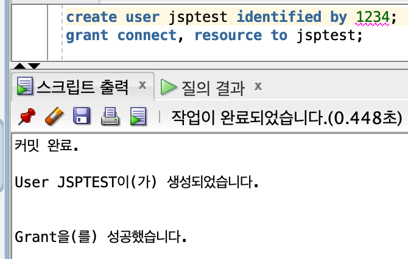
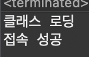
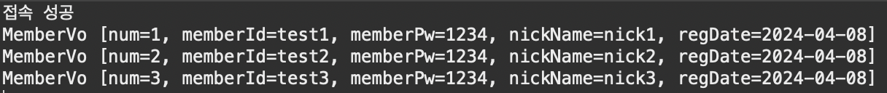
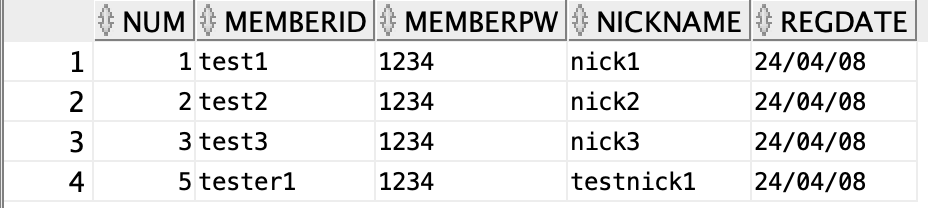

##### 2024 04 08

##### SQL Developer
- oracle은 db를 관리하는 시스템(DBMS)
- oracle은 계정마다 db가 나누어져있다
##### 계정 생성 
```
create user jsptest identified by 1234;
grant connect, resource to jsptest;
```
   
- jsptest라는 계정을 만들고 비밀번호는 1234로 지정한다
- grant로 권한을 부여한다
    - connect는 접속권한
    - resource는 객체, 데이터권한

##### 테이블 생성과 값추가
```
create table "MEMBER" (
    "NUM" number primary key,
    "MEMBERID" varchar2(100) not null unique,
    "MEMBERPW" varchar2(50) not null,
    "NICKNAME" varchar2(10) unique,
    "REGDATE" date
);

create sequence "MEMBER_SEQ"
start with 1
increment by 1
maxvalue 99999
nocache noorder nocycle;

insert into "MEMBER"
("NUM","MEMBERID","MEMBERPW","NICKNAME","REGDATE")
values ("MEMBER_SEQ".nextval,'test1','1234','nick1',sysdate);
insert into "MEMBER"
("NUM","MEMBERID","MEMBERPW","NICKNAME","REGDATE")
values ("MEMBER_SEQ".nextval,'test2','1234','nick2',sysdate);
insert into "MEMBER"
("NUM","MEMBERID","MEMBERPW","NICKNAME","REGDATE")
values ("MEMBER_SEQ".nextval,'test3','1234','nick3',sysdate);
commit;
```
   
- 생성시 관리자계정에서 자신이 만든 계정을 바꾸어야한다
    - 테이블관리등이 어렵기 때문
- MEMBER라는 테이블을 만든다
    - NUM은 기본키로 생성
    - MEMBERID는 null이 아니어야하고 중복이어서는 안된다
    - MEMBERPW는 null이 아니어야한다
    - NICKNAME은 중복이어서는 안된다
    - REGDATE는 날짜값이 들어간다
- MEMBER_SEQ라는 시퀀스를 만든다
    - 1부터 시작을하며 1씩 증가한다, 최대는 99999이다
    - 캐시를 사용하지 않고 다돌아갔을때 돌아가지 않는다
- INSERT로 MEMBER테이블에 값을 추가한다

#### db연동 
##### db연결
```
public class Ex01 {
	public static void main(String[] args) {
		Connection conn = null;
		try {
			Class.forName("oracle.jdbc.OracleDriver");
			//oracle.jdbc.driver.OracleDriver
			System.out.println("클래스 로딩");
			
			conn = DriverManager.getConnection(
					"jdbc:oracle:thin:@localhost:1521:xe",
					"jsptest",
					"1234");
			System.out.println("접속 성공");
		}catch(ClassNotFoundException e) {
			e.printStackTrace();
		}catch(SQLException e) {
			e.printStackTrace();
		}finally {
			if(conn != null) {
				try {
					conn.close();
				} catch (SQLException e) {
					e.printStackTrace();
				}
			}
		}
	}
}
```
   
- Class.forName()으로 드라이버가 있는지 확인할수 있다
- DriverManager를 사용해 DB에 연결할수 있다
    - 주소, DB계정 ID, PW를 알아야 한다

##### 테이블 검색
```
public class Ex02 {
	public static void main(String[] args) {
		Connection conn = null;
		
		PreparedStatement pstmt = null;
		ResultSet rs = null; 
		
		try {
			conn = DriverManager.getConnection(
					"jdbc:oracle:thin:@localhost:1521:xe",
					"jsptest",
					"1234");
			System.out.println("접속 성공");
			
			pstmt = conn.prepareStatement("select * from \"MEMBER\""); 
			rs = pstmt.executeQuery();
			
			while(rs.next()) {
				// NUM,MEMBERID,MEMBERPW,NICKNAME,REGDATE
				MemberVo vo = new MemberVo(
					rs.getInt(1),
					rs.getString(2),
					rs.getString("MEMBERPW"),
					rs.getString(4));
				vo.setRegDate(rs.getDate("REGDATE"));
				
				System.out.println(vo.toString());
			}
			
		}catch(SQLException e) {
			e.printStackTrace();
		}finally {
			if(rs != null) {
				try { rs.close();}
				catch (SQLException e) { e.printStackTrace();}
			}
			if(pstmt != null) {
				try { pstmt.close();}
				catch(SQLException e) { e.printStackTrace();}
			}
			if(conn != null) {
				try { conn.close(); }
				catch(SQLException e) { e.printStackTrace();}
			}
		}
	}
}

```
   
- PreparedStatement와 ResultSet을 만든다
    - PreparedStatement는 sql구문을 실행하는 역할
    - ResultSet은 select의 결과가 ResultSet으로 오기때문에 값을 넣기위함
- pstmt = conn.prepareStatement("select * from \"MEMBER\"");로 쿼리를 pstmt에 넣어준다
    - rs = pstmt.executeQuery();로 쿼리에 결과값을 rs에 저장한다
- while문을 돌리면서 값들을 가지고 온다
    - rs.next()로 가지고온값들을 하나씩 볼수 있다
    - rs.getInt, rs.getString으로 값을 지정해 가져올수 있다
        - 타입이 맞아야한다
    - 숫자로 지정할수도 있지만 테이블에 있는 MEMBERPW와 같이 사용을해도 값을 가져올수 있다
- 쿼리 구문을 "select * from \"MEMBER\" where \"NUM\"=?"로 변경하면 하나의 값을 가져올수 있다
    - pstmt.setInt(1, 2)로 ?의 값을 설정해줘야한다
        - 첫번째 ?의 값을 2로 지정한다

##### 데이터 삽입
```
public class Ex04 {
	public static void main(String[] args) {
		Connection conn = null;
		
		PreparedStatement pstmt = null; 
		int rs = 0; 
		
		try {
			conn = DriverManager.getConnection(
					"jdbc:oracle:thin:@localhost:1521:xe",
					"jsptest",
					"1234");
			System.out.println("접속 성공");
			
			StringBuffer query = new StringBuffer();
			query.append("insert into \"MEMBER\" ");
			query.append("(\"NUM\", \"MEMBERID\", \"MEMBERPW\", \"NICKNAME\", \"REGDATE\") ");
			query.append("values (\"MEMBER_SEQ\".nextval, ?,?,?,sysdate)");
			
			System.out.println(query.toString());
			
			pstmt = conn.prepareStatement(query.toString()); 
			pstmt.setString(1, "tester1");
			pstmt.setString(2, "1234");
			pstmt.setString(3, "testnick1");
			
			rs = pstmt.executeUpdate();
			System.out.println(rs + "행이 삽입되었습니다");
			
		}catch(SQLException e) {
			e.printStackTrace();
		}finally {
			if(pstmt != null) {
				try { pstmt.close();}
				catch(SQLException e) { e.printStackTrace();}
			}
			if(conn != null) {
				try { conn.close(); }
				catch(SQLException e) { e.printStackTrace();}
			}
		}
	}
}

```
   
- StringBuffer는 문자열을 관리하기 위해 사용했다
    - append로 값을 이어붙힐수 있다
- rs = pstmt.executeUpdate()로 쓰는 것은 insert는 반환하는 값이 숫자이기 때문이다
- 번호가 5번이것은 쿼리가 전송되면서 nextval이 동작했지만 삽입이 불가능했었기 떄문이다
- 입력한 값이 저장된것을 확인할수 있다
