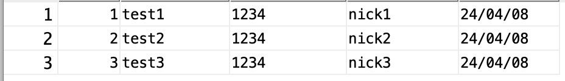

##### 2024 04 09

#### db연동
   
- 이전에 했던 테이블 상태

##### 수정하기
```
StringBuffer query = new StringBuffer();
query.append("update \"MEMBER\" ");
query.append("set \"MEMBERPW\"=?, \"NICKNAME\"=? ");
query.append("where \"NUM\"=?");
			
System.out.println(query.toString());
			
pstmt = conn.prepareStatement(query.toString()); 
pstmt.setString(1, "4321");
pstmt.setString(2, "nnnn");
pstmt.setInt(3, 5);
			
rs = pstmt.executeUpdate(); 
System.out.println(rs + "행이 수정되었습니다");
```
   
- update로 테이블에 있는 값을 변경한다
- MEMBERPW는 4321로 NICKNAME은 nnnn으로 변경한다
    - NUM이 5인 값을 변경시킨다

##### 삭제하기
```
StringBuffer query = new StringBuffer();
query.append("delete from \"MEMBER\" ");
query.append("where \"NUM\"=?");
			
System.out.println(query.toString());
			
pstmt = conn.prepareStatement(query.toString());
pstmt.setInt(1, 5);
			
rs = pstmt.executeUpdate(); 
System.out.println(rs + "행이 삭제되었습니다");
```
   
- delete로 테이블에 있는 값을 삭제한다
- MEMBER테이블에서 NUM에 값이 5인 값을 삭제한다


##### Connection파일 생성
```
public class JdbcConnectionUtil {
	private static JdbcConnectionUtil instance; 
	
	private String url = "jdbc:oracle:thin:@localhost:1521:xe";
	private String user = "jsptest";
	private String password = "1234";
	
	private JdbcConnectionUtil() {
		
	}
	
	public static JdbcConnectionUtil getInstance() {
		synchronized (JdbcConnectionUtil.class) {
			if(instance == null) {
				instance = new JdbcConnectionUtil();
			}
		}
		return instance;
	}
	
	public Connection getConnection() throws SQLException{
		return DriverManager.getConnection(url,user,password);
	}
	
	public void close(ResultSet rs) {
		if(rs != null) {
			try {
				rs.close();
			} catch (SQLException e) {
				e.printStackTrace();
			}
		}
	}
	public void close(Statement stmt) {
		if(stmt != null) {
			try {
				stmt.close();
			} catch (SQLException e) {
				e.printStackTrace();
			}
		}
	}
	public void close(Connection conn) {
		if(conn != null) {
			try {
				conn.close();
			} catch (SQLException e) {
				e.printStackTrace();
			}
		}
	}
}
```
- instance 변수는 자기자신과 동일한걸 참조 할수있는 변수이다
- 생성자가 private로 다른 파일에서는 호출할수가 없다
- getInstance메소드는 instance가 만약 null이라면 instance에 JdbcConnectionUtil을 생성하게함
    - 다른 파일이 아니라서 private에 접근이 가능
    - 어떤 쓰레드가 동기화 내부를 처리하는 중이라면 대기상태로 만든다
- getConnection메소드로 Connection을 리턴해준다
- close메소드는 ResultSet,Statement,Connection를 닫는 역할을 한다
```
JdbcConnectionUtil util = JdbcConnectionUtil.getInstance();
conn = util.getConnection();
```
- 기존보다 conn이 줄어들고 파일 하나로 간편하게 사용할수 있다

##### DAO
```
public class MemberDao {
	//db역할
	private JdbcConnectionUtil util;
	
	//생성자
	public MemberDao() {
		util = JdbcConnectionUtil.getInstance();
	}
	//c
	public int insertMember(MemberVo vo) {
			Connection conn = null;
			
			PreparedStatement pstmt = null; 
			int result = 0; 
			try {
				conn = util.getConnection();
				System.out.println("접속 성공");
				
				StringBuffer query = new StringBuffer();
				query.append("insert into \"MEMBER\" ");
				query.append("(\"NUM\", \"MEMBERID\", \"MEMBERPW\", \"NICKNAME\", \"REGDATE\") ");
				query.append("values (\"MEMBER_SEQ\".nextval, ?,?,?,sysdate)");
	
				pstmt = conn.prepareStatement(query.toString()); 
				pstmt.setString(1, vo.getMemberId());
				pstmt.setString(2, vo.getMemberPw());
				pstmt.setString(3, vo.getNickName());
				
				result = pstmt.executeUpdate();
				System.out.println(result + "행이 삽입되었습니다");			
			}catch(SQLException e) {
				e.printStackTrace();
			}finally {
				util.close(pstmt);
				util.close(conn);
			}
			return result;
	}
	
	//R
	public MemberVo selectMember(int num) {
		Connection conn = null;
		PreparedStatement pstmt = null; 
		ResultSet rs = null;
		MemberVo result = null;
		
		try {
			conn = util.getConnection();
			System.out.println("접속 성공");
			
			pstmt = conn.prepareStatement("select * from \"MEMBER\" where \"NUM\"=?");
			pstmt.setInt(1, num);
			rs = pstmt.executeQuery();
			
			if(rs.next()) {
				result= new MemberVo(
					rs.getInt(1),
					rs.getString(2),
					rs.getString("MEMBERPW"),
					rs.getString(4));
				result.setRegDate(rs.getDate("REGDATE"));
			}
			
		}catch(SQLException e) {
			e.printStackTrace();
		}finally {
			util.close(rs);
			util.close(pstmt);
			util.close(conn);
		}
		return result;
	}
	
	public List<MemberVo> selectMemverAll(){
		Connection conn = null;
		
		PreparedStatement pstmt = null; 
		ResultSet rs = null; 
		List<MemberVo> result = new ArrayList<>();
		try {
			conn = util.getConnection();
			System.out.println("접속 성공");
			
			pstmt = conn.prepareStatement("select * from \"MEMBER\"");
			rs = pstmt.executeQuery();
			
			while(rs.next()) {
				MemberVo vo = new MemberVo(
					rs.getInt(1),
					rs.getString(2),
					rs.getString("MEMBERPW"),
					rs.getString(4));
				vo.setRegDate(rs.getDate("REGDATE"));
				result.add(vo);
			}
			
		}catch(SQLException e) {
			e.printStackTrace();
		}finally {
			util.close(rs);
			util.close(pstmt);
			util.close(conn);
		}
		return result;
	}
	
	//U
	public int updateMamber(MemberVo vo) {
		Connection conn = null;
		PreparedStatement pstmt = null; 
		int result = 0; 
		
		try {
			conn = util.getConnection();
			System.out.println("접속 성공");
			
			StringBuffer query = new StringBuffer();
			query.append("update \"MEMBER\" ");
			query.append("set \"MEMBERPW\"=?, \"NICKNAME\"=? ");
			query.append("where \"NUM\"=?");
			
			System.out.println(query.toString());
			
			pstmt = conn.prepareStatement(query.toString()); 
			pstmt.setString(1, vo.getMemberPw());
			pstmt.setString(2, vo.getNickName());
			pstmt.setInt(3, vo.getNum());
			
			result = pstmt.executeUpdate(); 
			//System.out.println(rs + "행이 수정되었습니다");
			
		}catch(SQLException e) {
			e.printStackTrace();
		}finally {
			util.close(pstmt);
			util.close(conn);
		}
		return result;
	}
	
	//D
	public int deleteMember(int num) {
		Connection conn = null;
		PreparedStatement pstmt = null; 
		int result = 0; 
		
		try {
			conn = util.getConnection();
			System.out.println("접속 성공");
			
			StringBuffer query = new StringBuffer();
			query.append("delete from \"MEMBER\" ");
			query.append("where \"NUM\"=?");
			
			System.out.println(query.toString());
			
			pstmt = conn.prepareStatement(query.toString());
			pstmt.setInt(1, num);
			
			result = pstmt.executeUpdate(); 
			//System.out.println(result + "행이 삭제되었습니다");
			
		}catch(SQLException e) {
			e.printStackTrace();
		}finally {
			util.close(pstmt);
			util.close(conn);
		}
		return result;
	}
}
```
- 기존에 만들었던 코드를 DAO로 이동시킨다
- DAO에서 DB처리를 하게한다
- Service에서는 DAO에있는 메소드를 호출하면 DAO에서 DB쿼리를 처리하고 그 결과를 Service에 응답해준다
- main에서는 service에서 필요한 메소드를 호출하는 것으로 db에 값이 저장,변경,삭제되거나 값을 볼수있다