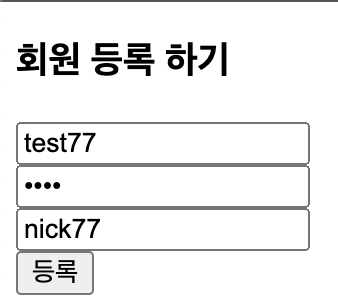
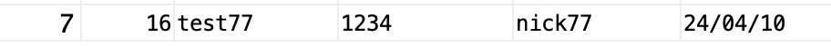
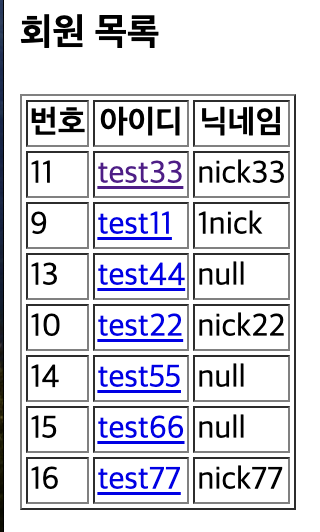
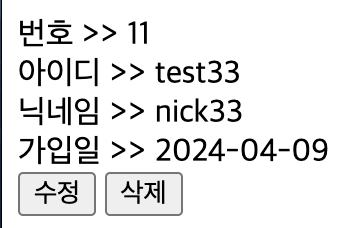

##### 2024 04 10

#### JSP DB연동
- 이전에 만들었던 파일 사용

##### JdbcConnectionUtil.java 변경사항
```
synchronized (JdbcConnectionUtil.class) {
			try {
				Class.forName("oracle.jdbc.OracleDriver");
			} catch (ClassNotFoundException e) {
				e.printStackTrace();
			}
			if(instance == null) {
				instance = new JdbcConnectionUtil();
			}
		}
```
- getInstance()메소드에 드라이버를 확인하는 코드 작성

##### MemberService.java 변경사항
```
public boolean regist(MemberVo vo) {
		int ret = memberDao.insertMember(vo);
		if(ret == 1) {
			return true;
		}
		return false;
	}
```
- MemberDao에 insertMember메소드의 반환값을 ret에 저장
    - 저장에 성공했다면 1을 반환했을것이기 때문이다

#### JSP 값 저장하기
##### index.jsp
```
<body>
	<h3>멤버 관리 메인</h3>
	<ul>
		<li><a href="registForm.jsp">등록하기</a></li>
		<li><a href="list.jsp">목록보기</a></li>
	</ul>
</body>
```
- 멤버를 등록하고 목록을 볼수 있는 페이지 작성 

##### registForm.jsp
```
<body>
	<h3>회원 등록 하기</h3>
	<form method="post" action="<%= request.getContextPath() %>/dbTest/member/regist.jsp">
		<input type="text" name="memberId" value="" placeholder="ID"><br>
		<input type="password" name="memberPw" value="" placeholder="PW"><br>
		<input type="text" name="nickName" value="" placeholder="Nickname"><br>
		<input type="submit" value="등록">
	</form>
</body>
```
   
- 멤버의 정보를 입력하는 폼
- 입력후 전송을 누르면 regist.jsp로 이동

##### regist.jsp
```
<%@page import="dbTestManager.*"%>    
<%
	request.setCharacterEncoding("utf-8");
	
	String memberId = request.getParameter("memberId");
	String memberPw = request.getParameter("memberPw");
	String nickName = request.getParameter("nickName");
	System.out.println(memberId + ">>" + memberPw + ">>" + nickName);
	MemberVo vo = new MemberVo(-1,memberId,memberPw,nickName);
	MemberDao dao = new MemberDao();
	MemberService memberService = new MemberService(dao);
	
	if(memberService.regist(vo)){
		response.sendRedirect(request.getContextPath()+"/dbTest/member/index.jsp");
	}else{
		response.sendRedirect(request.getContextPath()+"/dbTest/member/registForm.jsp");
	}
%>
```
   
- 입력 받은 값들을 받아와 MemberVo의 생성자에 값을 저장
- MemberDao의 생성자는 db연결을 하는 기능을 가지고 있다(JdbcConnectionUtil을 통해)
- memberService.regist(vo)가 true면 값이 저장되었기 떄문에 index.jsp로 페이지를 변경해주고 실패했다면 다시 값을 입력받는 페이지로 이동시킨다
- 해당 페이지는 값을 처리하는 페이지이다

#### JSP목록 출력

##### list.jsp
```
<%@page import="java.util.List"%>
<%@page import="dbTestManager.*"%>
<%
	MemberDao dao = new MemberDao();
	MemberService ms = new MemberService(dao);
	List<MemberVo> ls = ms.listAll();
%>
<!DOCTYPE html>
<html>
<head>
<meta charset="UTF-8">
<title>멤버 목록</title>
</head>
<body>
	<h3>회원 목록</h3>
	<table border="1">
		<%if(ls.size()==0)else{%>
			<tr>
				<th>번호</th>
				<th>아이디</th>
				<th>닉네임</th>
			</tr>
			<% for(MemberVo vo:ls){ %>
				<tr>
					<td><%=vo.getNum()%></td>
					<td>
						<a href="detail.jsp?num=<%=vo.getNum()%>">
							<%=vo.getMemberId()%>
						</a>
					</td>
					<td><%=vo.getNickName()%></td>
				</tr>
			<%}//for%>
		<%}//else%>
	</table>
</body>
</html>
```
   
- MemberService에 있는 listAll()메소드로 전체 목록을 가져온다
    - list로 받아온다
- 받아온 list에 값이 없다면 목록이 없습니다를 띄워준다
    - 값이 있다면 번호,아이디,닉네임을 table로 만들어 보여준다
    - id를 클릭하면 해당 회원의 정보를 볼수있다
    - num값을 detail.jsp에 넘겨준다

##### detail.jsp
```
<%@ page language="java" contentType="text/html; charset=UTF-8"
    pageEncoding="UTF-8"%>
<%@page import="dbTestManager.*"%>
<%
	String n = request.getParameter("num");
	int num = 0;
	if(n == null){
		response.sendRedirect("list.jsp");
	}else{
		num = Integer.parseInt(n);
		MemberService memberService = new MemberService(new MemberDao());
		MemberVo vo = memberService.read(num);
%>
<!DOCTYPE html>
<html>
<head>
<meta charset="UTF-8">
<title>회원 정보</title>
</head>
<body>
	<% if(vo == null)else{ %>
	번호 >> <%=vo.getNum() %><br>
	아이디 >> <%=vo.getMemberId()%><br>
	닉네임 >> <%=vo.getNickName()%><br>
	가입일 >> <%=vo.getRegDate()%><br>
	<a href="#"><button>수정</button></a>
	<a href="#"><button>삭제</button></a>
	<%} %>
</body>
</html>
<%}%>
```
   
- num의 값을 받아와 n에 저장을한다
- 만약 num의 값이 없다면 list.jsp로 이동시킨다
- 값이 있다면 n의 값을 정수형으로 변경후 num에 저장시킨다
    - memberService.read(num)로 해당 정보를 가져와 MemberVo인 vo에 저장시킨다
