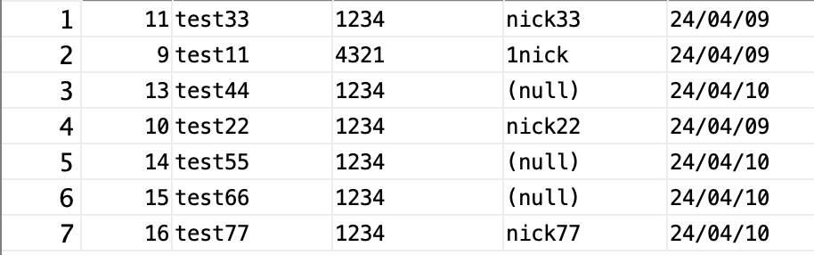
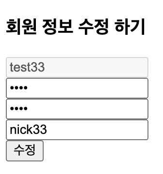
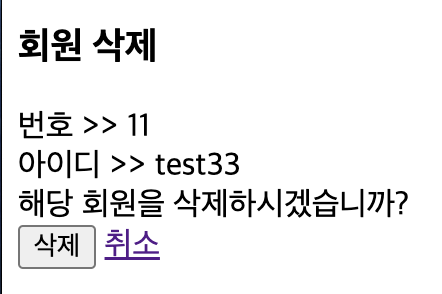
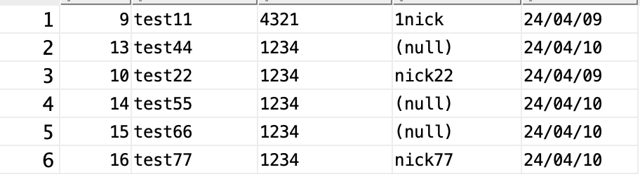

##### 2024 04 11

#### JSP DB연동
   
- 이전에 만들었던 파일 사용

#### JSP 회원 정보 수정
##### detail.jsp 수정 사항 
```
<a href="modifyForm.jsp?num=<%=vo.getNum()%>"><button>수정</button></a>
```

##### modifyForm.jsp
```
<%@page import="dbTestManager.*"%>
<%
	MemberService memberService = new MemberService(new MemberDao());
	int num = Integer.parseInt(request.getParameter("num"));
	MemberVo vo = memberService.read(num);
%>
<!DOCTYPE html>
<html>
<head>
<meta charset="UTF-8">
<title>회원정보 수정</title>
</head>
<body>
	<h3>회원 정보 수정 하기</h3>
	<form method="post" action="<%= request.getContextPath() %>/dbTest/member/modify.jsp">
		<input type="hidden" name="num" value="<%= vo.getNum() %>">
		<input type="text" name="memberId" value="<%= vo.getMemberId() %>" placeholder="ID" disabled><br>
		<input type="password" name="memberPwOld" value="" placeholder="기존 비밀번호"><br>
		<input type="password" name="memberPwNew" value="" placeholder="새로운 비밀번호"><br>
		<input type="text" name="nickName" value="<%= vo.getNickName() %>" placeholder="Nickname"><br>
		<input type="submit" value="수정">
	</form>
</body>
</html>
```
   
- 받아온 num으로 해당 사용자의 정보를 vo에 저장
- input type="hidden"으로 화면상으로는 보이지 않지만 회원 번호를 넘겨준다
    - 페이지 소스를 보면 해당값이 무엇인지 보이긴 한다

##### MemberService.java 수정
```
	public boolean edit(MemberVo vo, String memberPwOld) {
		int result = -1;
		MemberVo searchMember = memberDao.selectMember(vo.getNum());
		if(searchMember.getMemberPw().equals(memberPwOld)) {
			result = memberDao.updateMamber(vo);
		}
		return (result == 1) ? true : false;
	}
```
- edit의 반환값을 boolean으로 변경
    - update가 성공한다면 1을 반환하기 때문에 그 값을 result에 저장한다
- 입력한 수정값들은 vo에 저장되고 기존 비밀번호는 memberPwOld에 저장이되어 온다
    - 기존 pw와 검색을해 찾아온 유저에 비밀번호가 같으면 회원정보를 수정한다
- 성공했다면 result의 값은 1이 될것이며 return값으로 true를 반환하고 정보를 변경하지 못했다면 false를 반환한다

##### modify.jsp
```
<%@page import="dbTestManager.*"%>
<%
	request.setCharacterEncoding("utf-8");
	
	// 값을 가지고옴
	int num = Integer.parseInt(request.getParameter("num"));
	String memberId = request.getParameter("memberId");
	String memberPwOld = request.getParameter("memberPwOld");
	String memberPwNew = request.getParameter("memberPwNew");
	String nickName = request.getParameter("nickName");
	
	MemberService memberService = new MemberService(new MemberDao());
	
	MemberVo vo = new MemberVo(num,memberId,memberPwNew,nickName);
	if(memberService.edit(vo, memberPwOld)){
		response.sendRedirect(request.getContextPath() + "/dbTest/member/detail.jsp?num="+num);
	}else{
		response.sendRedirect(request.getContextPath() + "/dbTest/member/modifyForm.jsp?num="+num);
	}
%>
```
   
- 받아온 값들로 vo를 생성하고 memberService에 edit메소드에 vo와 이전 비밀번호를 같이 보낸다
    - 이전비밀번호를 보내는 이유는 기존비밀번호가 같아야 새로 변경할수 있기 때문이다
- 정보수정을 성공했다면 detail.jsp화면을 보여주고 실패했다면 다시 modifyForm.jsp를 보여준다
    - num값을 다시 보내 해당 유저의 정보를 다시 보거나 실패했을때 다시 변경을 할수 있게 해준다

#### JSP 유저 삭제
##### detail.jsp 수정 사항
```
<a href="deleteForm.jsp?num=<%=vo.getNum()%>"><button>삭제</button></a>
```
- 삭제할 유저의 num값을 delete.jsp에 보내준다

##### MemberService.java 수정 사항
```
public boolean remove(int num) {
	int result = memberDao.deleteMember(num);
	return (result == 1) ? true:false;
}
```
- 삭제가 되었다면 1을 반환하기 때문에 return 값으로 result가 1이면 true를 실패했다면 false를 반환한다

##### deleteForm.jsp
```
<%@page import="dbTestManager.*"%>
<%
	MemberService memberService = new MemberService(new MemberDao());
	int num = Integer.parseInt(request.getParameter("num"));
	MemberVo vo = memberService.read(num);
%>
<!DOCTYPE html>
<html>
<head>
<meta charset="UTF-8">
<title>삭제하기</title>
</head>
<body>
<h3>회원 삭제</h3>
번호 >> <%= vo.getNum() %><br>
아이디 >> <%= vo.getMemberId() %><br>
<form action="delete.jsp">
	해당 회원을 삭제하시겠습니까?<br>
	<input type="hidden" value="<%= vo.getNum() %>"  name="num">
	<input type="submit" value="삭제">
	<a href="<%=request.getContextPath()%>/dbTest/member/detail.jsp?num=<%= vo.getNum() %>">취소</a>
</form>
</body>
</html>
```
   
- 회원 정보를 가지고와서 정말 해당 유저를 삭제할껀지를 물어본다
- 취소한다면 detail.jsp로 이동을 하고 삭제를 누른다면 delete.jsp에서 처리를 한다

##### delete.jsp
```
<%@page import="dbTestManager.*"%>
<%
	MemberService memberService = new MemberService(new MemberDao());
	int num = Integer.parseInt(request.getParameter("num"));
	if(memberService.remove(num)){
		response.sendRedirect(request.getContextPath()+"/dbTest/member/list.jsp");
	}else{
		response.sendRedirect(request.getContextPath() + "/dbTest/member/detail.jsp?num="+num);
	}
%>
```
   
- 삭제 버튼을 누르면 삭제가 되는걸 볼수있다
    - 삭제가 되었다면 list.jsp로 이동을하고 실패했다면 detail.jsp로 이동을 한다
