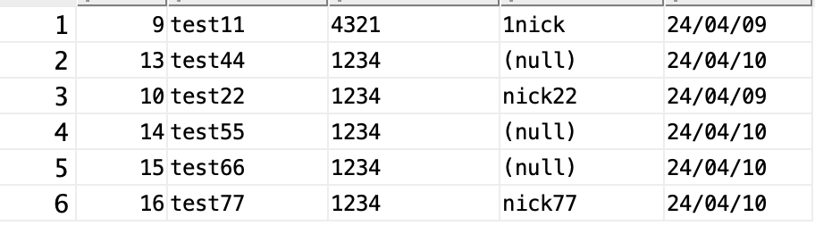
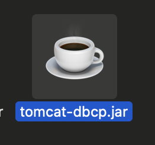

##### 2024 04 13

#### JSP DB연동
   
- 이전에 만들었던 파일 사용

#### 싱글톤으로 코드 변경

##### MemberDao.java
```
private static MemberDao instance;
public static MemberDao getInstance() {
	synchronized (MemberDao.class) {
		if(instance == null) {
			instance = new MemberDao();
		}
	}	
	return instance;
}	
```
- 싱글톤 패턴으로 변경한다

##### MemberService.java
```
private static MemberService instance;
public static MemberService getInstance() {
	synchronized (MemberService.class) {
		if(instance == null) {
		instance = new MemberService(MemberDao.getInstance());
		}
		return instance;
	}
}
```
- 싱글톤 패턴으로 변경한다

##### list.jsp
```
MemberService ms = MemberService.getInstance();
```
- MemberService(new MemberDao())를 사용하던걸 모두 변경한다

#### 자바빈즈 코드수정
- 코드가 간결해지고 사용하기 편해진다

##### regist.jsp
```
<%@page import="dbTestManager.*"%>    
<%request.setCharacterEncoding("utf-8");%>

<jsp:useBean id="vo" class="dbTestManager.MemberVo"/>
<jsp:setProperty name="vo" property="*"/>

<%	
	MemberService memberService = MemberService.getInstance();
	
	if(memberService.regist(vo)){
		response.sendRedirect(request.getContextPath()+"/dbTest/member/index.jsp");
	}else{
		response.sendRedirect(request.getContextPath()+"/dbTest/member/registForm.jsp");
	}
%>
```
- useBean으로 Membervo를 간단하게 사용할수 있다
- setProperty로 setter를 찾아 알아서 저장해준다

##### ModifyRequest.java
```
public class ModifyRequest {
	private int num;
	private String memberId;
	private String memberPwOld;
	private String memberPwNew;
	private String nickName;
	public int getNum() {
		return num;
	}
	public void setNum(int num) {
		this.num = num;
	}
	public String getMemberId() {
		return memberId;
	}
	public void setMemberId(String memberId) {
		this.memberId = memberId;
	}
	public String getMemberPwOld() {
		return memberPwOld;
	}
	public void setMemberPwOld(String memberPwOld) {
		this.memberPwOld = memberPwOld;
	}
	public String getMemberPwNew() {
		return memberPwNew;
	}
	public void setMemberPwNew(String memberPwNew) {
		this.memberPwNew = memberPwNew;
	}
	public String getNickName() {
		return nickName;
	}
	public void setNickName(String nickName) {
		this.nickName = nickName;
	}
	
}
```
- 회원정보수정은 받는 값이 다르기 때문에 getter,setter만 있는 새로운 자바파일 생성

##### modify.jsp
```
<%@page import="dbTestManager.*"%>
<%request.setCharacterEncoding("utf-8");%>
<jsp:useBean id="modifyRequest" class="dbTestManager.ModifyRequest" />
<jsp:setProperty name="modifyRequest" property="*" />

<%
	MemberService memberService = MemberService.getInstance();
	
	MemberVo vo = new MemberVo(
			modifyRequest.getNum(),
			modifyRequest.getMemberId(),
			modifyRequest.getMemberPwNew(),
			modifyRequest.getNickName());
	if(memberService.edit(vo, modifyRequest.getMemberPwOld())){
		response.sendRedirect(request.getContextPath() + "/dbTest/member/detail.jsp?num="+modifyRequest.getNum());
	}else{
		response.sendRedirect(request.getContextPath() + "/dbTest/member/modifyForm.jsp?num="+modifyRequest.getNum());
	}
%>
```
- jsp:setProperty로 값을 가져올수있기때문에 request.getParameter로 값을 하나씩 가져오지 않아도 된다

#### DBCP
   
- 톰캣 폴더에 lib폴더에 해당 jar파일이 있다
- 프로젝트에 lib폴더에 넣어두고 BuildPath를 시킨다
- META-INF폴더안에 context.xml파일을 생성한다
```
<?xml version="1.0" encoding="UTF-8"?>

<Context>
	<Resource
		name="jdbc/TestDB"
		auth="Container"
		type="javax.sql.DataSource"
		
		maxTotal="100"
		maxIdle="30"
		maxWaitMillis="1000"
		
		username="jsptest"
		password="1234"
		driverClassName="oracle.jdbc.OracleDriver"
		url="jdbc:oracle:thin:@localhost:1521:xe"
	/>
</Context>
```
- name은 설정정보를 읽기 위한 이름, auth는 어디에서 사용할것인지(관리를 누가하는지)
- type은 커넥션풀기능을 가진 클래스는 DataSource를 상속해서 만들기 떄문에
- max는 최대 만들수있는 커넥션의 갯수는 100개이다
- maxIdle은 최대 살아있는 기본적은 커넥션은 30개까지
- maxWaitMillis는 커넥션을 사용하기위한 대기시간
- username,password,driverClassName,url은 DB에 연결하기위한 정보들이다

```
  <!-- DBCP-->
  <resource-ref>
  	<description>DBCP</description>
  	<res-ref-name>jdbc/TestDB</res-ref-name>
  	<res-type>javax.sql.DataSource</res-type>
  	<res-auth>Container</res-auth>
  </resource-ref>
 ```
 - web.xml에 해당 설정을 추가해준다

 ##### JdbcConnectionUtil.java 수정
```
private DataSource ds;
private JdbcConnectionUtil() {
	try {
		Context ctx = new InitialContext();
		ds = (DataSource)ctx.lookup("java:/comp/env/jdbc/TestDB");
	} catch (NamingException e) {
		e.printStackTrace();
	}
}
public Connection getConnection() throws SQLException{
	return ds.getConnection();
}
```