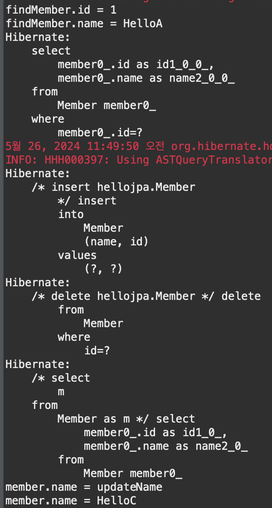
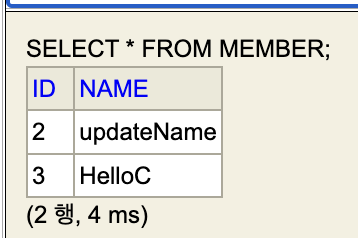

# section1

### 프로젝트 생성
- eclipse에서 maven 프로젝트를 생성

##### pom.xml
```
 <dependencies>
	<!-- JPA 하이버네이트 -->
	<dependency>
		<groupId>org.hibernate</groupId>
		<artifactId>hibernate-entitymanager</artifactId>
		<version>5.3.10.Final</version>
	</dependency>
	
	<!-- H2 데이터베이스 -->
	<dependency>
    	<groupId>com.h2database</groupId>
    	<artifactId>h2</artifactId>
    	<version>2.2.224</version>
	</dependency>
	
	<!-- lombok-->
	<dependency>
	    <groupId>org.projectlombok</groupId>
	    <artifactId>lombok</artifactId>
	    <version>1.18.30</version>
	    <scope>provided</scope>
	</dependency>

 </dependencies>
```
- 라이브러리 추가

##### persistence.xml
```
<?xml version="1.0" encoding="UTF-8"?>
<persistence version="2.2"
	xmlns="http://xmlns.jcp.org/xml/ns/persistence" xmlns:xsi="http://www.w3.org/2001/XMLSchema-instance"
    xsi:schemaLocation="http://xmlns.jcp.org/xml/ns/persistence http://xmlns.jcp.org/xml/ns/persistence/persistence_2_2.xsd">
    
    <persistence-unit name="hello">
        <properties>
        	<!-- 필수 속성 -->
        	<!-- 데이터베이스 접근 속성 -->
		    <property name="javax.persistence.jdbc.driver" value="org.h2.Driver"/>
		    <property name="javax.persistence.jdbc.user" value="sa"/>
		    <property name="javax.persistence.jdbc.password" value=""/>
		    <property name="javax.persistence.jdbc.url" value="jdbc:h2:tcp://localhost/~/test"/>
		    <property name="hibernate.dialect" value="org.hibernate.dialect.H2Dialect"/>
			<!-- 옵션 -->
            <property name="hibernate.show_sql" value="true" />
            <property name="hibernate.format_sql" value="true" />
            <property name="hibernate.use_sql_comments" value="true" />
            <!-- <property name="hibernate.hbm2ddl.auto" value="create" /> -->
        </properties>
    </persistence-unit>
</persistence>
```
- h2데이터 베이스를 사용하기 위한 설정

### 애플리케이션 개발
- JPA는 Persistence라는 클래스가 있다
- persistence.xml(설정정보)를 읽어서 EntityManagerFactory를 만들어 필요할때마다 EntityManager를 만든다

##### Member테이블 생성
```
create table Member(
    id bigint not null,
    name varchar(255),
    primary key(id)
)
```
- h2데이터베이스에서 테이블을 생성한다

##### JpaMain.java
```
public class JpaMain {

	public static void main(String[] args) {

		EntityManagerFactory emf = Persistence.createEntityManagerFactory("hello");
		
		EntityManager em = emf.createEntityManager();
		
		EntityTransaction tx = em.getTransaction();
		tx.begin();
		
		
		try {
			// 생성
			Member member = new Member();
			member.setId(1L);
			member.setName("HelloA");
			em.persist(member);
			
			
			// 조회
			Member findMember = em.find(Member.class, 1L);
			System.out.println("findMember.id = " + findMember.getId());
			System.out.println("findMember.name = " + findMember.getName());

			// 삭제
			em.remove(findMember);
			
			// 수정
			Member findMember2 = em.find(Member.class, 2L);
			findMember2.setName("updateName");
			
			// 조회에 조건이 있을경우 JPQL(객체지향 SQL)을 사용해야함
			// JPA는 테이블을 대상으로 코드를 짜지 않음, Member객체를 대상으로 쿼리
			// 대상이 테이블이 아닌 엔티티객체
			List<Member> result = em.createQuery("select m from Member as m", Member.class).getResultList();
			for(Member members : result) {
				System.out.println("member.name = " + members.getName());
			}
			
			tx.commit();
		}catch(Exception e) {
			tx.rollback();
		}finally {
			em.close();
		}
		
		emf.close();
	}
}
```
- EntityManagerFactory는 웹서버가 올라가는 시점에 딱 하나만 생성이된다(DB당 하나)
    - persistence.xml에서 설정한 hello라는 이름을 사용해 만든다
    - close()로 종료한다
- EntityManager는 쓰레드간에 공유x(사용하고 버려야한다, em.close()
    - em.persist(member)로 저장한다
    - em.find(Member.class, 1L)로 조회한다
        - Member클래스에 1L을 찾아온다(H2에 Member테이블)
    - em.remove(findMember)로 삭제한다
    - 해당 작업이 모두 끝난다면 close()로 종료해야한다
    - 수정은 값이 변경됬는지 않됬는지를 트랜잭션을 커밋하는 시점에 체크를해서 jpa가 트랜잭션을 커밋하기 직전에 업데이트 쿼리를 날리고 커밋이된다
        - em.persist(findMember2)를 사용하지 않아도 된다
- JPA의 모든 데이터 변경은 트랜잭션 안에서 실행(조회X)
    -EntityTransaction tx = em.getTransaction();
	- tx.begin()로 트랙잭션을 시작한다
    - tx.commit()로 해당 내용을 반영시키고 오류가 있다면 tx.rollback()으로 반영하지 않는다

   
- 쿼리가 어떻게 실행되는지 확인할 수 있다

   
- 테이블에 저장된 데이터