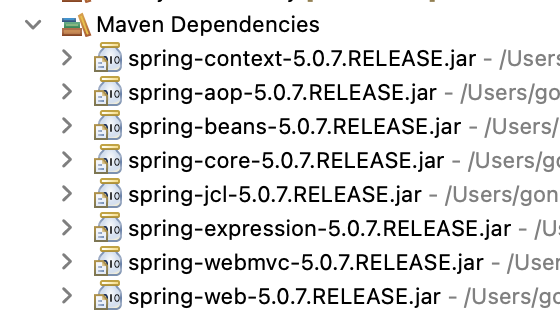
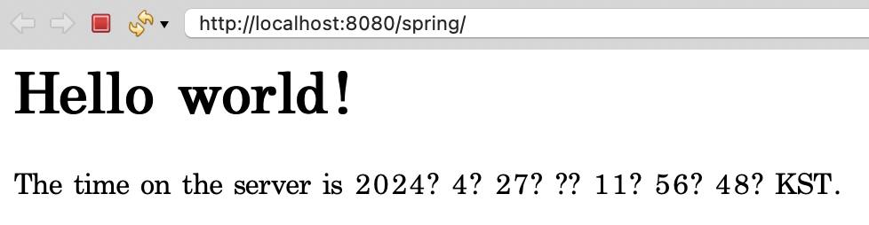
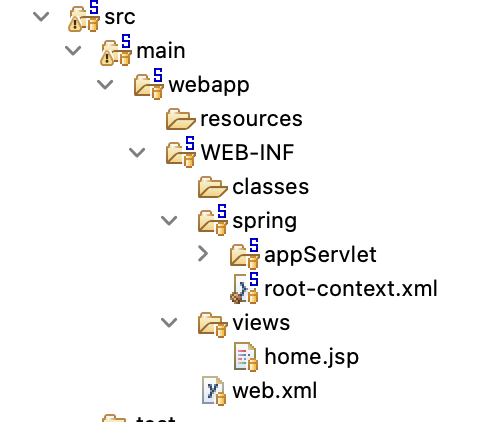
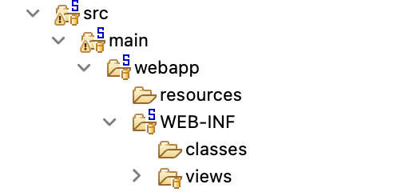

# CH1

### STS설치
- https://spring.io/tools 에서 설치가 가능하다
    - STS4는 스프링 부트사용에 적합하다
- STS3을 사용할것이기 때문에 https://github.com/spring-attic/toolsuite-distribution/wiki/Spring-Tool-Suite-3 에서 다운받아 설치한다
   
- 설치가 완료되고 프로젝트를 만든후 실행하면 정상적으로 작동한다
    - Spring Legacy Project에 Spring MVC Project로 생성한다
- pom.xml은 Maven이 사용하는 파일이다
- views폴더는 웹과 관련된 jsp파일의 경로이다
- servlet-context.xml은 스프링의 설정파일이다
- java/main/java는 작성되는 코드의 경로
    - test는 테스트 코드를 넣는 경로이다
- java/main/resources는 설정파일을 넣어둔다
    - test는 test관련된 설정파일을 넣어둔다

### Lombok 설치
- https://projectlombok.org/ 에서 다운받는다
```
java -jar lombok.jar
```
- 터미널에서 다운받은 파일이있는 위치에서 해당 코드를 입력한다

#### pom.xml 수정
```
<properties>
		<java-version>1.6</java-version>
		<org.springframework-version>5.0.7.RELEASE</org.springframework-version>
		<org.aspectj-version>1.6.10</org.aspectj-version>
		<org.slf4j-version>1.6.6</org.slf4j-version>
	</properties>
```
   
- 스프링 프레임워크의 버전을 5.0.7로 변경한다
- Maven Dependencies에서 변경이 되었는지 확인한다
   
```
  <plugin>
                <groupId>org.apache.maven.plugins</groupId>
                <artifactId>maven-compiler-plugin</artifactId>
                <version>3.5.1</version>
                <configuration>
                    <source>1.8</source>
                    <target>1.8</target>
                    <compilerArgument>-Xlint:all</compilerArgument>
                    <showWarnings>true</showWarnings>
                    <showDeprecation>true</showDeprecation>
                </configuration>
            </plugin>
```
   
- java의 버전을 변경시킨다
- 그후 프로젝트를 실행한후 Maven->Update Project를 실행시킨다
    - 버전이 변경된걸 확인할수 있다
   
   
- 실행이 제대로 된다

### java설정변경
- xml로 설정된것이 아닌 java로 설정을 하도록 변경시킨다
   
   
   
- web.xml파일과 spring폴더를 제거한다

#### pom.xml 추가
```
	<plugin>
                <groupId>opg.apache.maven.plugins</groupId>
                <artifactId>maven-war-plugin</artifactId>
                <version>3.2.0</version>
                <configuration>
                    <failOnMissingWebXml>false</failOnMissingWebXml>
                </configuration>
            </plugin>
```
- 해당 코드를 pom.xml에 plugin에 추가해준다

#### pom.xml 수정
```
	<properties>
		<java-version>1.8</java-version>
		<org.springframework-version>5.0.7.RELEASE</org.springframework-version>
		<org.aspectj-version>1.6.10</org.aspectj-version>
		<org.slf4j-version>1.6.6</org.slf4j-version>
	</properties>

    <plugin>
        <groupId>org.apache.maven.plugins</groupId>
        <artifactId>maven-compiler-plugin</artifactId>
        <version>2.5.1</version>
        <configuration>
            <source>1.8</source>
            <target>1.8</target>
            <compilerArgument>-Xlint:all</compilerArgument>
            <showWarnings>true</showWarnings>
            <showDeprecation>true<showDeprecation>
        </configuration>
    </plugin>
```
- version을 1.8로 변경시킨다
- plugin에 version을 2.5.1로 변경시킨다
- Maven->Update Project를 실행시킨다
- java설정을 사용하면 xml대신 설정 파일을 직접 작성해야한다

#### RootConfig.java
```
@Configuration
public class RootConfig {

}
```
- @Configuration이라는 어노테이션을 이용해 해당 클래스의 인스턴스를 이용해 설정파일을 대신한다

#### WebConfig.java
```
public class WebConfig extends AbstractAnnotationConfigDispatcherServletInitializer{
	
	@Override
	protected Class<?>[] getRootConfigClasses(){
		return new Class[] {RootConfig.class};
	}
	
	@Override
	protected Class<?>[] getServletConfigClasses(){
		return null;
	}
	
	@Override
	protected String[] getServletMappings(){
		return null;
	}
}
```
- web.xml을 대신하는 클래스
    - 톰캣의 web.xmlㅍ파일
- 3개의 추상 메서드를 오버라이드 하도록 작성
- getRootConfigClasses메서드는 root-context.xml을 대신하는 클래스
    - root-context.xml은 스프링 설정파일 