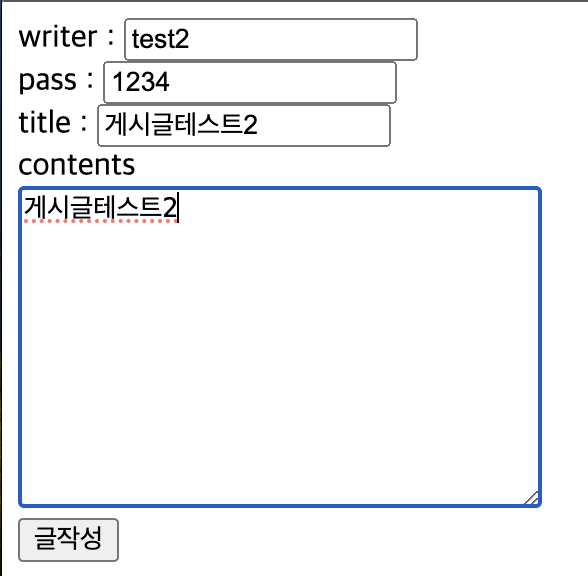
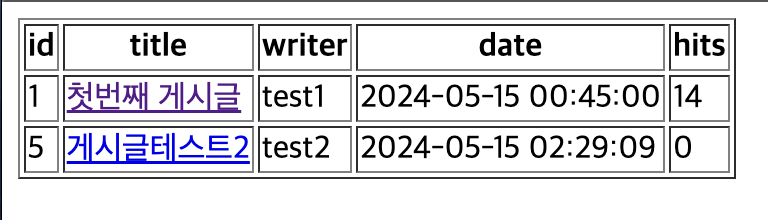
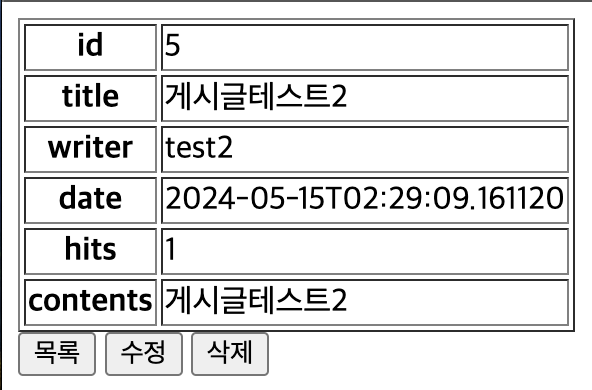
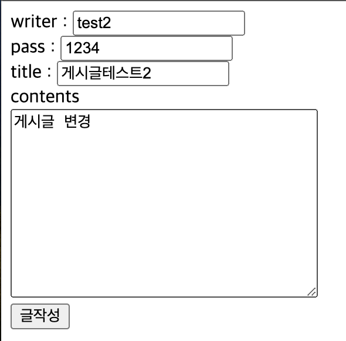

# Spring boot 게시판

### 게시판 html파일
##### index.html
```
<button onclick="saveReq()">글작성</button>
<button onclick="listReq()">글목록</button>
<script>
    // 게시글 작성
    // function saveReq(){} 와 같음
    const saveReq = () => {
        location.href="/board/save";
    }
    const listReq = () => {
        location.href="/board/";
    }
</script>
```
- 게시글 작성과 목록을 보기위한 버튼을 추가
- javascript에 함수는 get방식으로 요청됨

##### boardSave.html
```
<!DOCTYPE html>
<html lang="en">
<head>
    <meta charset="UTF-8">
    <meta name="viewport" content="width=device-width, initial-scale=1.0">
    <title>boardSave</title>
</head>
<body>
    <form action="/board/save" method="post">
        writer : <input type="text" name="boardWriter"><br>
        pass : <input type="text" name="boardPass"><br>
        title : <input type="text" name="boardTitle"><br>
        contents<br><textarea name="boardContents" cols="30" rows="10"></textarea><br>
        <input type="submit" value="글작성">
    </form>
</body>
</html>
```
- 게시글 작성 폼
- 익명으로 게시글 작성을 위한 폼

##### boardList.html
```
<!DOCTYPE html>
<html lang="en" xmlns:th="http://www.thymeleaf.org">
<head>
    <meta charset="UTF-8">
    <meta name="viewport" content="width=device-width, initial-scale=1.0">
    <title>boardList</title>
</head>
<body>
    <table border="1">
        <tr>
            <th>id</th>
            <th>title</th>
            <th>writer</th>
            <th>date</th>
            <th>hits</th>
        </tr>
        <tr th:each="board:${boardList}">
            <td th:text="${board.id}"></td>
            <td><a th:href="@{|/board/${board.id}|}" th:text="${board.boardTitle}"></a></td>
            <td th:text="${board.boardWriter}"></td>
            <td th:text="*{#temporals.format(board.boardCreatedTime,'yyyy-MM-dd HH:mm:ss')}"></td>
            <td th:text="${board.boardHits}"></td>
        </tr>
    </table>
</body>
</html>
```
- 게시글 전체 목록을 보여주는 페이지

##### boardDetail.html
```
<!DOCTYPE html>
<html lang="en" xmlns:th="http://www.thymeleaf.org">
<head>
    <meta charset="UTF-8">
    <meta name="viewport" content="width=device-width, initial-scale=1.0">
    <title>boardDetail</title>
</head>
<body>
    <table border="1">
        <tr>
            <th>id</th>
            <td th:text="${board.id}"></td>
        </tr>
        <tr>
            <th>title</th>
            <td th:text="${board.boardTitle}"></td>
        </tr>
        <tr>
            <th>writer</th>
            <td th:text="${board.boardWriter}"></td>
        </tr>
        <tr>
            <th>date</th>
            <td th:text="${board.boardCreatedTime}"></td>
        </tr>
        <tr>
            <th>hits</th>
            <td th:text="${board.boardHits}"></td>
        </tr>
        <tr>
            <th>contents</th>
            <td th:text="${board.boardContents}"></td>
        </tr>
    </table>
    <button onclick="listReq()">목록</button>
    <button onclick="updateReq()">수정</button>
    <button onclick="deleteReq()">삭제</button>
</body>
<script th:inline="javascript">
    const listReq = () =>{
        console.log("목록 요청");
        location.href="/board/";
    }
    const updateReq = () =>{
        console.log("수정 요청");
        const id=[[${board.id}]];
        location.href="/board/update/"+id;
    }
    const deleteReq = () =>{
        console.log("삭제 요청");
        const id= [[${board.id}]];
        location.href="/board/delete/"+id;
    }
</script>
</html>
```
- 선택한 게시글을 볼수있는 페이지
- 목록,수정,삭제 버튼을 통해 해당 작업을 실행할 수 있다

##### boardUpdate.html
```
<!DOCTYPE html>
<html lang="en" xmlns:th="http://www.thymeleaf.org">
<head>
    <meta charset="UTF-8">
    <meta name="viewport" content="width=device-width, initial-scale=1.0">
    <title>BoardUpdate</title>
</head>
<body>
    <form action="/board/update" method="post" name="updateForm">
        <input type="hidden" name="id" th:value="${boardUpdate.id}">
        writer : <input type="text" name="boardWriter" th:value="${boardUpdate.boardWriter}" readonly><br>
        pass : <input type="text" name="boardPass" id="boardPass"><br>
        title : <input type="text" name="boardTitle" th:value="${boardUpdate.boardTitle}"><br>
        contents<br><textarea name="boardContents" cols="30" rows="10" th:text="${boardUpdate.boardContents}"></textarea><br>
        <input type="hidden" name="boardHits" th:value="${boardUpdate.boardHits}">
        <input type="submit" value="글작성" onclick="boardUpdate()">
    </form>
</body>
<script th:inline="javascript">
    const boardUpdate = () =>{
        const pass = [[${boardUpdate.boardPass}]];
        const inputPass = document.getElementById("boardPass").value;
        if(pass == inputPass){
            document.updateForm.submit(); // updateFrom이라는 name을 가진 form을 전송
        }else{
            alert("비밀번호가 일치하지 않습니다!");
            history.back;
        }
    }
</script>
</html>
```
- 게시글을 수정하는 페이지
- 해당 게시글을 작서한 pass와 변경후 입력한 pass가 같아야 변경된다

### 게시판 java파일
##### BoardController.java
```
@Controller
@RequiredArgsConstructor
@RequestMapping("/board")
public class BoardController {
    private final BoardService boardService;

    // 게시글 작성 폼
    @GetMapping("/save") // /board/save와 같음
    public String saveForm(){
        return "boardSave";
    }

    // 게시글 저장
    @PostMapping("/save")
    public String save(@ModelAttribute BoardDTO boardDTO){
        System.out.println("boardDTO >> " + boardDTO);
        boardService.save(boardDTO);
        return "index";
    }
    
    // 게시글 목록
    @GetMapping("/")
    public String findAll(Model model) {
        List<BoardDTO> boardDTOList = boardService.findAll();
        model.addAttribute("boardList", boardDTOList);
        return "boardList";
    }
    
    // 게시글 조회
    @GetMapping("/{id}")
    public String findById(@PathVariable Long id,Model model){
        boardService.updateHits(id);
        BoardDTO boardDTO = boardService.findById(id);
        model.addAttribute("board", boardDTO);
        return "boardDetail";
    }
    
    // 게시글 수정
    @GetMapping("/update/{id}")
    public String updateForm(@PathVariable Long id,Model model){
        BoardDTO boardDTO = boardService.findById(id);
        model.addAttribute("boardUpdate", boardDTO);
        return "boardUpdate";
    }
    @PostMapping("/update")
    public String update(@ModelAttribute BoardDTO boardDTO, Model model){
        BoardDTO board = boardService.update(boardDTO);
        model.addAttribute("board", board);
        return "boardDetail";
    }

    // 게시글 삭제
    @GetMapping("/delete/{id}")
    public String delete(@PathVariable Long id){
        boardService.delete(id);
        return "redirect:/board/";
    }
    
}
```
- @RequestMapping("/board")는 주소에 /board로 시작이 하는 Mapping이 많다면 Mapping들은 /board를 기본으로 잡아준다
- 게시글 목록은 여러개의 BoardDTO가 있기 때문에 List로 받는다

##### BoardService.java
```
@Service
@RequiredArgsConstructor
public class BoardService {
    private final BoardRepository boardRepository;

    // 게시글 작성
    public void save(BoardDTO boardDTO){
        BoardEntity boardEntity = BoardEntity.toSaveEntity(boardDTO);
        boardRepository.save(boardEntity);
    }
    
    // 게시글 목록
    public List<BoardDTO> findAll(){
        List<BoardEntity> boardEntityList = boardRepository.findAll();
        List<BoardDTO> boardDTOList = new ArrayList<>();
        for(BoardEntity boardEntity: boardEntityList){
            boardDTOList.add(BoardDTO.toBoardDTO(boardEntity));
        }
        return boardDTOList;
    }

    // 게시글 조회
        // 조회수 증가
    @Transactional
    public void updateHits(Long id){
        boardRepository.updateHits(id);
    }
    public BoardDTO findById(Long id){
        Optional<BoardEntity>  optionalBoardEntity = boardRepository.findById(id);
        if(optionalBoardEntity.isPresent()){
            BoardEntity boardEntity = optionalBoardEntity.get();
            BoardDTO boardDTO = BoardDTO.toBoardDTO(boardEntity);
            return boardDTO;
        }else{
            return null;
        }
    }

    // 게시글 수정
    public BoardDTO update(BoardDTO boardDTO) {
        BoardEntity boardEntity = BoardEntity.toUpdateEntity(boardDTO);
        boardRepository.save(boardEntity);
        return findById(boardDTO.getId());
    }

    // 게시글 삭제
    public void delete(Long id) {
        boardRepository.deleteById(id);
    }
}

```
- 게시글 조회에 조회수 증가는 직접 쿼리를 만들었으므로 @Transactional를 사용해야한다
- 조회수를 증가시킨후 해당 게시글을 보여주는 메서드를 실행해 게시글을 보여준다

##### BoardRepository.java
```
public interface BoardRepository extends JpaRepository<BoardEntity,Long>{
    // 조회수 증가
    @Modifying
    @Query(value = "update BoardEntity b set b.boardHits=b.boardHits+1 where b.id=:id")
    void updateHits(@Param("id") Long id);
}
```
- updateHits는 쿼리를 만들어 실행하기 떄문에 직접 쿼리를 만들어 준다
    - 게시글의 조회수를 증가시켜주는 메소드
    - @Modifying은 update,delete등을 실행해야하며 추가
    - Entity를 기준으로 BoardEntity를 b로 설정 boardHits값을 1증가 시킴
    - :id는 @Param의 id와 매칭

##### BoardDTO.java
```
@Getter
@Setter
@ToString
@NoArgsConstructor // 기본생성자
@AllArgsConstructor // 모든 필드를 매개변수로 하는 생성자
public class BoardDTO {
    private Long id;
    private String boardWriter;
    private String boardPass;
    private String boardTitle;
    private String boardContents;
    private int boardHits; // 조회수
    private LocalDateTime boardCreatedTime;
    private LocalDateTime boardUpdatedTime;

    public static BoardDTO toBoardDTO(BoardEntity boardEntity){
        BoardDTO boardDTO = new BoardDTO();
        boardDTO.setId(boardEntity.getId());
        boardDTO.setBoardWriter(boardEntity.getBoardWriter());
        boardDTO.setBoardPass(boardEntity.getBoardPass());
        boardDTO.setBoardTitle(boardEntity.getBoardTitle());
        boardDTO.setBoardContents(boardEntity.getBoardContents());
        boardDTO.setBoardHits(boardEntity.getBoardHits());
        boardDTO.setBoardCreatedTime(boardEntity.getBoardCreatedTime());
        boardDTO.setBoardUpdatedTime(boardEntity.getBoardUpdatedTime());
        return boardDTO;
    }
}
```
- toBoardDTO는 메서드는 Entity -> DTO로 변경할때 사용한다

##### BoardEntity.java
```
@Entity
@Getter
@Setter
@Table(name = "board_table") // table 이름
// BaseEntity상속으로 BaseEntity에 시간관련 컬럼도 만들어진다
public class BoardEntity extends BaseEntity{
    @Id //pk지정
    @GeneratedValue(strategy = GenerationType.IDENTITY) // auto_increment
    private Long id;

    //@Column // default, 크기 255, null 허용
    @Column(length = 20, nullable = false) // 크기20, not null
    private String boardWriter;
    
    @Column
    private String boardPass;
    
    @Column
    private String boardTitle;
    
    @Column(length = 500)
    private String boardContents;
    
    @Column
    private int boardHits;

    public static BoardEntity toSaveEntity(BoardDTO boardDTO){
        BoardEntity boardEntity = new BoardEntity();
        boardEntity.setBoardWriter(boardDTO.getBoardWriter());
        boardEntity.setBoardPass(boardDTO.getBoardPass());
        boardEntity.setBoardTitle(boardDTO.getBoardTitle());
        boardEntity.setBoardContents(boardDTO.getBoardContents());
        boardEntity.setBoardHits(0);
        return boardEntity;
    }

    // 게시글 수정
    public static BoardEntity toUpdateEntity(BoardDTO boardDTO) {
        BoardEntity boardEntity = new BoardEntity();
        boardEntity.setId(boardDTO.getId());
        boardEntity.setBoardWriter(boardDTO.getBoardWriter());
        boardEntity.setBoardPass(boardDTO.getBoardPass());
        boardEntity.setBoardTitle(boardDTO.getBoardTitle());
        boardEntity.setBoardContents(boardDTO.getBoardContents());
        boardEntity.setBoardHits(boardDTO.getBoardHits());
        return boardEntity;
    }
}
```
- toSaveEntity는 게시글을 작성할때 DTO를 Entity로 변경하는 메서드이다
- toUpdateEntity는 게시글을 수정할때 DTO를 Entity로 변경하는 메서드이다
    - toSaveEntity와는 다르게 id값을 set해주고 BoardHits에 값도 set해준다

##### BaseEntity.java
```
@MappedSuperclass
@EntityListeners(AuditingEntityListener.class)
@Getter
public class BaseEntity {
       
    @CreationTimestamp
    @Column(updatable = false)
    private LocalDateTime boardCreatedTime;
    
    @UpdateTimestamp
    @Column(insertable = false)
    private LocalDateTime boardUpdatedTime;
}
```
- 시간관련한 column을 따로 생성
- boardCreatedTime은 게시글을 처음 작성한 시간이다
    - @CreationTimestamp생성시간
    - @Column(updatable = false) update할때 관여 X
- boardUpdatedTime은 게시글을 업데이트한 시간이다
    - @UpdateTimestamp 업데이트 시간
    - @Column(insertable = false) insert할때 관여 X

### 실행 결과
   
   
   
   