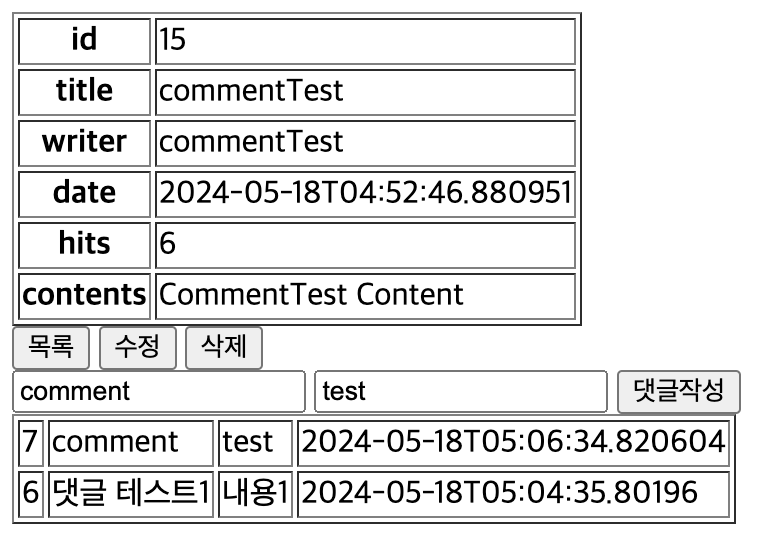
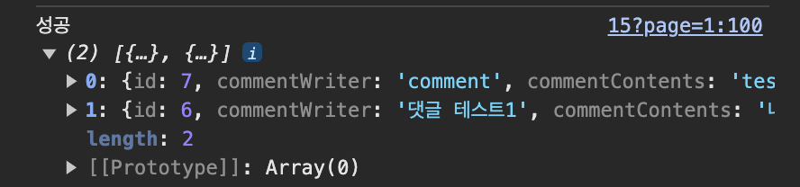

# Spring boot ajax 댓글

### 댓글 html파일
```
<!-- jQuery CDN-->
<script src="https://code.jquery.com/jquery-3.7.1.min.js" integrity="sha256-/JqT3SQfawRcv/BIHPThkBvs0OEvtFFmqPF/lYI/Cxo=" crossorigin="anonymous"></script>
```
- jquery를 사용하기 위해 CDN추가

##### boardDetail.html
```
 <!-- comment -->
    <!-- 작성 -->
    <div id="comment-write">
        <input type="text" id="commentWriter" placeholder="작성자">
        <input type="text" id="commentContents" placeholder="내용">
        <button id="comment-write-btn" onclick="commentWrite()">댓글작성</button>
    </div>
    <!-- 출력 -->
    <div id="comment-list">
        <table border="1">
            <tr>
                <th>댓글번호</th>
                <th>작성자</th>
                <th>내용</th>
                <th>작성시간</th>
            </tr>
            <tr th:each="comment: ${commentList}">
                <td th:text="${comment.id}"></td>
                <td th:text="${comment.commentWriter}"></td>
                <td th:text="${comment.commentContents}"></td>
                <td th:text="${comment.commentCreatedTime}"></td>
            </tr>
        </table>
    </div>

<script th:inline="javascript">
 const commentWrite = () =>{
        const writer = document.getElementById("commentWriter").value;
        const contents = document.getElementById("commentContents").value;
        const id= /*[[${board.id}]]*/id; //게시글번호
        console.log("writer>>"+writer+", contents>>"+contents,", board_num>>"+id);
        
        $.ajax({
            type:"post",
            url:"/comment/save",
            // 작성자,작성내용,게시글번호
            data:{
                "commentWriter":writer,
                "commentContents":contents,
                "boardId":id
            },
            success: function(res){
                console.log("성공",res);
                let output = "<table class='table' border='1'>";
                    for(let i in res){
                        output += "<tr>";
                        output += "<td>" + res[i].id + "</td>";
                        output += "<td>" + res[i].commentWriter + "</td>";
                        output += "<td>" + res[i].commentContents + "</td>";
                        output += "<td>" + res[i].commentCreatedTime + "</td>";
                        output += "</tr>";
                    }
                    output += "</table>";
                    document.getElementById('comment-list').innerHTML = output;
                    document.getElementById('connentWriter').value='';
                    document.getElementById('commentContents').value='';
            },
            error: function(err){
                console.log("실패",err);
            }
        });
    }
</script>
```
- ajax에 data로 작성자, 작성한 댓글, 게시글 번호를 넘긴다 
- 문제가 없다면 table을 만들고 for문으로 받은 데이터를 반복하여 댓글을 출력한다

### 댓글 java파일
##### CommentDTO.java
```
@Getter
@Setter
@ToString
public class CommentDTO {
    private Long id;
    private String commentWriter;
    private String commentContents;
    private Long boardId;
    private LocalDateTime commentCreatedTime;
    
    public static CommentDTO toCommentDTO(CommentEntity commentEntity, Long boardId) {
        CommentDTO commentDTO = new CommentDTO();
        commentDTO.setId(commentEntity.getId());
        commentDTO.setCommentWriter(commentEntity.getCommentWriter());
        commentDTO.setCommentContents(commentEntity.getCommentContents());
        commentDTO.setCommentCreatedTime(commentEntity.getBoardCreatedTime());
        //commentDTO.setBoardId(commentEntity.getBoardEntity().getId());
        commentDTO.setBoardId(boardId);
        return commentDTO;
    }  
}
```
- toCommentDTO로 Entity를 DTO로 변경시킨다

##### CommentEntity.java
```
@Entity
@Getter
@Setter
@Table(name = "comment_table")
public class CommentEntity extends BaseEntity{
    
    @Id
    @GeneratedValue(strategy = GenerationType.IDENTITY)
    private Long id;

    @Column(length = 20, nullable = false)
    private String commentWriter;

    @Column
    private String commentContents;
    // board : comment, 1:N
    @ManyToOne(fetch = FetchType.LAZY)
    @JoinColumn(name = "board_id")
    private BoardEntity boardEntity;

    public static CommentEntity toSaveEntity(CommentDTO commentDTO,BoardEntity boardEntity) {
        CommentEntity commentEntity = new CommentEntity();
        commentEntity.setCommentWriter(commentDTO.getCommentWriter());
        commentEntity.setCommentContents(commentDTO.getCommentContents());
        commentEntity.setBoardEntity(boardEntity);
        return commentEntity;
    }
}
```
- comment_table이라는 테이블을 생성한다

##### BoardEntity.java
```
@OneToMany(mappedBy = "boardEntity", cascade = CascadeType.REMOVE, orphanRemoval = true, fetch = FetchType.LAZY)
private List<CommentEntity> CommentEntityList = new ArrayList<>();    
```

##### CommentRepository
```
public interface CommentRepository extends JpaRepository<CommentEntity,Long>{
    //select * from comment_table where board_id=? order by desc;
    List<CommentEntity> findAllByBoardEntityOrderByIdDesc(BoardEntity boardEntity);
}
```

##### CommentController.java
```
@Controller
@RequestMapping("/comment")
@RequiredArgsConstructor
public class CommentController {
    
    private final CommentService commentService;

    @PostMapping("/save")
    public ResponseEntity save(@ModelAttribute CommentDTO commentDTO) {
        System.out.println("commentDTO>>"+commentDTO);
        Long saveResult = commentService.save(commentDTO);
        if(saveResult != null){
            List<CommentDTO> commentDTOList = commentService.finadAll(commentDTO.getBoardId());
            return new ResponseEntity<>(commentDTOList, HttpStatus.OK);
        }else{
            return new ResponseEntity<>("해당 게시글이 존재하지 않습니다.",HttpStatus.NOT_FOUND);
        }
    }
   
}
```

##### CommentService.java
```
@Service
@RequiredArgsConstructor
public class CommentService {
    private final CommentRepository commentRepository;
    private final BoardRepository boardRepository;

    // 댓글 작성
    public Long save(CommentDTO commentDTO){
        // 부모엔티티 조회
        Optional<BoardEntity> optionalBoardEntity = boardRepository.findById(commentDTO.getBoardId());
        if(optionalBoardEntity.isPresent()){
            BoardEntity boardEntity = optionalBoardEntity.get();
            CommentEntity commentEntity = CommentEntity.toSaveEntity(commentDTO, boardEntity);
            return commentRepository.save(commentEntity).getId(); 
        }else{
            return null;
        }
    }

    public List<CommentDTO> finadAll(Long boardId) {
        // select * from comment_table where board_id=? order by desc;
        BoardEntity boardEntity = boardRepository.findById(boardId).get();
        List<CommentEntity> commentEntityList = commentRepository.findAllByBoardEntityOrderByIdDesc(boardEntity);
        // Entity->DTO
        List<CommentDTO> commentDTOList = new ArrayList<>();
        for(CommentEntity commentEntity:commentEntityList){
            CommentDTO commentDTO = CommentDTO.toCommentDTO(commentEntity,boardId);
            commentDTOList.add(commentDTO);
        }
        return commentDTOList;
    }
}
```

##### BoardController.java
```
List<CommentDTO> commentDTList = commentService.finadAll(id);
model.addAttribute("commentList", commentDTList);
```
- BoardController에 findById에 위 코드 추가

### 결과
   
   