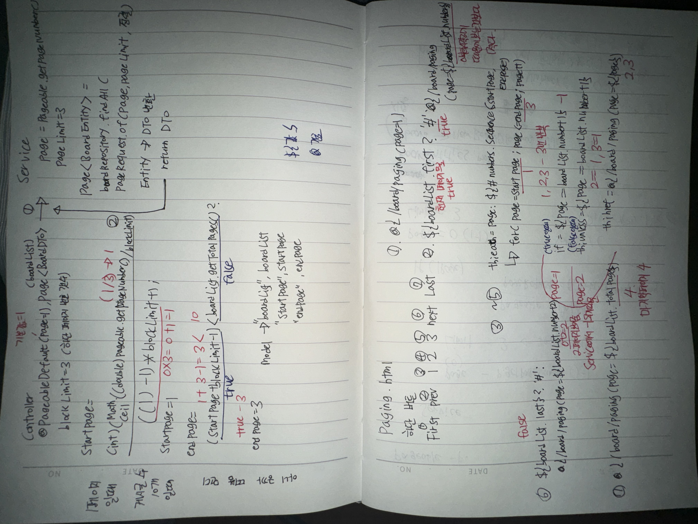

# Spring boot 게시판 페이징

### 페이징 html파일
##### index.html
```
    <button onclick="pagingReq()">페이징 목록</button>
    // 페이징
    const pagingReq = () => {
        location.href="/board/paging";
    }
```
- 페이지한 목록을 보여주기 위한 버튼

##### boardDetail.html
```
    const listReq = () =>{
        console.log("목록 요청");
        const page = [[${page}]];
        location.href="/board/paging?page="+page;
    }
```
- 게시글을 조회할때 페이지 번호를 함께 넘겨 목록보기를 했을때 1페이지로 가지않고 해당 게시글을 클릭했던 페이지로 이동하게 한다

##### paging.html
```
<!DOCTYPE html>
<html lang="en" xmlns:th="http://www.thymeleaf.org">
<head>
    <meta charset="UTF-8">
    <meta name="viewport" content="width=device-width, initial-scale=1.0">
    <title>paging</title>
</head>
<body>
<button onclick="saveReq()">글작성</button>

<table border="1">
    <tr>
        <th>id</th>
        <th>title</th>
        <th>writer</th>
        <th>date</th>
        <th>hits</th>
    </tr>
    <tr th:each="board: ${boardList}">
        <td th:text="${board.id}"></td>
        <td><a th:href="@{|/board/${board.id}|(page=${boardList.number + 1})}" th:text="${board.boardTitle}"></a></td>
        <td th:text="${board.boardWriter}"></td>
        <td th:text="*{#temporals.format(board.boardCreatedTime, 'yyyy-MM-dd HH:mm:ss')}"></td>
        <td th:text="${board.boardHits}"></td>
    </tr>
</table>
<!-- 첫번째 페이지로 이동 -->
<!-- /board/paging?page=1과 같음-->
<a th:href="@{/board/paging(page=1)}">First</a>

<!-- 이전 링크 활성화 비활성화 -->
<!-- boardList.getNumber()는 사용자가 보는 페이지보다 1작은 값이기 때문에 이전페이지 요청을 하게된다-->
<a th:href="${boardList.first} ? '#' : @{/board/paging(page=${boardList.number})}">prev</a>

<!-- for(int page=startPage; page<=endPage; page++)-->
<span th:each="page: ${#numbers.sequence(startPage, endPage)}">
<!-- 현재페이지는 링크 없이 숫자만, boardList.number는 사용자가 요청한 값보다 1적기떄문에 1을더해 사용자가 2페이지를 보고있다면 값이 2가되게 만든다 -->
    <span th:if="${page == boardList.number + 1}" th:text="${page}"></span>
<!-- 현재페이지 번호가 아닌 다른 페이지번호에는 링크를 보여줌 -->
    <span th:unless="${page == boardList.number + 1}">
        <a th:href="@{/board/paging(page=${page})}" th:text="${page}"></a>
    </span>
</span>

<!-- +2로 다음페이지를 보여줄수 있음-->
<a th:href="${boardList.last} ? '#' : @{/board/paging(page=${boardList.number + 2})}">next</a>
<!-- totalPages로 전체 페이지 값을 가져오면 마지막 페이지로 이동이 가능하다-->
<a th:href="@{/board/paging(page=${boardList.totalPages})}">Last</a>

</body>
<script>
    const saveReq = () => {
        location.href = "/board/save";
    }

</script>
</html>
```
- 

### 페이징 java파일
##### BoardController.java
```
    // 게시글 조회
    @GetMapping("/{id}")
    public String findById(@PathVariable Long id,Model model,
                            @PageableDefault(page=1) Pageable pageable){
        boardService.updateHits(id);
        BoardDTO boardDTO = boardService.findById(id);
        model.addAttribute("board", boardDTO);
        model.addAttribute("page", pageable.getPageNumber());
        return "boardDetail";
    }


    // 페이징
    @GetMapping("/paging")
    public String paging(@PageableDefault(page = 1)Pageable pageable, Model model){
        // @PageableDefault(page = 1) 기본값은 1
        Page<BoardDTO> boardList = boardService.paging(pageable);
        int blockLimit = 3; // 하단에 보여지는 페이지 번호 갯수
        
        // 시작페이지 1,4,7,10~
        int startPage = (((int)(Math.ceil((double)pageable.getPageNumber()/blockLimit)))-1)*blockLimit+1;
        // 끝페이지 3,6,9,12~
        int endPage = ((startPage+blockLimit-1)<boardList.getTotalPages()?startPage+blockLimit-1:boardList.getTotalPages());
        
        model.addAttribute("boardList", boardList);
        model.addAttribute("startPage", startPage);
        model.addAttribute("endPage", endPage);
        return "paging";
    }
```
##### BoardService.java
```
 // 페이징
    public Page<BoardDTO> paging(Pageable pageable) {
        // pageable에 몇페이지를 요청했는지, 1을빼는이유는 값이 0부터 시작하기 때문에
        int page = pageable.getPageNumber() - 1;
        int pageLimit = 3;
        // 한페이지당 3개씩의 글을 보여주고 정렬 기준은 id기준으로 내림차순 정렬
        Page<BoardEntity> boardEntities =
             boardRepository.findAll(PageRequest.of(page, pageLimit, Sort.by(Sort.Direction.DESC,"id")));
             // 몇페이지를 보고싶은지, 한페이지에 보여줄 글 갯수, 정렬방식, Entity에 기준(id,pk)
        
        pagingPrint(boardEntities);

        // board<-boardEntities를 하나씩 꺼내서 DTO로 옮기는 작업을 함, pagingPrint메서드에 있는 출력 메서드를 사용할수 있음
        // 목록 : id, writer, title, hits, createTime
        Page<BoardDTO> boardDTOS = boardEntities.map(board -> new BoardDTO(board.getId(), board.getBoardWriter(),board.getBoardTitle(),board.getBoardHits(),board.getBoardCreatedTime()));
        return boardDTOS;
    }
    // 페이징 확인
    public void pagingPrint(Page<BoardEntity> boardEntities){
        System.out.println("boardEntities.getContent() = " +boardEntities.getContent()); // 요청 페이지에 해당하는 글
        System.out.println("boardEntities.getTotalElements() = "+boardEntities.getTotalElements()); // 전체 글갯수
        System.out.println("boardEntities.getNumber() = "+boardEntities.getNumber()); // DB로 요청한 페이지 번호
        System.out.println("boardEntities.getTotalPages() = "+boardEntities.getTotalPages()); // 전체 페이지 개수
        System.out.println("boardEntities.getSize() = "+boardEntities.getSize()); // 한 페이지에 보여지는 글 갯수
        System.out.println("boardEntities.hasPrevious() = "+boardEntities.hasPrevious()); // 이전 페이지 존재 여부
        System.out.println("boardEntities.isFirst() = "+boardEntities.isFirst()); // 첫 페이지 여부
        System.out.println("boardEntities.isLast() = "+boardEntities.isLast()); // 마지막 페이지 여부
    }
```
##### BoardDTO.java
```
    // Page
    public BoardDTO(Long id, String boardWriter, String boardTitle, int boardHits, LocalDateTime boardCreatedTime){
        this.id = id;
        this.boardWriter = boardWriter;
        this.boardTitle = boardTitle;
        this.boardHits = boardHits;
        this.boardCreatedTime = boardCreatedTime;
    }
```

