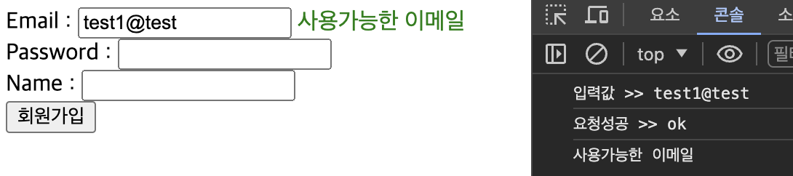
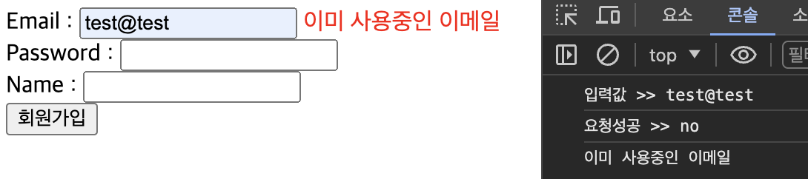

# Spring boot 이메일 중복

##### save.html
```
Email : <input type="text" name="memberEmail" id="memberEmail" onblur="emailCheck()">
<span id="check-result"></span><br>

<script th:inline="javascript">
    const emailCheck = () => {
        const email = document.getElementById("memberEmail").value;
        const checkResult = document.getElementById("check-result");
        console.log("입력값 >> " + email);
        // ajax
        $.ajax({
            // 요청방식 : post , url : email-check , data : email
            type : "post",
            url : "/member/email-check",
            data : {
                "memberEmail":email
            },
            success : function(result){
                console.log("요청성공 >> " + result);
                if(result == "ok"){
                    console.log("사용가능한 이메일");
                    checkResult.style.color = "green";
                    checkResult.innerHTML = "사용가능한 이메일";
                }else{
                    console.log("이미 사용중인 이메일");
                    checkResult.style.color = "red";
                    checkResult.innerHTML = "이미 사용중인 이메일";
                }
            },
            error : function(err){
                console.log("에러발생 >> " + err);
            }
        });
    }
</script>
```
- Email에 input태그에 id값과 onblur="emailCheck()"를 추가
    - id값은 javascript에서 해당 태그에 입력된 값을 가져오기위해 사용
    - onblur은 태그에 입력후 다른 곳을 클릭했을때 emailCheck()함수를 사용하기 위해 사용
- span태그는 이메일 중복여부를 텍스트로 보여줄것이다
- post방식으로 /member/email-check로 email값을 보내고 처리한후 ok라는 값이 반환되었다면 사용가능한 이메일임을 알려주고 그게 아니라면 사용중인 이메일임을 알려준다


##### MemberController.java
```
@PostMapping("/member/email-check")
    public @ResponseBody String emailCheck(@RequestParam("memberEmail") String memberEmail){
        System.out.println("memberEmail = " + memberEmail);
        String checkResult = memberService.emailCheck(memberEmail);
        if(checkResult!=null){
            return "ok";
        }else{
            return "no";
        }
    }
```
- memberService.emailCheck에서 return된 값이 null이 아니면 사용가능한 이메일이기 때문에 ok를 return한다
- null이 return되면 사용불가능하기 때문에 no를 return

##### MemberService.java
```
public String emailCheck(String memberEmail){
        Optional<MemberEntity> byMemberEmail = memberRepository.findByMemberEmail(memberEmail);
        if(byMemberEmail.isPresent()){
            // 결과가 있음, 중복
            return null;
        }else{
            // 결과가 없음, 사용가능
            return "ok";
        }
    }
```
- MemberRepository에 만들어둔 이메일값을 가져오는 메서드로 값이 있는지 없는지를 확인
- 값이 있다면 이메일이 중복이므로 null을 return하고 값이 없다면 ok를 return

##### 결과
   
   